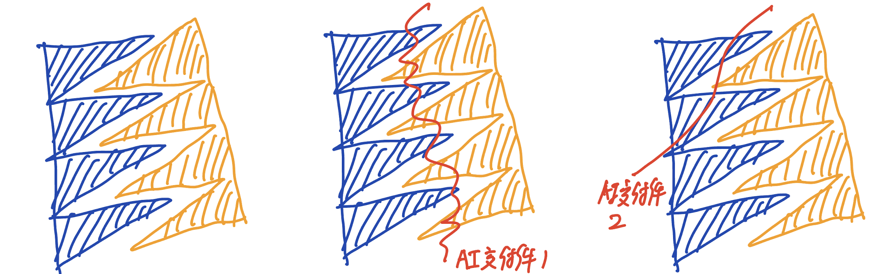
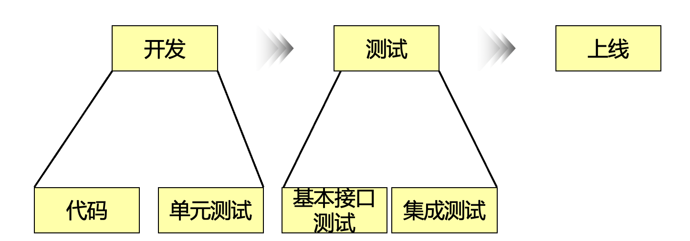
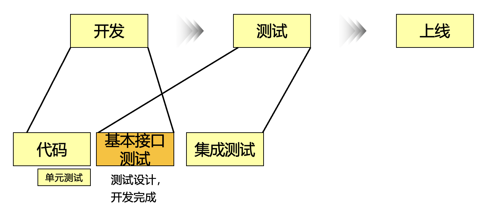

一方面，是Vibe效率的飞升：三天完成一个Demo，一下午Vibe一个Poc项目。
另一方面，是企业效率没有想象中的提升，似乎，没有AI辅助流程，对企业没有任何影响。

为什么？

首先，这是极具代表性的两个开发场景：
其一，单人开发，担任产品经理、开发、测试、运维角色，一人承担所有的责任。（即使GPT写错了付款接口你也只能责怪自己）。
其二，多人协作开发，分工明确，各自承担不同的角色与责任。

基于此，针对AI辅助开发，笔者分析整理了三个原因，这三个问题层层叠加，从模型能力到系统隔离，再到协作方式，构成了企业级 AI 提效的现实瓶颈。

# 一、模型、算力
模型的推理能力、支持上下文的长度，对工具的效果影响是天差地别的。企业出于对资产安全的考虑，往往会选择私有化搭建模型，这可能会导致如下两个问题：
- **内部模型参数量较小**：推理能力明显低于公有云大模型，尤其在多语言代码生成和复杂语义补全上差距明显。
- **上下文长度受限**： 受限于上下文窗口，AI 工具只能看到当前编辑文件或部分上下文，导致生成结果割裂。
> 先进的理论、经验都是基于AK 47的，确定一定要基于AK 36继续优化么？
# 二、信息系统孤岛

在传统的逻辑下，将信息分隔到多个系统，进行精细化管理，通过人来串起整个流程，这无疑是非常优秀的做法。笔者也曾经将团队中的所有数据库相关实体定义集中到一个代码库管理。

而AI辅助开发工具通常运行在代码仓，单人开发模式下，我可以把设计文档提交到代码仓，典型测试集都提交到代码仓，编写代码需要的Everything，只要适合转换为文本模式的，我都可以提交到代码仓。

在AI辅助开发工具没有集成对应信息系统的情况下，需要开发人员手动提炼复制上下文到AI辅助开发工具，这和我再提炼提炼，以Chat的方式对话，有什么区别？
> 其实这一点在代码仓管理上也存在，Repo的分隔也存在这个问题，前端、多个语言的客户端、API的Yaml文件，进行精细化的管理。但CC、Cursor这样的工具无法看到全貌。
> 
> 下一个我做的项目，我倾向于使用Mono Repo，充分利用AI工具提交，并且如果是AI相关项目的话，我倾向于使用Python语言。

但是我相信，如果多个系统都能与AI工具对接打通，给AI提供了更加结构化、质量更高的数据，理论上上限要高于所有东西以markdown格式放在代码仓库不同文件夹的做法。
# 三、工作流程

**AI没有改变软件工程，只是把其中的很多工作加速到不可思议的地步。**

**AI只能加速单人闭环的工作，对人和人的交互没有帮助。**

AI 当前的强项，是提升“单人闭环任务”的速度。但当任务涉及**跨角色交互**时（如开发与测试、测试与运维、产品与开发），AI 的作用显著减弱。

左图是人与人的交互，严丝合缝。如右边两张图所示，AI交付件还不能做到严丝合缝地对接，为了能顺利走完流程，蓝色、橙色，必须得有一方做出额外的工作才行。（当然，为了避免同事说你不靠谱，我还是推荐蓝色方做出额外工作。）

AI时代，应该尽量把一个工作的各个方面交给一个人，这样来减少人与人的交互，充分提高效率。

> 这和交给Agent足够的上下文的道理是相通的。

来看一个典型案例：微服务开发与测试的协同。一个典型微服务的开发、测试、发布上线流程如下：
> 产品与开发、开发和运维，这样的问题也存在，以编码举例子，主要是因为时间相对长，矛盾更加明显。

测试负责产品质量的出口，测试在自己的领域范围内，通过自己的理解，对整体的测试进行分层落地（基本接口测试与集成测试环节）。

图中共有四项活动：代码、单元测试、基本接口测试、集成测试。这个模式下，单元测试与基本接口测试存在能力上的重叠。对流程进行了如下优化（测试将测试设计左移，基本接口测试放在开发阶段，弱化单元测试。

但是现在，下面这种方式和上面这种方式，谁用AI辅助的效率更高？

从传统领域的角度来看，下面的方式，测试更早介入，且减少了重复工作。但是从AI辅助的角度来看，那个效率更高？

从AI辅助的角度，橙色的环节充斥着大量的交互，诸如代码中书写的测试要匹配测试的设计（通过方法名与用例Id匹配），开发要确认测试设计表达的含义等。当团队想要使用AI提效时，这个矛盾就被放大。尤其是当 **模型能力不足** 与 **信息孤岛** 并存时，协作复杂度被进一步放大。

当下，在笔者所在的团队，上下两种流程都存在。上下两种方式那种更好？笔者下意识地觉得当未来AI的生产力突飞猛进的时候，上面的方式会更好（这一判断源于相信人和AI协作的效率会远远大于人和人协作的效率），但是在当下，笔者想不清楚，也给不出答案。当前笔者针对上下两种场景，寻找集成了对应信息源、最合适的工具进行提效。

总得来说，企业要避免陷入 **"工具因为流程导致效果不及预期"、"流程不会为没有效果的工具变更，让步"、"开发人员对工具没有信心"** 的恶性循环。
# 总结

AI 在个人层面的高效令人振奋，但企业的整体效率并未出现预期的跃升。问题主要集中在模型能力、信息孤岛与工作流程三方面。前两者可以通过技术投入与资源建设逐步改善，而工作流程的变革则需要企业在思维模式与协作方式上完成真正的转变。