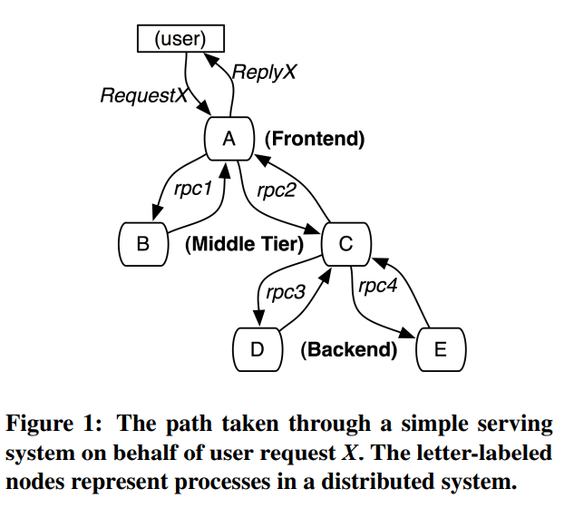
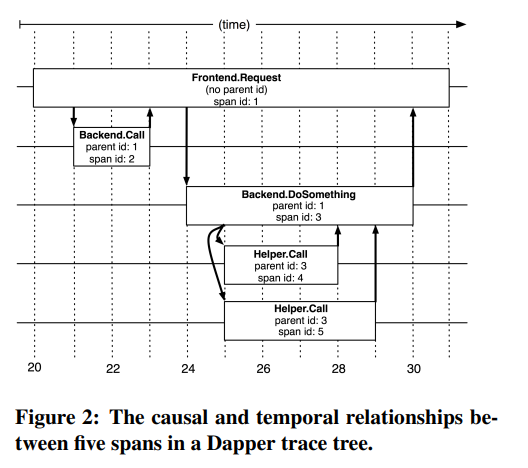
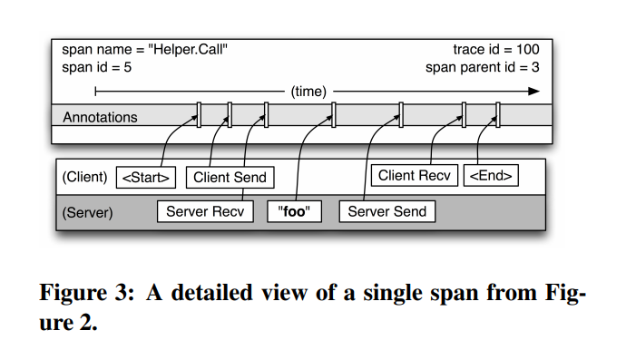
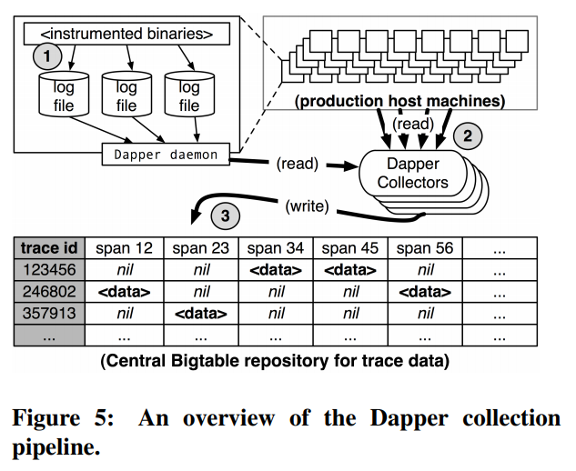
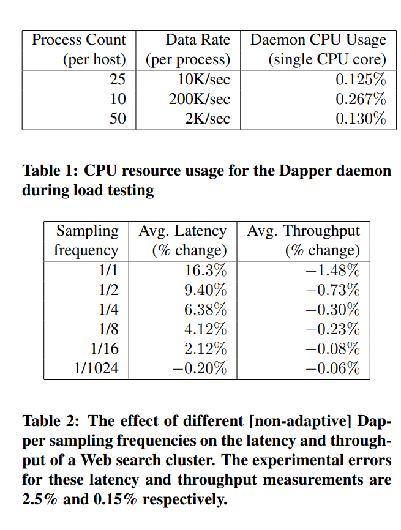

## Dapper出现的背景

分布式系统不容易观测。有些问题靠日志和统计根本无法挖掘。
有些无法重现或极难重现的场景。

## Dapper设计的原则

### 低时延

微不足道的性能影响，使应用程序团队愿意迁移。

### 应用透明

应用尽量少做侵入式修改

### 可扩展

随着应用程序的规模扩展

## Dapper概念

### 概览

通过引入parent id和span id等来将调用链串起来

### trace id

特定的模式是trace id

### span id

span，包括日志，起始、终止时间，也包括key、value。还区分了网络和非网络时延。

### annotation

应用程序根据自己的需要可以打上annotation，不仅仅是key、value，还可以有时间戳等，有助于分析方法级别的耗时

## Dapper原理

- 每当一个线程处理一个采样的控制线路时。Dapper在其中放置一个trace context在thread-local中。trace
  context是一个小型、容易拷贝的对象，包含trace id和span id
- 异步或者callback的时候，用统一的library封装传递
- RPC自动继承
- 不行，就通过api的方式接入

## Dapper的流程

写入流程分为三步。1、写入本地日志文件 2、被Dapper daemon获取 3、写入Bigtable

端到端的中位数时延在15秒。百分之75的数据的98时延在2分钟以内，但百分之25的数据的98时延可能会到几小时

## 为什么不在RPC接口中顺手收集信息

- trace信息可能比rpc本身的报文要大
- 对于异步流程，无法收集

## Trace消耗的性能

### 在应用程序侧

创建root span耗时约204纳秒，非root span耗时176纳秒

日志文件的消耗，可并行批量

### Trace收集

每个trace数据约426byte

仅占用千分之一的Google生产带宽

### 自适应采样

测试环境或低量请求多采样。请求量大小采样

### 远端采样

远端采样，降低服务端风险。

## Dapper索引选择

基于服务、机器、时间

## Dapper的典型使用流程

- 1用户选择服务、时间、期望看到的指标值（如时延）
- 2展示出满足这个条件的所有pattern，（trace pattern）
- 3展示这个pattern的调用链图，
- 4右侧是全部的采样
- 5展示出详细的时间戳分布

## Dapper实际作用

- 发现无意义的调用
- 是否有必要访问主库，而不是从库
- 理解黑盒系统的依赖
- 测试。如果你不能观测，就不能优化
- 推断依赖
- 判断点到点网络故障，根据请求的大小，进一步推断，谁到谁引发了网络故障。
- 在底层share系统之上，外围按用户或其他维度统计调用
- Dapper daemon的实时信息，可用来救火

## Dapper现在做不到的

- 合并、批量处理，无法拆开识别
- 针对批系统，能力有限
- 根因分析，需要联合分析，比如在annotation中携带线程池队列大小，进行多个请求的联合分析等
- 如何和Linux内核关联，如何将错误和内核联系起来
