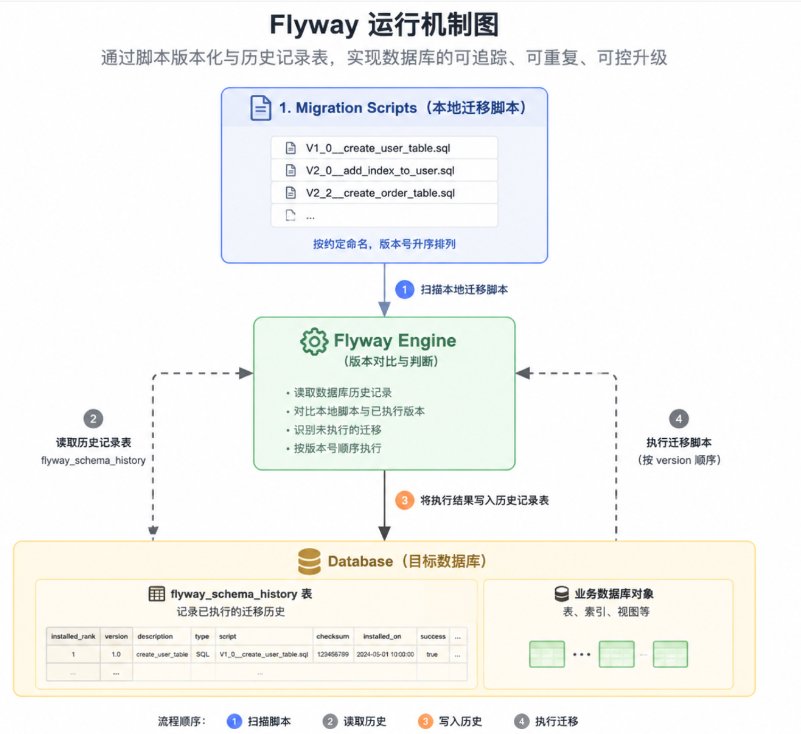
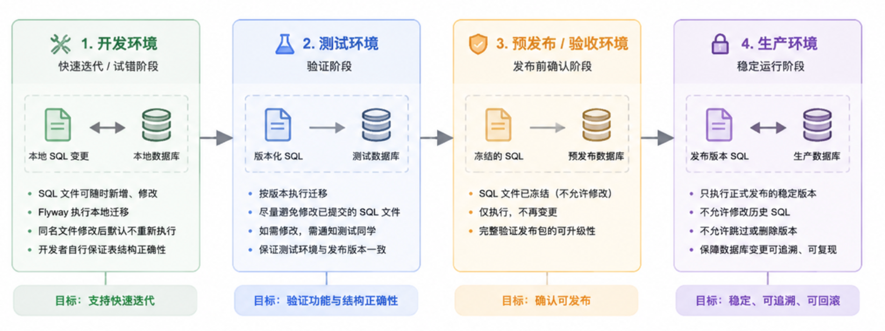

# Flyway是什么

现代容器化交付模式下，当我们决定要发布的时候，从代码仓拉取分支，经过CI/CD构建，最终产出镜像包并发布。

但有些产品，数据库变更往往还是一个 SQL 文件、一段群消息，或者某个人手动在数据库里执行了一下。

Flyway 解决的就是这个问题：把数据库变更当成一种可以版本化、可追踪、可重复执行的工程交付件。它可以帮助开发者控制数据库的版本，并在应用程序中管理数据库的更改和迁移。Flyway的基本原理是跟踪数据库的更改历史，这样开发者就可以知道哪些更改已经被应用，哪些还没有。Flyway支持大多数的关系型数据库，如MySQL，PostgreSQL，SQL Server等。

Flyway主要针对Java语言，此外，也有一些[Go](https://github.com/libgox/flyway)、[Python](https://pypi.org/project/flyway/)的移植版本。

# Flyway原理



Flyway的运行机制可以抽象成如下几个流程：

## 迁移脚本的版本化定义

开发者通过约定命名定义数据库变更，例如：
```
V1_0__create_user_table.sql  
V2_0__add_index_to_user.sql  
V2_2__create_order_table.sql
```

SQL文件名遵循一个固定模式，版本号和描述之间用双下划线分割，版本号每个数字之间用下划线分割：
```
V<版本号>__<描述>.sql
```

## 数据库端的状态记录

Flyway在你的数据库中会生成一个叫做`flyway_schema_history`的表，用来记录数据库的版本迁移历史。

这个表的结构在Flyway的不同版本中可能有所不同，但是大致包含以下几个字段：

- `installed_rank`：这是一个递增的数字，表示迁移脚本的执行顺序。
- `version`：迁移脚本的版本号。这是根据你的脚本文件名确定的，比如文件名为`V1__Create_table.sql`的脚本，其版本就是1。
- `description`：迁移脚本的描述。这通常来自脚本的文件名，比如文件名为`V1__Create_table.sql`的脚本，其描述就是`Create_table`。
- `type`：迁移的类型。对于SQL迁移，这个值通常是`SQL`。
- `script`：迁移脚本的文件名。
- `checksum`：迁移脚本的校验和。Flyway用它来检测迁移脚本是否被修改过。
- `installed_by`：执行迁移的数据库用户。
- `installed_on`：迁移脚本的执行时间。
- `execution_time`：迁移脚本的执行时长（单位：毫秒）。
- `success`：迁移是否成功。如果迁移成功，这个值为`True`，否则为`False`

## 启动时的差量计算与执行

每次应用启动或执行 migrate 时，Flyway 会做一件事：

1. 扫描本地 migration 脚本
2. 读取数据库中 `flyway_schema_history`
3. 对比两者差异
4. 找出“未执行过的版本”
5. 按 version 顺序依次执行

执行完成后，将结果写入 history 表。

# Flyway在团队内的实践

## Flyway实践常见的问题

Flyway本身的机制是清晰的，但是在团队协作场景下，会有一些新的问题需要解决，例如：

研发过程中，一定会有一些错误，比如 某个字段，你开始的时候，觉得这个字段应该是个整数，但是后面他变成了字符串，那么在版本没发布之前，我们没有必要把**研发过程中的错误，推敲的历史，也合并到最终版本中**。这和我们强调，修复review意见，修改typo这些不要作为commit记录合并上来是一样的。**Flyway最终服务的是生产环境，而不是开发、测试环境**。

此外，还有一些SQL文件应该如何命名？SQL文件的粒度，是一个版本，还是一个特性，一张表？
## SQL文件怎么拆

推荐在一个大团队内，所有微服务都使用一个合理的粒度拆分，这个粒度可以是 一个发布版本、一个发布版本里的特性等，选择一个合理的粒度拆分，我常用的是按照发布版本拆分，一个版本所有特性放到一个SQL文件里。SQL文件数量少，目录简洁，易于整理。

> 团队曾经在HCS场景下碰到一个问题，Flyway二十多个文件，中间偏偏有一个没有执行成功，最后也没找出原因 :(。尽量避免过多的Flyway文件。

## Flyway团队协作机制



由上面的推导来说，无论是那种颗粒度，最终都会面临到开发过程中SQL文件的改动，这些老版本的SQL文件一旦上到测试环境上，我们就需要对环境做对应的清理，保障最终环境与生产的一致性。

在开发环境上，SQL文件修改，针对同名的SQL文件，Flyway会忽略不执行，开发人员要自行对表结构进行修复。

测试环境，一旦SQL文件发生修改，开发人员要对测试人员进行通知，并广播下测试环境进行改造的SQL语句。

开发过程中的版本，也就是非发布版本，不允许发布到现网，如果有现网POC项目使用非发布版本，也要做一定的清理，卸载后重装。

补丁版本原则上不允许修改表结构。

由于Flyway里面的SQL文件会有改动，需要留出一定的时间窗口（如版本发布前半个月不允许修改），以确保Flyway机制得到充分的验证。