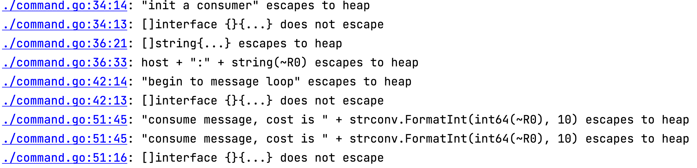

### TLDR

大部分场景应该使用值传递。

### 正文

Go 的文档指出

```
Programs using times should typically store and pass them as values, not pointers. That is, time variables and struct fields should be of type time.Time, not *time.Time. A Time value can be used by multiple goroutines simultaneously.
```

翻译一下就是

程序使用times典型场景应该把它们当做值传递，而非指针。也就是说time变量及结构体field应该为`time.Time`，而不是`*time.Time`。Time值是协程安全的。之所以说`typically`，是因为有着那么不`typically`的场景，比如你想在方法内修改原来的`time.Time`对象这种场景（很少见）。

`time.Time`是一个较小的对象，把它作为值传递是完全合理的。传递指针而不是值的很重要的一个原因是避免昂贵的拷贝动作。但是传递指针也会给gc带来一些额外的开销，如逃逸分析等。

值得一提的是，你可以通过`go build -gcflags="-m"`来判断变量在堆中还是在栈中。



`time.Time`在我的MBP上只有24个字节。附上几个简单类型的字节数

```
byte size is  1
int32 size is  4
int size is  8
int64 size is  8
float32 size is  4
float64 size is  8
time size is  24
```

测试程序

```go
package demo_base

import (
	"fmt"
	"testing"
	"time"
	"unsafe"
)

func TestSize(t *testing.T) {
	{
		var x byte = 0
		fmt.Println("byte size is ", unsafe.Sizeof(x))
	}
	{
		var x int32 = 0
		fmt.Println("int32 size is ", unsafe.Sizeof(x))
	}
	{
		var x int = 0
		fmt.Println("int size is ", unsafe.Sizeof(x))
	}
	{
		var x int64 = 0
		fmt.Println("int64 size is ", unsafe.Sizeof(x))
	}
	{
		var x float32 = 0
		fmt.Println("float32 size is ", unsafe.Sizeof(x))
	}
	{
		var x float64 = 0
		fmt.Println("float64 size is ", unsafe.Sizeof(x))
	}
	{
		t := time.Now()
		fmt.Println("time size is ", unsafe.Sizeof(t))
	}
}
```
