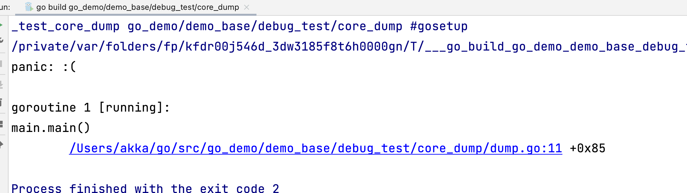
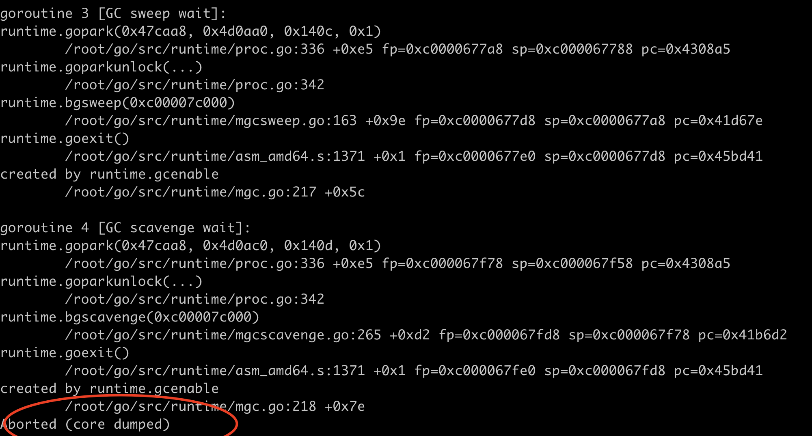
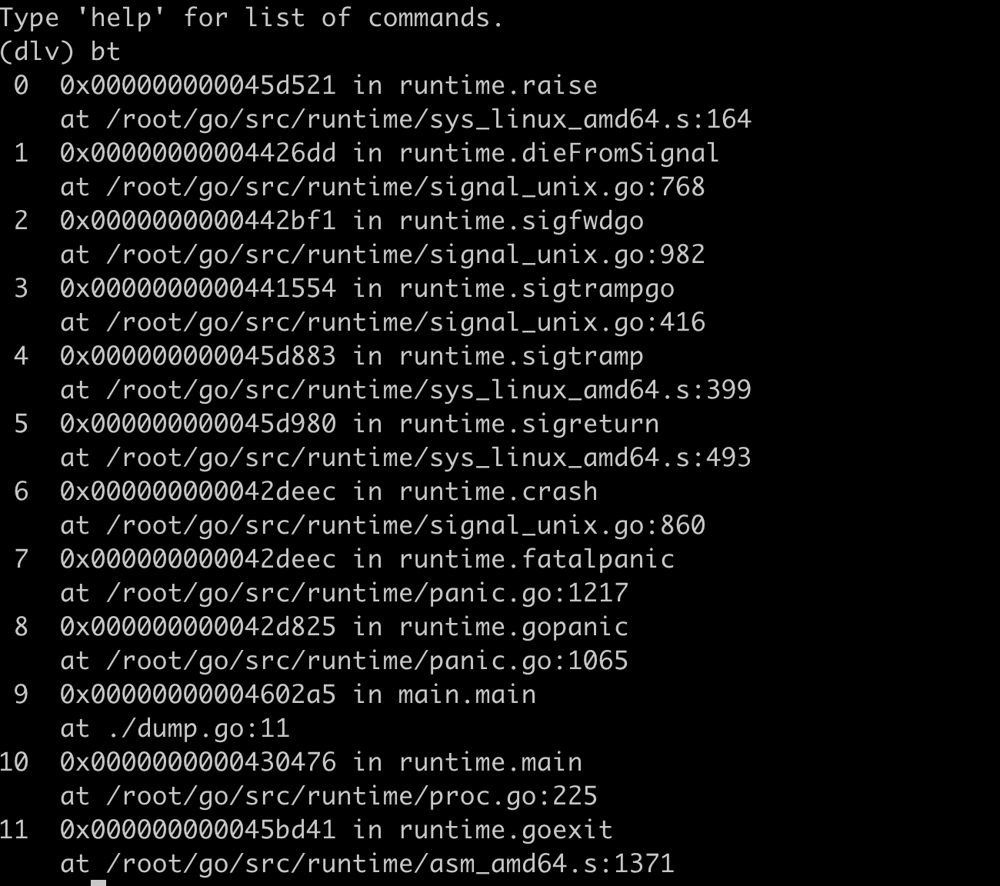
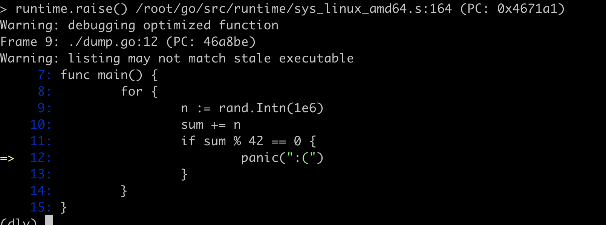
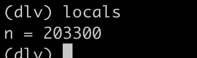
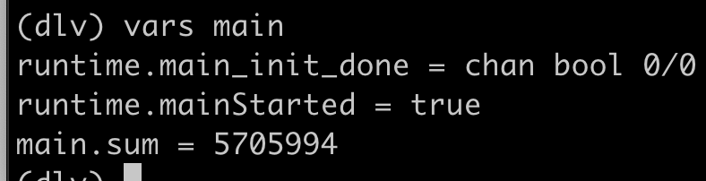

# 使用Delve对Go程序进行Debug

## 翻译自

https://medium.com/a-journey-with-go/go-debugging-with-delve-core-dumps-384145b2e8d9

CoreDump是异常退出程序的内存快照。可以用来死后debug来找出crash发生的原因以及牵连的变量。通过`GOTRACEBACK`，`Go`提供了控制程序崩溃时的输出。变量还可以强制生成CoreDump，使得debug成为可能。

## GOTRACEBACK

`GOTRACEBACK`控制着程序崩溃时的输出，可以取以下的值

- `none` 不展示任何协程堆栈追踪
- `single` 默认选项，打印当前协程堆栈
- `all` 展示所有用户创建的协程堆栈
- `system` 展示所有协程堆栈，包括go运行时
- `crash` 和`system`相似，不过同时会生成core dump文件

最后一个选项给了我们在crash的时候，debug程序的能力。如果您没有获得足够的日志，或者崩溃不可重现，这可能是一个不错的选择。 让我们以下面的程序为例

```go
package main

import "math/rand"

func main() {
	for {
		var sum int
		n := rand.Intn(1e6)
		sum += n
		if sum % 42 == 0 {
			panic(":(")
		}
	}
}
```

程序将很快`crash`



我们不能从堆栈看出来什么值导致了crash。添加日志可能是一个解决方案，但是我们不是所有情况都知道在哪里添加日志。当一个问题无法重现时，添加日志只是一个后知后觉，不断寻找的思路。

让我们加上环境变量`GOTRACEBACK=crash`。由于所有协程和runtime堆栈都会输出，输出更加详细。并且我们还有了coredump文件

```bash
go build -gcflags=all="-N -l" .
export GOTRACEBACK=crash
./core_dump
# 如果您的core_dump没有生成，可能是coredump size配置为0，如下命令将coredump配置为1MB大小
ulimit -c 1048576
```

我们有



Core-dump文件可被Go delve或GDB分析

## Delve

安装Delve

```bash
go install github.com/go-delve/delve/cmd/dlv@latest
```

Delve 是用 Go 编写的 Go 程序的调试器。 它允许通过在用户代码和运行时的任何位置添加断点来逐步调试，甚至可以使用将二进制文件和CoreDump作为参数的命令 dlv core 调试CoreDump。

通过`dlv core core_dump core.2716`来调试coredump。然后通过`bt`命令打印堆栈，并且展示程序造成的`panic`。



我们看到7发生了panic，然后通过`frame 9`查看第9个堆栈



这展示了panic时的代码，然后通过命令`locals`打印本地变量，帮助我们搞明白什么变量参与了`crash`



随机生成的n的值是203300。sum呢？通过`vars main`来查看main包里的`sum`的值



通过这个就可以推理出，sum的和刚好整除42，导致程序panic
