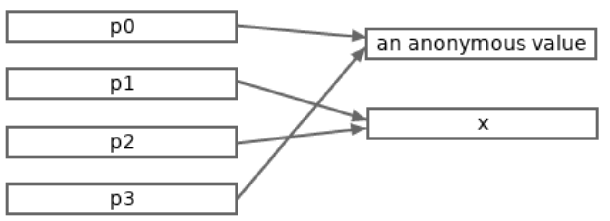

# Go中的指针

## 翻译自

https://go101.org/article/pointer.html

尽管Go吸收了很多其他语言的特性，但Go总体来说是一个C家族语言。其中一个证据就是Go也支持指针。Go指针和C指针在许多方面非常相似，但其中也有一些不同。本文将会列举Go指针的概念和细节。

## Memory Address 内存地址

内存地址指的是整个系统管理（通常由操作系统管理）的内存空间中的偏移量（byte的个数）。

通常，内存地址被存储成一个无符号（整型）字。字长在32位机器上是4字节，在64位机器上是8字节。所以理论最大寻址范围，在32位机器上是
`2^32`，也就是4GB。在64位机器上是`2^64`，也就是16EB（1EB=1024PB，1PB=1024TB，1TB=1024GB）。

内存地址通常用Hex表达模式书写，如`0x1234CDEF`

## Value Address 值地址

值的地址代表这个值在内存段中的起始地址

## 什么是指针？

指针是Go的一种类型。指针用来存储内存地址。跟C语言不同，为了安全的原因，Go指针上有一些限制。

## Go指针类型和值

在Go中，未定义的指针类型可以被写成`*T`，`T`可以是任意类型。`T`是`*T`的基础类型。

我们也可以自定义指针类型，通常由于未定义指针类型拥有更好的可读性，不推荐使用自定义指针类型。

如果一个定义的指针类型的底层类型（underlying type）是`*T`，那么该指针的基础类型是`T`。这个基础类型相同的指针也是同一种类型。样例

```go
// 未定义的指针类型，基础类型是int
*int
// 未定义的指针类型，基础类型是*int
**int 

// Ptr是一个定义指针类型，基础类型是int
type Ptr *int 
// PP是一个定义指针类型，基础类型是Ptr
type PP *Ptr
```

指针的零值是`nil`，不存储任何地址。

基础类型为`T`的指针仅能存储`T`类型值的地址

## 如何获得指针值、什么是可寻址值

有两种方式可用于获取非nil的指针值

- go内置的`new`函数，可以分配任何类型的内存。`new(T)`在内存中分配一个`T`值的空间，然后返回`T`值的地址。分配的值是`T`
  类型的零值。返回的地址就是一个`T`类型的指针
- 我们还可以直接获取可寻址值的地址。对于一个可寻址类型`T`的值`t`，我们可以使用`&t`来获取`t`的地址，`&操作符用来获取值地址。

通常上来说，可寻址值意味着该值存放在内存中的某处。现在，我们只需要知道任何变量都是可寻址的，同时常数、函数调用和显示转换的结果是不可寻址的。变量声明的时候，Go运行时将会为这个变量分配一片内存，这片内存的开始地址就是这个变量的地址。

## Pointer Derefernece 指针解引用

对于一个基础类型为`T`的指针类型`p`，你如何获取指针中存储的值（或者说，被指针指向的值）？只需要使用表达式`*p`，`*`
被称为解引用操作符。指针的解引用是取地址的逆运算。`*p`的返回值是`T`类型，也就是`p`的基础类型。

对`nil`指针进行解引用会导致运行时异常。

这个程序展示了地址获取和解引用的例子:

```go
package main

import "fmt"

func main() {
	// p0指向int的零值
	p0 := new(int)
	// hex表达的地址
	fmt.Println(p0)
	// 0
	fmt.Println(*p0)

	// x是p0指向值的拷贝
	x := *p0
	// 都取得x的地址
	// x, *p1, *p2 的值相同
	p1, p2 := &x, &x
	// true
	fmt.Println(p1 == p2)
	// false
	fmt.Println(p0 == p1)
	// p3 和 p0 也存储相同的地址
	p3 := &*p0
	fmt.Println(p0 == p3)
	*p0, *p1 = 123, 789
	// 789 789 123
	fmt.Println(*p2, x, *p3)

	// int, int
	fmt.Printf("%T, %T \n", *p0, x)
	// *int, *int
	fmt.Printf("%T, %T \n", p0, p1)
}
```

下图揭示了上面程序存储的值间关系



## 为什么我们需要指针

让我们先来看一个样例程序

```go
package main

import "fmt"

func double(x int) {
	x += x
}

func main() {
	var a = 3
	double(a)
	fmt.Println(a) // 3
}
```

上例中的`double`函数预期对输入值进行双倍处理。但是它失败了。为什么？因为所有值的分配，包括函数参数的传递，都是值拷贝。`double`
函数操作的`x`只是`a`变量的拷贝，而不是`a`变量。

修复上例的一种方式是让double函数返回一个新值。但这并不是所有场景都适用。下例展示了另一种使用指针的方案

```go
package main

import "fmt"

func double(x *int) {
	*x += *x
    // 这行只为了解释用途
	x = nil 
}

func main() {
	var a = 3
	double(&a)
	fmt.Println(a) // 6
	p := &a
	double(p)
	fmt.Println(a, p == nil) // 12 false
}
```

我们可以发现，通过将参数改为指针类型，传递的指针参数`&a`和它的拷贝`x`都指向相同的值，所以在`*x`上进行的修改，在`a`
上也体现了出来。同时，因为参数传递都是值拷贝，上面将`x`赋值为nil，在p上也不生效。

简而言之，指针提供了操作值的间接方式。大部分语言没有指针的概念。然而，指针的概念只是隐藏在了语言的其他概念中。

## 返回局部变量指针在Go是安全的

和C语言不通，Go支持垃圾回收，所以返回局部变量的指针在Go中是绝对安全的

```go
func newInt() *int {
	a := 3
	return &a
}
```

## Go指针的限制

为了安全原因，相比C语言来说，Go在指针上做了一些限制。通过这些限制，Go保持了指针带来的收益，并且避免了危险的指针使用。

### Go指针不支持算术操作

在Go中，指针不能进行算术运算。对于指针`p`，`p++`和`p-2`都是非法的。

如果指针p指向一个数值，编译器会将*p++识别为一个合法的语句，并解析为`(*p)++`。换句话说，`*p`操作的优先级高于`++`、`--`操作符。样例

```go
package main

import "fmt"

func main() {
	a := int64(5)
	p := &a

	// 下面的语句无法编译
	/*
	p++
	p = (&a) + 8
	*/

	*p++
	fmt.Println(*p, a)   // 6 6
	fmt.Println(p == &a) // true

	*&a++
	*&*&a++
	**&p++
	*&*p++
	fmt.Println(*p, a) // 10 10
}
```

### 指针值不能转换为任意的指针类型

在Go中，`T1`的指针值可以被隐式或是显示地转换为`T2`，需要满足如下两个条件

- `T1`和`T2`的底层类型相同（忽略结构体Tag）。特别地，如果`T1`和`T2`都是未定义类型并且它们的底层类型相同（考虑结构体Tag），可以进行隐式转换。
- `T1`和`T2`都是未定义指针类型，并且它们的基础类型的底层类型相同（忽略结构体Tag）

举个例子，有如下类型

```go
type MyInt int64
type Ta *int64
type Tb *MyInt
```

有如下事实

- `*int64`类型的值可以被隐式转换为`Ta`类型，反过来也是可以的。因为它们的底层类型都是`*int64`
- `*MyInt`类型的值可以被隐式转换为`Tb`类型，反过来也行。因为它们的底层类型都是`*MyInt`
- `*MyInt`类型的值可以被限制转换为`*int64`，反之亦然。因为它们的基础类型的底层类型都是`int64`
- 即使是显示转换，`Ta`类型的值也不能直接转换为`Tb`。因为`Ta`和底层类型和`Tb`不同，并且都是定义指针类型。不过可以进行连续几次转换，将
  `Ta`类型的`pa`间接转化为`Tb`类型。 先将`pa`转化为`*int64`类型（因为基础类型的底层类型都是`int64`），再将`*int64`类型转换为
  `*MyInt`类型，再将`*MyInt`类型转化为`*Tb`类型。`Tb((*MyInt)((*int64)(pa)))`

上面的值通过任何安全的手段，都不能转化为类型`*uint64`

### 任意两个指针的值不能比较

在Go中，指针可以通过`==`和`!=`符号比较。如果满足如下任意一个条件，那么两个Go指针的值可以进行比较

- 两个Go指针类型一致
- 指针值可以隐式转换为另一类型
- 两个指针中的一个且仅一个用无类型 nil 标识符表示。

```go
package main

func main() {
	type MyInt int64
	type Ta    *int64
	type Tb    *MyInt

	// 4个不同类型的指针零值
	var pa0 Ta
	var pa1 *int64
	var pb0 Tb
	var pb1 *MyInt

	// 下面这6行都可以正常编译
	// 比较结果都为true
    // 指针可以隐式转换
	_ = pa0 == pa1
    // 指针类型一致
	_ = pb0 == pb1
	_ = pa0 == nil
	_ = pa1 == nil
	_ = pb0 == nil
	_ = pb1 == nil

	// 这三行都不能正常编译
	/*
	_ = pa0 == pb0
	_ = pa1 == pb1
	_ = pa0 == Tb(nil)
	*/
}
```

### 指针值不能赋值给其他指针类型

指针值互相赋值的条件和比较的条件一样

## 有手段打破Go对指针的限制

unsafe 标准包提供的机制（特别是 unsafe.Pointer 类型）可以用来打破 Go 中对指针的限制。 unsafe.Pointer 类型类似于 C 中的
void*。一般不推荐使用`unsafe`。
