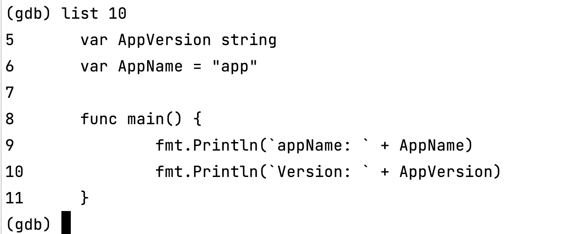
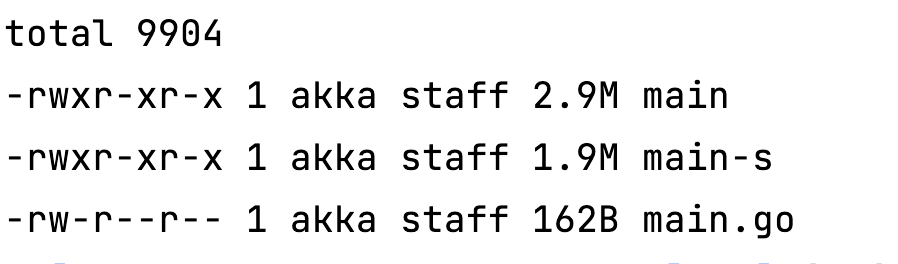
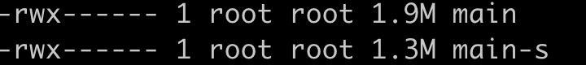

# Go符号表简介

参考资料

https://medium.com/a-journey-with-go/go-how-to-take-advantage-of-the-symbols-table-360dd52269e5

在参考资料的基础上，尝试复写已存在的变量，并更新Go版本到1.16。

符号表由编译器创建维护，用于存储程序相关的信息，比如函数或全局变量。

## 符号表

每个由Go编译的二进制程序默认包含符号表。举个例子

```go
package main

import "fmt"

var AppVersion string

func main() {
	fmt.Println(`Version: ` + AppVersion)
}
```

```bash
go build . -o main
nm main
```

符号表输出非常大，截取其中几行，如下

```
000000000114b000 s _main..inittask
000000000115fc10 b _main.AppVersion
00000000010a3120 t _main.main
0000000001158d10 d _runtime.buildVersion
```

符号前面用`b`标识是未初始化的数据。我们之前的变量`AppVersion`的确也没有初始化。`d`代表已初始化的数据。`t`代表文字符号，由这两者组成函数。

`go`也包装了`nm`命令，使用`go tool nm`可以得到相同的结果。

## 自定义变量

运行命令`go build`时，将会执行两个阶段：编译和链接。链接阶段从编译阶段的产物中派生出二进制文件。为了实现这一目标，链接器使用符号表将符号重新定位到最终的二进制文件。

Go允许我们通过-X命令来复写符号表。这是例子

```bash
go build -o ex -ldflags="-X main.AppVersion=v1.0.0"
```

重新运行程序，程序打印

```
Version: v1.0.0
```

重新运行`nm`命令，发现变量已经是初始化状态了

```
0000000001158c80 d _main.AppVersion
```

该方式不仅可以复写未初始化的变量，同时也可以复现已初始化的变量

```
go build -o ex -ldflags="-X main.AppVersion=v1.0.0,main.AppName=k8s"
```

感兴趣的朋友可以用这个程序试一下输出是什么

```go
package main

import "fmt"

var AppVersion string
var AppName = "app"

func main()
	fmt.Println(`appName: ` + AppName)
	fmt.Println(`Version: ` + AppVersion)
}
```

## Debug

符号表的目的是确保使用的标识符在使用之前已经得到了很好地声明。这意味着一旦程序构建完成，它就不再需要该表了。但是，默认情况下，出于调试目的，符号表嵌入在Go二进制文件中。在了解如何从二进制文件中删除它之前，让我们了解如何利用它。使用`go build`构建应用程序

```bash
go build -gcflags "-N -l" -ldflags="-compressdwarf=false -X main.AppVersion=v1.0.0 -X main.AppName=k8s" main.go
```

上述参数解释

- Go 1.11 之后，为了压缩二进制文件的大小，debug信息被压缩了，OSX的gdb不能识别压缩的DWARF信息
- -N代表禁止优化，不要在生产环境上开启，此处仅为演示使用
- -l参数代表禁止内联，也建议不要在生产环境上开启，此处仅为演示使用

```bash
gdb main
```



我们可以通过`-s`去掉符号表信息

```bash
go build -gcflags "-N -l" -ldflags="-s -X main.AppVersion=v1.0.0 -X main.AppName=k8s" main.go
```

gdb就看不到其他信息了


## 二进制文件大小

去掉符号表，会使debug变得更加困难，但可以有效降低文件大小。MAC上两个文件的差异是



```bash
go build -gcflags "-N -l" -ldflags="-compressdwarf=false -X main.AppVersion=v1.0.0 -X main.AppName=k8s" main.go
go build -gcflags "-N -l" -ldflags="-s -X main.AppVersion=v1.0.0 -X main.AppName=k8s" -o main-s main.go
```

如果在linux上，可以开启压缩dwarf特性，差距差不多在



百分之20~百分之30之间
