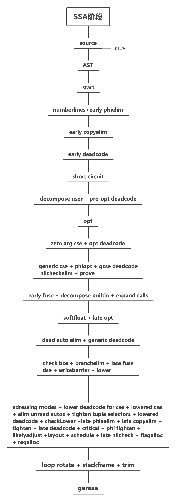

## 参考资料

- https://github.com/golang/go/blob/master/src/cmd/compile/README.md
- https://medium.com/a-journey-with-go/go-overview-of-the-compiler-4e5a153ca889
- 基于Golang 1.16版本

## 阶段

Go编译器由四个阶段组成，可以分为两类

- frontend前端：这一阶段对源码进行语法解析，并生成AST
- backend后端：这一阶段将把transform the representation of the source code into machine code, 并进行数项优化

为了更好地理解每个阶段，让我们使用如下的示例程序

```go
package main

func main() {
	a := 1
	b := 2
	if true {
		add(a, b)
	}
}

func add(a, b int) {
	println(a + b)
}
```

## P1 解析

- `cmd/compile/internal/syntax` 词法，解析器，语法树

第一个阶段非常简单直接：

第一阶段，源码经过词法分析、语法解析，对每个源码文件，都构造出相应的语法树

Lexer首先运行，把源代码转化为词法单元。我们可以通过这个程序来自己模拟运行Lexer

```go
package main

import (
	"fmt"
	"go/scanner"
	"go/token"
	"io/ioutil"
)

func main() {
	// src is the input that we want to tokenize.
	src, _ := ioutil.ReadFile(`main.go`)

	// Initialize the scanner
	var s scanner.Scanner
	// positions are relative to fSet
	fSet := token.NewFileSet()
	file := fSet.AddFile("", fSet.Base(), len(src))
	// nil means no error handler
	s.Init(file, src, nil, scanner.ScanComments)

	// Repeated calls to Scan yield the token sequence found in the input
	for {
		pos, tok, lit := s.Scan()
		if tok == token.EOF {
			break
		}
		fmt.Printf("%s\t%s\t%q\n", fSet.Position(pos), tok, lit)
	}
}

```

截选输出如下:

```
1:1	package	"package"
1:9	IDENT	"main"
1:13	;	"\n"
3:1	func	"func"
3:6	IDENT	"main"
3:10	(	""
3:11	)	""
3:13	{	""
4:2	IDENT	"a"
4:4	:=	""
4:7	INT	"1"
4:8	;	"\n"
5:2	IDENT	"b"
5:4	:=	""
5:7	INT	"2"
5:8	;	"\n"
6:2	if	"if"
6:5	IDENT	"true"
6:10	{	""
7:3	IDENT	"add"
7:6	(	""
7:7	IDENT	"a"
```

一旦经过词法化，源码被解析构造成语法树。

语法树还包含了代码位置信息，该信息可用于debug或错误报告。

## P2 类型检查和AST转化

- `cmd/compile/internal/gc` 创建编译器AST，类型检查，AST转换

AST是类型检查的。第一个步骤就是名字解析和类型推断，确定对象和标识符的对应关系，表达式是何种类型。Type-checking这一阶段还引入了额外的确定性步骤，例如，“声明未使用”、函数是否终止等。

还有一些确定的转换也在AST阶段完成。一些节点会根据类型信息进行细化，比如字符串加法从算术加法节点中分离出来。其他一些示例是不可达代码清除、内联函数调用、逃逸分析。

转化到AST的步骤可以通过命令`go tool compile -w`来展示出来，如果加上-l，则可以禁用内联。在我们的样例代码中，如果不禁用内联，add方法会被内联掉。我们可以分别使用`go tool compile -w example.o`和`go tool compile -w -l example.o`进行对比

禁用了内联的命令，会输出这样的AST


没禁用内联的命令则不会生成，这里可以看出来，编译器做了内联的优化。

## SSA 生成

### SSA 概念

- `cmd/compile/internal/gc` AST转化到SSA
- `cmd/compile/internal/ssa` SSA阶段和规则

在这个阶段，AST转化为SSA的格式，这是一种具有特定属性的更底层的IR，可以更轻松地在上面进行优化并最终生成机器码。阶段应用了内联函数。这些是编译器被教导要根据具体情况用高度优化的代码替换的特殊函数。在AST到SSA的转换期间，某些确定的节点也被降低为更简单的组件，使得编译器的其余部分可以使用它们。例如，内置的copy函数被内存移动取代、范围循环被重写为for循环。由于历史原因，其中一些目前在SSA转换之前发生，但长期计划是将它们全部移到这里。

然后，应用一系列的、机器无关的阶段和规则。这些不涉及任何的计算机架构，因此可以在任何`GOARCH`变体上运行。

这些通用的阶段包括：不可达代码清除、删除不需要的nil检查、移除无用的分支。

通用的重写规则主要涉及表达式，包括表达式替换为常量、优化乘法和浮点运算等。

SSA code可以用这个命令`dump`并展示出来

```bash
GOSSAFUNC=main go tool compile main.go && open ssa.html
```

### SSA阶段



### SSA优化解析

start Tab上生成了最开始的SSA


变量 a 和 b 与 if 条件一起在此处突出显示，以便我们稍后查看这些行是如何更改的。 代码还向我们展示了编译器如何管理 `println`
函数，它被分解为 4 个步骤：`printlock`、`printint`、`printnl`、`printunlock`。 编译器会自动为我们加锁，并根据参数的类型调用相关方法正确打印。
在我们的示例中，由于 a 和 b 在编译时已知，编译器可以计算最终结果并将变量标记为不再需要。  `opt`阶段 会优化这部分：


这个阶段v7被优化计算成了3。并且接下来，因为v4和v5已经没有人声明使用，在`opt deadcode`阶段，v4和v5也会被清除掉


等待所有阶段完成之后，Go编译器将会生成中间汇编语言


下一阶段会将汇编语言转换为二进制文件

## 机器代码生成

- `cmd/compile/internal/ssa` SSA "lowering" 和 特定arch的阶段
- `cmd/internal/obj` 机器语言生成

机器相关的编译阶段从"lowering"阶段开始，它将通用的值替换成机器特定的变体。例如，在 amd64 内存操作数上是可能的，因此可以组合许多加载-存储操作。

注意这些底层阶段执行了所有机器特定的规则，所以也应用了很多优化。

一旦SSA被"lowered"到更特定的目标架构，就开始执行最终的代码优化。这包括另一个不可达代码清除阶段、将值更靠近它们的使用者、移除从未使用的本地变量、寄存器分配。

还有一部分重要工作包括堆栈帧布局，它将堆栈偏移分配给局部变量，以及指针存活分析，它计算每个 GC 安全点上哪些堆栈上指针是活跃的。

在 SSA 生成阶段结束时，Go 函数已转换为一系列 obj.Prog 指令。 这些被传递给汇编器（cmd/internal/obj），汇编器将它们转换成机器代码并写出最终的目标文件。
目标文件还将包含反射数据、导出数据和调试信息。

我们可以使用`go tool objdump $binary`来查看汇编代码。当compile的`.o`文件生成之后，可以通过`go tool link`来生成二进制可运行文件。
