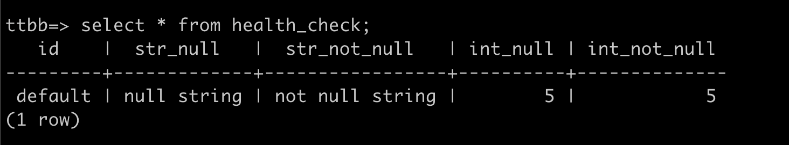
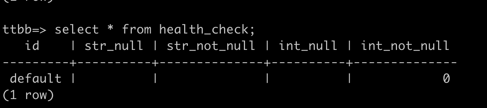
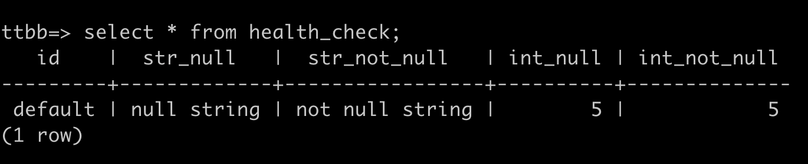
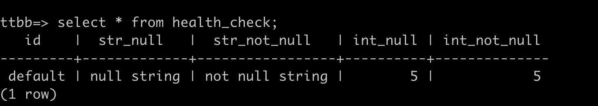
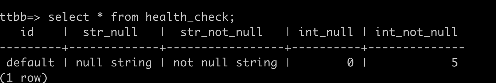

前几天，我的同事碰到了一个问题，是关于**GoFrame** 框架中数据字段的更新问题，数据中有一个`status`字段，他本来不想更新，但是却更新成了0。

相信看到描述，已经有经验丰富的专家可以猜到是数据部分更新导致的问题。

没错，就是因为数据库部分更新，把0这个值当成了需要更新的值刷新到了数据库中。

中间是复现问题的流程及代码细节，不感兴趣的可以直接拉到最后

## 复现问题

### 创建一个数据表

```sql
CREATE TABLE health_check
(
    id           VARCHAR(50) PRIMARY KEY,
    str_null     VARCHAR(50) NULL,
    str_not_null VARCHAR(50) NOT NULL,
    int_null     INT NULL,
    int_not_null INT         NOT NULL
)
```

### 插入一条数据



### 数据库module的声明

```go
type HealthCheck struct {
	Id         string  `orm:"id"`
	StrNull    *string `orm:"str_null"`
	StrNotNull string  `orm:"str_not_null"`
	IntNull    *int    `orm:"int_null"`
	IntNotNull int     `orm:"int_not_null"`
}
```

### 更新数据

这时，只想把IntNotNull字段更新成0

```go
func UpdateHealth() error {
	table := g.DB().Schema(healthDb).Table(healthTable)
	healthCheck := &module.HealthCheck{}
	healthCheck.Id = config.HealthCheckId
	i := 6
	healthCheck.IntNull = &i
	table.Data(healthCheck).Where("id", config.HealthCheckId)
	result, err := table.Update()
	glog.Info(result)
	return err
}
```

### 执行完毕之后

除了我要更新的`int_not_null`字段，其他值都被修改了



这肯定不是我们想要的效果，我们只想更新一个字段。

这个时候GoFrame框架提供了`OmitEmpty`方法，可以忽略0值，也就是达到没传值不修改的效果，让我们加上`OmitEmpty`试试

```go
table := g.DB().Schema(healthDb).Table(healthTable).OmitEmpty()
	healthCheck := &module.HealthCheck{}
	healthCheck.Id = config.HealthCheckId
	i := 0
	healthCheck.IntNotNull = i
	table.Data(healthCheck).Where("id", config.HealthCheckId)
	result, err := table.Update()
	glog.Info(result)
	return err
```

重新导入数据



操作update



可是什么都没有更新，原来OmitEmpty把数字0当做是0值，没有进行更新，那么要怎么写呢，答案是使用`*int`类型

让我们使用定位为`*int`类型的字段来更新一下`int_not_null`，代码如下

```go
func UpdateHealth() error {
	table := g.DB().Schema(healthDb).Table(healthTable).OmitEmpty()
	healthCheck := &module.HealthCheck{}
	healthCheck.Id = config.HealthCheckId
	i := 0
	healthCheck.IntNull = &i
	table.Data(healthCheck).Where("id", config.HealthCheckId)
	result, err := table.Update()
	glog.Info(result)
	return err
}
```

再次操作Update



效果达成.

## 总结

- GoFrame的框架默认会对全量字段进行更新，无论你的字段有没有复制
- OmitEmpty可以让框架跳过空值，但是int类型的0，也会跳过
- 如果你还是想用`OmitEmpty`跳过空值的情况下，写入0，请使用`*int`类型
