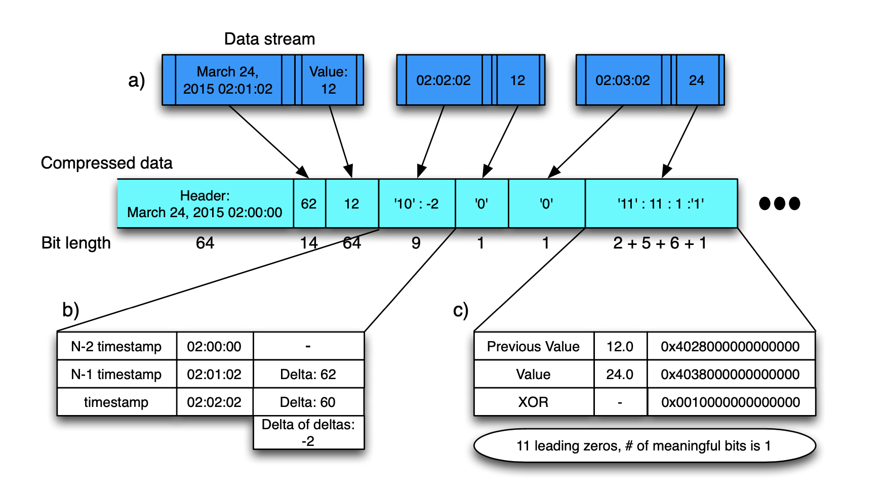
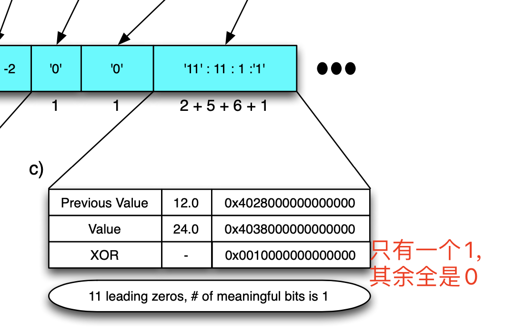
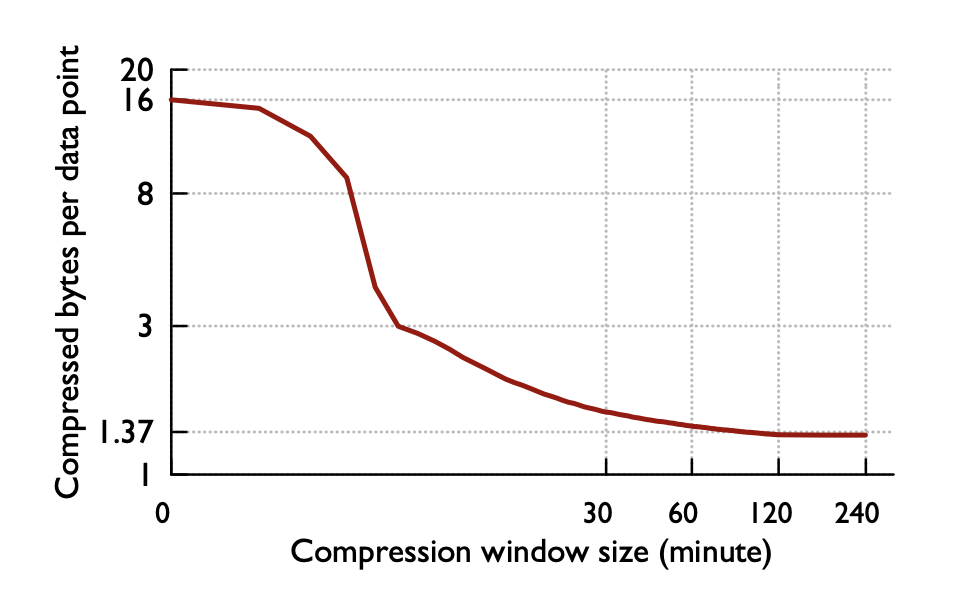

用了几个小时读完了Gorilla这篇经典的 [时序数据库论文](http://www.vldb.org/pvldb/vol8/p1816-teller.pdf)
，prometheus的时序数据库在很多地方都参考了这篇论文。以此文总结一下读后感，非论文翻译。截图基本都出自于论文。本论文可以解答如下的普罗问题

### 为什么普罗不支持字符串类型，只支持double作为监控值

为了压缩数据，普罗使用了高效的用于double的压缩算法。

### 为什么普罗的默认的落盘间隔是2个小时

根据这篇论文，2个小时或以上的block的压缩比更小

### 普罗data盘里的文件都是用来干啥的？

有索引文件、数据文件、恢复日志等

顺带一提，Gorilla是大猩猩的意思，也是银魂中近藤勋的绰号。

Facebook因为从HBase读取时间序列太慢，再加上扩展性已经无法满足需求。Facebook对时延迟要求如此之低，Facebook否决了所有依赖磁盘做数据存储查询的方案，希望数据查询从内存返回。最终从论文看来，查询比HBase快了300多倍。

## 数据的编码方式

Facebook想要把数据都放到内存中，prometheus号称单机可处理数百万序列，如果按照业务代码的模式书写，三百万序列在1个小时内要占用多少内存呢？时间戳long值4byte，字符串名称加维度20byte，值算double类型，8byte，总共是32byte，两个小时，假设1分钟一个点，共有120个点。共1.2G内存。仅仅纯数据就占用了1.2G内存。Facebook基于如下两个监控数据的特点，对数据进行了高效压缩，缩小12倍原数据的大小

- 大多数监控数据往往相差固定的时间间隔，而其他监控数据，虽然不是严格固定间隔，也基本接近固定的时间间隔。这个比例在Facebook的监控数据是24：1，即百分之96的数据都是固定间隔上报的
- 大多数监控数据监控的值变化缓慢

基于这两点假设，它们对时间戳和值提出了两种压缩算法

### 时间戳

对时间戳的差值的差值进行存储，压缩空间大小。

先存储这一块的起始时间`2015 02:00:00`，对于第一个数值`2015 02:01:02`记录差值62，对下一个值`2015 02:02:02`，其的差值是60，差值的差值是
`60-62=-2`，只存储-2即可，这样子大大节约了存储时间戳的空间

### 监控值

监控值采用异或的手法进行压缩，会得到0很多的二进制串，再通过合理的编码，降低总字节数。根据论文，有超过一半的数据相较上一个值没什么变化，使用一个字节即可存储

那么这样一个`block`里面应该存储多久的数据呢？这是一个权衡，如果存储很久的数据，则每次查询都需要查询出很large的值，才能获得结果，如果存储数据较短，则难以达到很高的压缩比。最终他们选择了两小时。

对于普罗里的指标名称及维度，在普罗里，一个指标名称加上一组维度称为一个时间序列，Gorilla论文并没有提及维度的概念，仅仅使用名称。这块普罗实际和Gorilla都通过码表的方式，通过将字符串映射为一个longId，来大大降低存储的字节数。

对于普罗的查询流程，是 指标名称+维度=》一组时间序列，然后分别查询其中的值。Gorilla自身没有包装这一个流程，需要客户端组网自己想要查询的时间序列列表。

基于时序监控系统里的，新数据比旧数据关键，Gorilla也会将旧数据落盘。

## Gorilla的高可用

### 单机可靠性

Facebook调查了自己之前的监控系统，发现百分之85以上请求都只查询了26个小时以内的数据。在Gorilla的第一版中，他们决定只支持26个小时数据的查询，将2小时的数据放在内存中。超过2小时的数据，会存储在高可用磁盘上，如GlusterFs、HDFS等。2小时以内的数据，有一个log用来做重启时恢复数据来保证可靠性。这样就保证了单机重启的可靠性
注：这个日志不保证能恢复所有的数据，允许异常场景下有数据丢失

### Region宕机的可靠性

对于每一个Gorilla，都会主备部署一个对等的位于不同Region的实例，这两个实例都会存储数据，但数据并不完全一致。对于用户来说，他们接入距离他们最近的Gorilla实例。一旦其中一个Gorilla宕机，另一个Gorilla将会接管它的工作。为了保证数据的准确，待其恢复后26小时（拥有了它该拥有的全量数据），才可以接受业务请求。

## Gorilla的扩展

Gorilla选择了水平扩展的方式，根据指标名做分区，分区到不同的主备`Gorilla`

论文还提到了一些其他有用的信息

## 监控时序数据的特点

### 写请求占大多数

读请求很少，人工读取，或者一些自动化告警系统

### 注重状态的变化

内存突然上升，乃至于一个指标值的导数突然上升等

## 监控系统的目标

### 高可用

出现问题的时候，监控系统和业务系统同时宕机是什么体验？是一把黑的体验。

### 低延迟

### 可容错

容忍单点故障灯

### 可扩展

随着业务系统的扩展，监控系统也需要扩展
