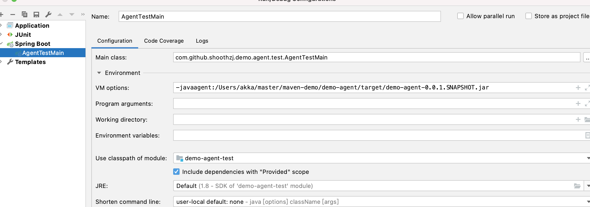

## 创建一个java maven工程

### Step1 添加bytebuddy及日志依赖

```xml
<dependencies>
        <dependency>
            <groupId>org.springframework</groupId>
            <artifactId>spring-web</artifactId>
            <version>5.2.9.RELEASE</version>
            <scope>provided</scope>
        </dependency>

        <!-- 字节码 注入 -->
        <dependency>
            <groupId>net.bytebuddy</groupId>
            <artifactId>byte-buddy</artifactId>
            <version>1.10.19</version>
        </dependency>

        <dependency>
            <groupId>org.slf4j</groupId>
            <artifactId>slf4j-api</artifactId>
            <version>1.7.30</version>
            <scope>provided</scope>
        </dependency>
    </dependencies>
```
### Step2 书写Agent的入口处

agent有两个入口函数，分别是premain和agentmain，用于两种启动场景-javaagent启动场景和attach启动场景,我们这里先书写-javaagent启动场景

```java
package com.github.hezhangjian.demo.agent;

import net.bytebuddy.ByteBuddy;
import net.bytebuddy.agent.builder.AgentBuilder;
import net.bytebuddy.matcher.ElementMatchers;
import org.slf4j.Logger;
import org.slf4j.LoggerFactory;

import java.lang.instrument.Instrumentation;

import static net.bytebuddy.matcher.ElementMatchers.nameStartsWith;

/**
 * @author hezhangjian
 */
public class AgentMain {

    private static final Logger log = LoggerFactory.getLogger(AgentMain.class);

    /**
     * call on -javaagnet
     * @param agentArgs
     * @param inst
     */
    public static void premain(String agentArgs, Instrumentation inst) {
        System.out.println("start agent premain");
        final ByteBuddy byteBuddy = new ByteBuddy();
        new AgentBuilder.Default(byteBuddy)
                //这些类都是常见的无需切面注入的类,忽略掉可以提升agent加载速度
                .ignore(nameStartsWith("net.bytebuddy.")
                        .or(nameStartsWith("org.slf4j.")
                        .or(nameStartsWith("org.apache.logging.")
                        .or(nameStartsWith("org.groovy."))
                        .or(nameStartsWith("javassist"))
                        .or(nameStartsWith(".asm."))
                        .or(nameStartsWith("sun.reflect"))
                        .or(ElementMatchers.isSynthetic()))))
                //你想切面的包名
                .type(ElementMatchers.nameStartsWith("com.github.hezhangjian.agent.test"))
                .transform(new AgentTransformer())
                .with(AgentBuilder.RedefinitionStrategy.RETRANSFORMATION)
                .installOn(inst);
    }

    public static void agentmain(String agentArgs, Instrumentation inst) {
        System.out.println("start agent main");
    }

}
```
这个时候Transform先书写一个空实现

> ```java
> package com.github.hezhangjian.demo.agent;
> 
> import net.bytebuddy.agent.builder.AgentBuilder;
> import net.bytebuddy.description.type.TypeDescription;
> import net.bytebuddy.dynamic.DynamicType;
> import net.bytebuddy.utility.JavaModule;
> 
> /**
>  * @author hezhangjian
>  */
> public class AgentTransformer implements AgentBuilder.Transformer{
> 
>     @Override
>     public DynamicType.Builder<?> transform(DynamicType.Builder<?> builder, TypeDescription typeDescription, ClassLoader classLoader, JavaModule javaModule) {
>         return builder;
>     }
> 
> }
> 
> ```
>
> 

### Step3 maven pom文件配置打包

> ```xml
> <build>
>         <plugins>
>             <plugin>
>                 <groupId>org.apache.maven.plugins</groupId>
>                 <artifactId>maven-shade-plugin</artifactId>
>                 <version>3.2.4</version>
>                 <executions>
>                     <execution>
>                         <phase>package</phase>
>                         <goals>
>                             <goal>shade</goal>
>                         </goals>
>                         <configuration>
>                             <transformers>
>                                 <transformer implementation="org.apache.maven.plugins.shade.resource.ManifestResourceTransformer">
>                                     <manifestEntries>
>                                         <Premain-Class>com.github.hezhangjian.demo.agent.AgentMain</Premain-Class>
>                                         <Can-Redefine-Classes>true</Can-Redefine-Classes>
>                                         <Can-Retransform-Classes>true</Can-Retransform-Classes>
>                                     </manifestEntries>
>                                 </transformer>
>                             </transformers>
>                             <artifactSet>
>                                 <includes>
>                                     <include>org.slf4j:slf4j-api</include>
>                                     <include>org.apache.logging.log4j:log4j-api</include>
>                                     <include>org.apache.logging.log4j:log4j-core</include>
>                                     <include>org.apache.logging.log4j:log4j-slf4j-impl</include>
>                                     <include>org.apache.logging.log4j:log4j-jcl</include>
>                                 </includes>
>                             </artifactSet>
>                             <filters>
>                                 <filter>
>                                     <artifact>*:*</artifact>
>                                     <excludes>
>                                         <exclude>META-INF/*.SF</exclude>
>                                         <exclude>META-INF/*.DSA</exclude>
>                                         <exclude>META-INF/*.RSA</exclude>
>                                     </excludes>
>                                 </filter>
>                             </filters>
>                             <relocations>
>                                 <relocation>
>                                     <pattern>org.slf4j</pattern>
>                                     <shadedPattern>com.github.hezhangjian.org.slf4j</shadedPattern>
>                                 </relocation>
>                                 <relocation>
>                                     <pattern>org.apache.logging</pattern>
>                                     <shadedPattern>com.github.hezhangjian.org.apache.logging</shadedPattern>
>                                 </relocation>
>                             </relocations>
>                         </configuration>
>                     </execution>
>                 </executions>
>             </plugin>
>         </plugins>
>     </build>
> ```
>
> 这里配置了打java agent的包，和打shade包规避类冲突的问题，关于打shade包，可以参考https://www.jianshu.com/p/8171607ce03f

## 创建一个测试SpringBoot工程

### Step1 书写主函数

```java
package com.github.hezhangjian.demo.agent.test;

import lombok.extern.slf4j.Slf4j;
import org.springframework.boot.SpringApplication;
import org.springframework.boot.autoconfigure.SpringBootApplication;

/**
 * @author hezhangjian
 */
@Slf4j
@SpringBootApplication
public class AgentTestMain {

    public static void main(String[] args) {
        SpringApplication.run(AgentTestMain.class);
    }

}

```

### Step2 修改运行参数，加载java agent

这里我的agent，maven package后的路径在 **/Users/akka/master/maven-demo/demo-agent/target/demo-agent-0.0.1.SNAPSHOT.jar**

-javaagent:/Users/akka/master/maven-demo/demo-agent/target/demo-agent-0.0.1.SNAPSHOT.jar

 

### Step3 运行结果


可以看到agent已经正常启动
