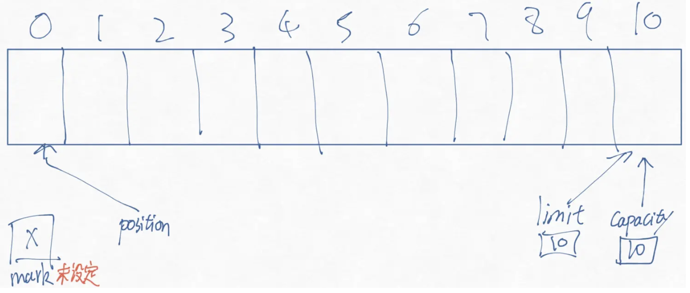
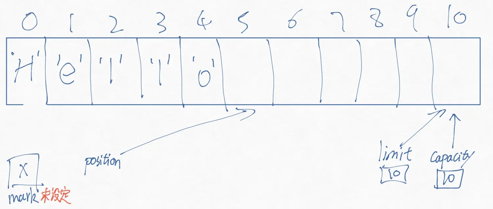
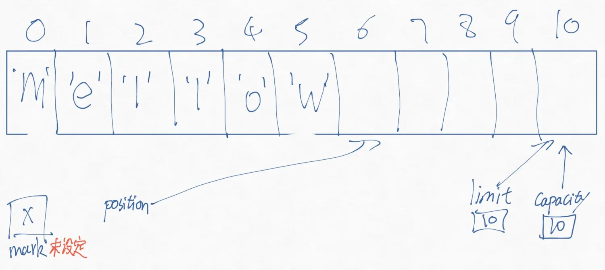
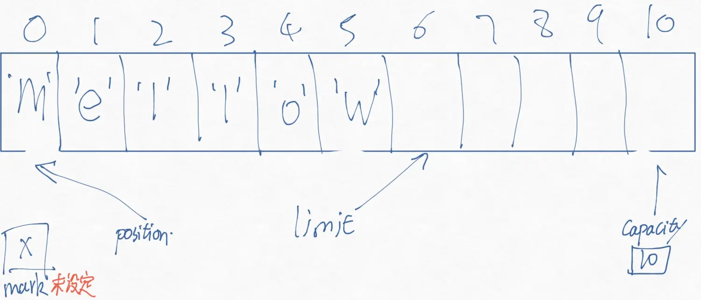
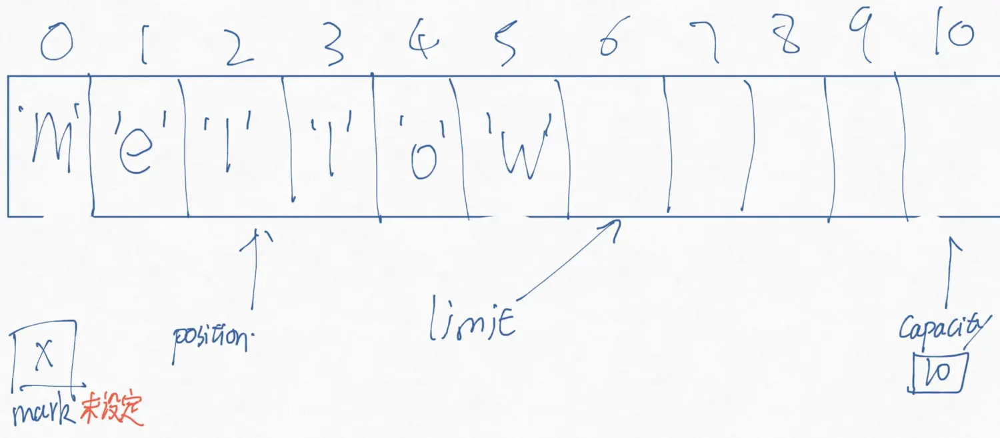
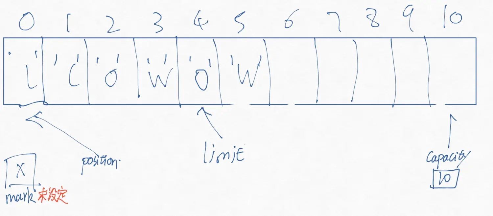
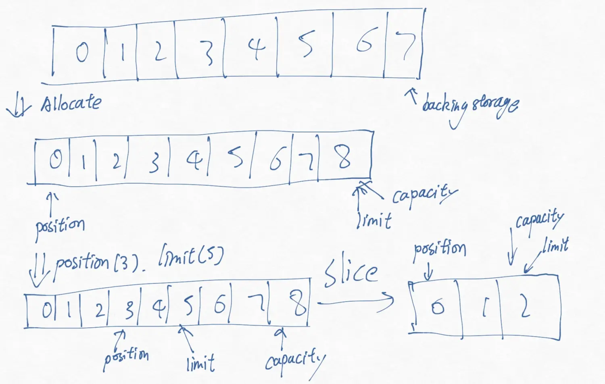
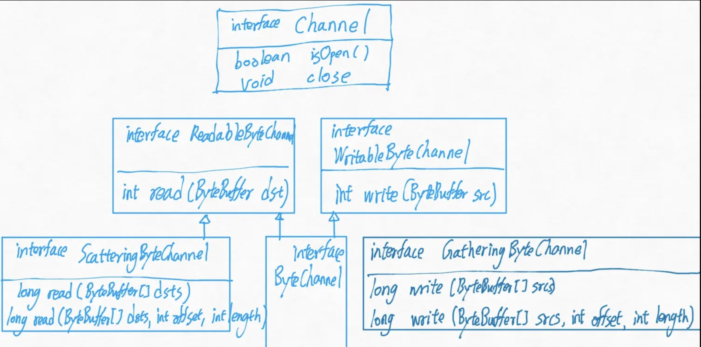
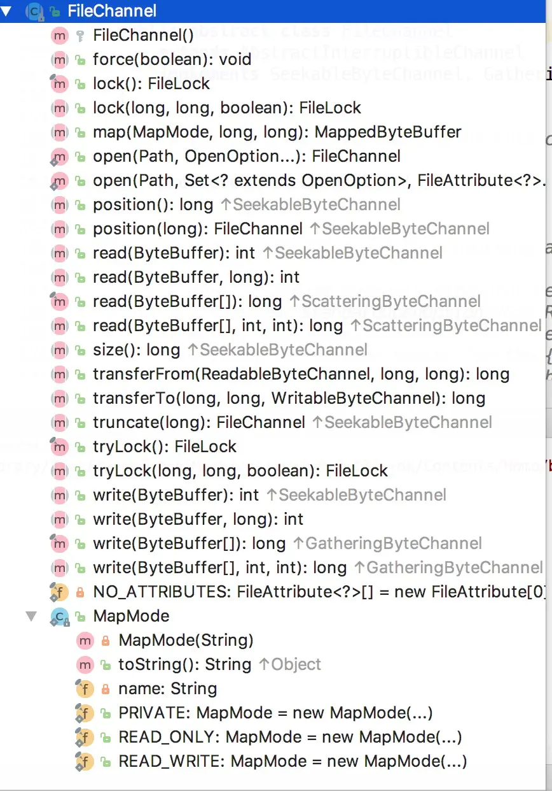

## NIO 主要概念介绍

1.Buffers(缓冲区)
Buffer类是常规JAVA类和channels(管道)之间的通道。Buffer包含固定长度的数组中，数组中存放着原始数据，封装在一个包含状态的对象中。管道可以消耗缓冲区的数据，也可以向缓冲区中存入数据。此外，还有一种特殊类型的缓冲区，用于内存映射文件。

2.Channels(通道)
NIO中引入的最抽象的概念就是Channel。通道对象代表着通信连接。通信连接可以是单向的，也可以是双向的。可以理解成缓冲区和IO设备之间的道路。

一些java.io中的旧类也可以使用channel。为了和使用通道的文件，socket连接，或多或少地添加了新方法

大多数通道可以工作在非块模式下，有很好的可扩展性，尤其是在和Selectors(选择器)同时使用的时候。

3.File locking and memory-mapped files(文件锁和内存映射文件)
FileChannel对象提供许多面向文件的功能。比如文件锁这个进程之间处理数据必不可少的功能。把内存映射到文件，在你看来，文件就像是在内存之上一样，省去了把文件拷贝到内存的操作。

4.Sockets
SocketChannel 提供了一种和网络套接字新的交互方法，SocketChannel可以工作在非阻塞模式可以用来和Selectors一起工作。作为结果，许多scoket可以多路传输，比起java.net里的传统socket类更高效

5.Selectors
Selectors提供准备就绪选择(查看channel是否准备就绪)。也可以确定你感兴趣的Channel。通过使用Selector，大量的活动中的I/O channel 可以被一个线程简单有效地监控操作。

6.Character sets(字符集)
提供了多种从byte流映射到字符的方式。

## Buffer

Buffer即缓冲区，是包含有一定量数据的容器。Buffer的工作和Channel有着紧密的联系。Channel是I/O的出入口，buffer就是IO的来源或者目标。
要向外传输数据，把数据存放在buffer中交给channel
要接受数据，提供buffer让channel写入。



Capacity
  Buffer可以包含的最大字节数。当Buffer创建的时候，容量被设置而且不可更改

Limit
  Buffer中的第一个元素，这个元素不应该被读或者是被写。包含着在buffer中“存活”的数据个数

Position
  下一个被操作的数据的位置。put和get操作会更新position的位置

Mark
  一个有记忆的位置，设置了mark，之后可以回退到标记点，重新进行操作。

新创建一个大小为10的Buffer，概念中可以理解成是这样的


下面是Buffer的方法签名
```
public abstract class Buffer{
  public final int capacity()
  public final int position()
  public final Buffer position (int newPosition)
  public final int limit ()
  public final Buffer limit(int newLimit)
  public final Buffer mark()
  public final Buffer reset()
  public final Buffer clear()
  public final Buffer flip()
  public final Buffer rewind()
  public final int remaining()
  public final boolean hasRemaining();
  public abstract boolean isReadOnly();
}
```
你可能会觉得有一些方法应该返回空值，但是却返回了buffer对象，这是为了构建一个流式的API。比如像这样的代码
 ```
  buffer.mark();
  buffer.position(5);
  buffer.reset()
  //就可以写成下面这样
  buffer.mark().position(5).reset();
```
所有的buffer都是可读的，但并不是所有的buffer都支持写操作，通过isReadOnly方法判断是否可以写，如果你试图向不支持写操作的buffer中写入数据，会抛出ReadOnlyBufferException异常。

Buffer管理着给定数目的数据元素。但是在大多数情况下，我们只关心其中的一部分数据。就像是，当我们想要向池子里倒水时，水盆里的水，只盛了一半。但我们需要追踪一些信息，buffer中已经有的数据，下一个处理哪个数据？position属性负责处理这个信息。当处理put（向buffer中写入数据）或者get方法（从buffer中获取数据）的时候，position就会更新。

尽管在[JAVA NIO BUFFER（一）](http://www.jianshu.com/p/4e955074b3f0)中，列表中没有put和get方法。但是每个Buffer都包含这两个方法，因为每个buffer的实现不同，需要处理不同的数据类型，没法被声明为抽象方法(nio在jdk1.4被引入，泛型是1.5)。我们用ByteBuffer作为例子，来看这两个方法的声明
```
public abstract class ByteBuffer extends Buffer implements Comparable {
  //列出了一部分api
  public abstract byte get();
  public abstract byte get(int index);
  public abstract ByteBuffer put(byte b);
  public abstract ByteBuffer put(int index, byte b);
}
```

如果不指定具体的位置，put和get就会操作在现有的position属性上，并将position加1。如果超出了capacity。如果是读操作就会抛出BufferOverflowException,写操作就会BufferUnderflowException.如果是任意操作，也会抛出一个IndexOutOfBoundsException.

让我们试着对ByteBuffer中写入数据，如果执行下面的命令，[JAVA NIO BUFFER（一）](http://www.jianshu.com/p/4e955074b3f0)中的概念图，就会变成如下的样子。
```
 buffer.put((byte)'H').put((byte)'e').put((byte)'l').put((byte)'l').put((byte)'o');
```



猜一猜，如果执行这个命令
```
  buffer.put(0,(byte)'M').put((byte)'w');
```
会变成什么样子？



会变成这样！，第一个把0位置的H替换为M，然后紧接着的put操作查看到了position在5位置，把5位置写入W,然后position自加变为6.

我们准备好了Buffer，现在我们要将它交由Channel处理。现在假设我们填满了一个Buffer，emmmm，然后把它传给Channel对象，Channel对象对buffer调用get方法，然后position自加，会怎么样？IndexOutOfBoundsException被抛出了！

那怎么办？为了让Channel能够处理对象，我们需要把postion重设为你希望它开始处理的位置，顺便再设置limite为现在存储的位置，假设我们需要Channel从头开始处理对象，那么就应该做如下的处理:
```
  buffer.limit(buffer.position()).position(0);
  //上面的调用，等同于如下的方法
  buffer.flip();
```
然后概念图就会变成下面这样:

[JAVA NIO BUFFER（一）](http://www.jianshu.com/p/4e955074b3f0)中提到的rewind()方法，只把position设置为0，并不影响limit的位置。

进行完这个操作之后，你就可以试着读取里面的数据
```
  //利用hasRemaining()方法判断Buffer中是否还有数据
  for(int i=0;buffer.hasRemaining();i++) {
    myByteArray[I]=buffer.get();
  }
  //上面的方法未必高效，循环体中每次循环都要进行一次判断
  //你可以使用remaining()方法，返回剩余的数目
  int count = buffer.remaining();
  for(int i=0;buffer.count;i++) {
    myByteArray[I]=buffer.get();
  }
  //如果你对Buffer有着惊人的控制，那么不进行数据检查将会是最快的
```
一旦Buffer使用完毕，它就可以进行复用，clear()方法把一个Buffer重置到一个空的状态。它不更改任何数据，把limit设置为capacity，并把position设置为0.至于里面是不是还有数据？这不重要，Buffer仅仅通过position来判断数据的“死活”为什么一定要将数据置空，这些操作难道不需要时间吗？下面的例子使用到了一些buffer的基本操作:
```
public class BufferFillDrain {
    //原代码作者 Ron Hitchens (ron@ronsoft.com)
    private static int index = 0;

    private static String[] strings = {
            "Hello, this is ZhangJian",
            "He likes Eminem",
            "Put the dick in the dust",
            "And? Fuck the world?",
            "Lyrics are great",
            "But what I like more",
            "is the spirit"
    };

    public static void main(String[] args) throws Exception {
        CharBuffer buffer = CharBuffer.allocate(100);
        while( fillBuffer(buffer)) {
            buffer.flip();
            drainBuffer(buffer);
            buffer.clear();
        }
    }

    private static void drainBuffer (CharBuffer buffer) {
        while (buffer.hasRemaining()) {
            System.out.print(buffer.get());
        }

        System.out.println("");
    }

    private static boolean fillBuffer(CharBuffer buffer) {
        if(index >= strings.length) {
            return false;
        }
        String string = strings[index++];
        for(int i=0;i<string.length();i++) {
            buffer.put(string.charAt(i));
        }
        return true;
    }

}
```

有一些情况，你只想把Buffer的一部分输出，然后下次再接着操作，下次操作的时候下标也要从0开始。这么做的话，就必须将未读的数据左移至开头，这样做毫无疑问是低效率的，如果一定要这么做的话，Buffer提供了compact方法
```
  buffer.compact();
```
假设你输出了两个字符那么现在概念图就会变成这样:


然后你调用了compact方法


4，5都会保持不变，还是同样的道理，Buffer不会做那些看上去合理但并没有用的操作。

Mark方法，允许buffer记下一个位置，如果reset被调用，那么position会转移到mark的位置。如果在mark还未指定的情况下调用reset，会抛出InvalidMarkException。如果你调用一些buffer方法，mark标记会被丢弃，比如rewind，clear和flip。如果调用带参数的limit或者position方法，如果该参数值在mark标记之前，那么mark也会废弃。

设计buffer的目标是为了有效的数据交换，在循环中依次移动数据非常地没有效率。如下列出了CharBuffer中大量移动数据的API
```
public abstract class CharBuffer extends Buffer implements CharSequence,Comparable {
  //这只是方法的一部分
  public CharBuffer get (char[] dst)
  public CharBuffer get(char[] dst, int offset, int length)

  public final CharBuffer put (char[] src)
  public CharBuffer put(char[] src, int offset, int length)
  public CharBuffer put(char[] src)
  
  public final CharBuffer put(String src)
  public CharBuffer put(String src, int start, int end)
```
两种方式从数组中复制数据。第一个方法，只携带一个数组作为参数。第二个携带偏移量和长度两个参数指定子数组。虽然最终这个和循环移动的结果相同，但是这种方式往往更加有效，因为通常这些方法都会优化移动数据或者调用native代码。

如果你要求的数据们无法被转移，那么会抛出BufferUnderflowException.或者你要求的参数，buffer无法全部填充，也会抛出异常。在尝试获取数据之前，你应该先判断一下容量是否充足：
```
        char[] bigArray = new char[1000];
        //获取buffer剩余输出
        int length = buffer.remaining();
        //如果length不够填充整个数组
        buffer.get(bigArray,0,length);
        processData(bigArray,length);
```
但是如果buffer持有的数据大于了你的数组，你可以这么做:
```
        char[] smallArray = new char[10];

        while (buffer.hasRemaining()) {
            int length = Math.min(buffer.remaining(), smallArray.length);
            buffer.get(smallArray, 0, length);
            processData(smallArray, length);
        }
```

buffer的put方法，如果buffer有空间存放这些数据，数据就会从现在buffer的position中开始写入，并且更新buffer的position值。如果空间不足，不会有任何数据写入，并抛出BufferOverflowException。

当然buffer的put方法也可以直接传入一个buffer作为参数，这和下面的操作等价:
```
  dstBuffer.put(srcBuffer) 等价于 dstBuffer.put(srcBuffer.get());
```

如果是以String为参数的put方法，和charArray类似。尽管String并不是char的集合，但我们倾向于把String概念化为char的集合。

在[JAVA NIO BUFFER（一）](http://www.jianshu.com/p/4e955074b3f0)看到了七个基本的buffer类，我们以CharBuffer为例。来看看如何创建一个CharBuffer对象:
```
public abstract class CharBuffer extends Buffer implements CharSequence, Comparable {
  public static CharBuffer allocate (int capacity)
  
  public static CharBuffer wrap(char[] array)
  public static CharBuffer wrap(char[] array, int offset, int length)

  public final boolean hasArray()
  public final char[] array()
  public final int arrayOffset()
}
```
通过包装或者分配都可以构造一个新的Buffer对象，分配方式创建了一个Buffer对象并且给它分配了私人空间。包装方式创建了一个Buffer对象但是没有给它分配私人空间(就使用你传递给它的数组参数)
```
  //分配一个CharBuffer可以容纳100个字符
  CharBuffer charBuffer = CharBuffer.allocate(100);
  //如果你想要使用你自己的数组
  char[] myArray = new char[100];
  CharBuffer charBuffer = CharBuffer.wrap(myArray);
```

那么你觉得如下的代码会怎么样呢
```
  CharBuffer charBuffer = CharBuffer.wrap(myArray,12,42);
```
会分配一个大小为30的数组给你操作？


不是，假如myArray的长度是100，CharBuffer还是掌控着长度为100的数组，只是初始的position为12，limit为42.而后面要提到的slice方法可以生成一个只能够操作给定范围的CharBuffer。

通过allocate或者wrap生成的buffer是不直接的。不直接的buffer包含有着数组。hasArray方法告诉你是否存在数组，如果这个方法返回true，那么array方法就会返回给你这个数组的引用。如果返回false，不要调用array或者arrayOffset方法，否则就会抛出UnsupportedOperationException.

如果Buffer是只读的，就算它是通过wrap数组方法生成的，调用它的array或者arrayOffset方法也会抛出ReadOnlyBufferException 防止你通过数组修改只读数据。

通过数组的形式存储数据，可以实现Buffer的功能，进而创建Buffer对象，但是Buffer可不仅仅只能通过数组才能实现。Buffer还可以管理其它buffer的数组。一旦这么做，就是一个view buffer对象。大多数view buffers是bytebuffers的视图。

View Buffers通常通过调用已经存在buffer的方法生成。创建的view buffer不仅可以通过get，put方法操作原有的buffer，而且如果原来的buffer是直接的，view buffer也可以得到同样的性能优势。以CharBuffer为例，查看它的相关方法声明:
```
public abstract class CharBuffer extends Buffer implements CharSequence, Comparable {
  public abstract CharBuffer duplicate();
  public abstract CharBuffer asReadOnlyBuffer();
  public abstract CharBuffer slice();
}
```
duplicate方法创建了一个跟原来相似的新的buffer。两个buffer共享数据，有相同的容量，但是两个buffer独自管理自己的position，limit和mark。对数据的更改会反应在两个buffer之上。

你也可以通过asReadOnlyBuffer来创建一个只读的CharBuffer，大部分和duplicate相同，新的buffer会禁用put方法，而且它的isReadOnly方法会返回true。如果试图破坏这个CharBuffer的只读属性，会抛出ReadOnlyBufferException，值得一提的是，对数据元素的更改也会反应在只读的CharBuffer上。

slice方法跟duplicate方法也很相似，但是slice方法返回的是一部分，下图说明一个原本大小为8的CharBuffer被slice之后，生成的新CharBuffer的属性
```
  CharBuffer buffer = CharBuffer.allocate(8);
  buffer.position(3).limit(5);
  CharBuffer sliceBuffer = buffer.slice();
```


这些方法都不会对mark属性进行操作。

除了布尔类型，其他基本类型都有自身的Buffer类，但是byteBuffer还有不少其他特性。操作系统和他的IO设备来看，byte是最基本的数据单元。需要把其他类型的数据转化为bytes来操作。为了方便参阅，这里列出来了ByteBuffer的完整API。

```java
public abstract class ByteBuffer extends Buffer implements Comparable {
  public static ByteBuffer allocate (int capacity)
  public static ByteBuffer allocateDirect (int capacity)
  public abstract boolean isDirect(  );
  public static ByteBuffer wrap (byte[] array, int offset,int length)
  public static ByteBuffer wrap (byte[] array)
  public abstract ByteBuffer duplicate(  );
  public abstract ByteBuffer asReadOnlyBuffer(  );
  public abstract ByteBuffer slice(  );
  public final boolean hasArray(  )
  public final byte [] array(  )
  public final int arrayOffset(  )
  public abstract byte get(  );
  public abstract byte get (int index);
  public ByteBuffer get (byte[] dst, int offset, int length)
  public ByteBuffer get (byte[] dst, int offset, int length)
  public abstract ByteBuffer put (byte b);
  public abstract ByteBuffer put (int index, byte b);
  public ByteBuffer put (ByteBuffer src)
  public ByteBuffer put (byte[] src, int offset, int length)
  public final ByteBuffer put (byte[] src)
  public final ByteOrder order(  )
  public final ByteBuffer order (ByteOrder bo)
  public abstract CharBuffer asCharBuffer(  );
  public abstract ShortBuffer asShortBuffer(  );
  public abstract IntBuffer asIntBuffer(  );
  public abstract LongBuffer asLongBuffer(  );
  public abstract FloatBuffer asFloatBuffer(  );
  public abstract DoubleBuffer asDoubleBuffer(  );
  public abstract char getChar(  );
  public abstract char getChar (int index);
  public abstract ByteBuffer putChar (char value);
  public abstract ByteBuffer putChar (int index, char value);
  public abstract short getShort(  );
  public abstract short getShort (int index);
  public abstract ByteBuffer putShort (short value);
  public abstract ByteBuffer putShort (int index, short value);
  public abstract int getInt(  );
  public abstract int getInt (int index);
  public abstract ByteBuffer putInt (int value);
  public abstract ByteBuffer putInt (int index, int value);
  public abstract long getLong(  );
  public abstract long getLong (int index);
  public abstract ByteBuffer putLong (long value);
  public abstract ByteBuffer putLong (int index, long value);
  public abstract float getFloat(  );
  public abstract float getFloat (int index);
  public abstract ByteBuffer putFloat (float value);
  public abstract ByteBuffer putFloat (int index, float value);
  public abstract double getDouble(  );
  public abstract double getDouble (int index);
  public abstract ByteBuffer putDouble (double value);
  public abstract ByteBuffer putDouble (int index, double value);
  public abstract ByteBuffer compact(  );
  public boolean equals (Object ob);
  public int compareTo (Object ob);
  public String toString(  );
  public int hashCode(  );
}
```
除了boolean类型之外，byte占1个byte，char两个，short两个，int四个，long八个，float四个，double八个。虽然这些字节一定是按照顺序的，但是也有大端和小端之分。(指的是连续的内存单元，先放高字节，还是先存放低字节)在java.nio中，字节顺序由ByteOrder这个类来封装
```
public final class ByteOrder {
  public static final ByteOrder BIG_ENDIAN
  public static final ByteOrder LITTLE_ENDIAN

  public static ByteOrder nativeOrder()
  public String toString()
}
```
这个类定义了两个自己实例的公共域，在JVM中，只有这两个实例，所以要比较的话，可以使用==。如果你需要知道JVM上的字节顺序，调用nativeOrder方法。

每一个buffer类都可以通过order方法知悉自己现在的字节顺序设置
```
  public final ByteOrder order()
```
返回ByteOrder的两个实现之一，但和ByteBuffer不同，这个返回的对象只是可读的。ByteBuffer的默认字节顺序是大根端(无论运行在什么字节顺序的平台上),Java的默认字节顺序也是大根端，允许类文件，序列化的对象运行在任何JVM上。如果本地的硬件设备是小根端的话，这可能会有着性能的影响。把ByteBuffer作为其他数据类型接受的时候，使用本地的字节顺序会更有效。

ByteBuffer的字节顺序可以通过order方法改变
```
  public final ByteOrder order()
  public final ByteOrder order(ByteOrder bo)
```
如果buffer被创建为ByteBuffer的一个视图，那么order返回的就是当这个buffer创建时，原来的buffer的字节顺序，即使原来的buffer改变字节顺序，buffer的字节顺序也不会改变。

ByteBuffer和其他Buffer不同的是，它们可以作为Channel(通道)操作的起点或者终点。通道只接受ByteBuffer作为参数。

操作系统在内存区中进行IO操作，这些内存区域就是连续的byte。操作系统会直接进入进程的地址空间来转移数据。也就是说内存区的数据最好是连续的字节数。但是在JVM中，字节数组并不一定存储在连续的内存区域，GC可能会移动它们。如何存储数组，根据JVM的实现还有很大的区别。

因为这个原因，引入了direct buffer这一概念，direct buffer来处理通道和本地IO操作。尽最大努力把byte数据存储在一个channel可以直接使用的或者可以直接由本地方法通知操作系统，操作系统直接操作的内存区域。

这往往是IO最高效的选择，支持JVM能支持的最高效IO机制。非直接的Buffer也可以传递给channel，但是会导致性能的损失。通常情况下，非直接的buffer是不可能作为本地IO操作的目标的。如果你将一个非直接buffer传递给channel操作，channel可能会做如下的操作
  1.创建一个临时的direct ByteBuffer对象
  2.把非直接的ByteBuffer中的内容拷贝到1创建的对象中
  3.利用临时对象进行低等级的IO操作
  4.临时对象使用完毕，等待GC回收

创建DirectBuffer的代价可能会更高，DirectBuffer使用的内存是越过JVM，直接由本地代码分配的。而且DirectBuffer使用的内存无法被垃圾回收，因为它们在JVM堆之外。
```
public abstract class ByteBuffer extends Buffer implements Comparable {
  public static ByteBuffer allocate(int capacity)
  public static ByteBuffer allocateDirect(int capacity)
  public abstract boolean isDirect();
}
```
调用allocateDirect方法来创建一个DirectBuffer。那些根据wrap方法创建的buffer，总是非直接的(non-direct)。

## Channel

Channels是java.nio的第二个主要创新，提供了跟IO服务的直接连接。Channel是bytebuffer，文件，或者socket之间传输数据的导管。Channel提供了平台无关的抽象，但仍然可以比拟现代操作系统上native代码的IO能力。

```
public interface Channel {
  public boolean isOpen();
  public void close() throws IOException;
}
```
跟buffer不同，channel的实现在不同的操作系统上差距很大，所以channel只定义为一个接口，描述它可以做什么。通常情况下用native方法实现。只有两个方法，一个用来判断通道是否处于打开状态，一个用于关闭通道。

InterruptibleChannel是一个标记接口，代表这个通道是可中断的，可中断的通道在运行它们的线程中断时有特殊的特性。

IO分为两个大类，文件IO和流IO。通道也分为，文件通道和socket通道。Socket通道有工厂方法可以直接创建。但是一个文件通道不能够直接创建，只能够通过调用RandomAccessFile,FileInputStream,FileOutputStream的getChannel方法。你不能够直接创建一个FileChannel对象

```java
SocketChannel sc = SocketChannel.open();
sc.connect(new InetSocketAddress("some host",someport));

ServerSocketChannel ssc = new ServerSocketChannel().open();
ssc.socket().bind(new InetSocketAddress(somelocalport));

DatagramChannel dc = DatagramChannel.open();

RandomAccessFile raf = new RandomAccessFile("somefile","r");
FileChannel fc = raf.getChannel();
```

先看如下的API
```
public interface ReadableByteChannel extends Channel {
  public int read (ByteBuffer dst) throws IOException;
}
public interface WritableByteChannel extends Channel {
  public int write(ByteBuffer src) throws IOException;
}
public interface ByteChannel extends ReadableByteChannel, WritableByteChannel {
}
```
通道可以是双向的也可以是单向的。根据需要实现这三个接口中的一个。

通道的read(),write()方法都以ByteBuffer作为参数，每个都返回操作了的字节数，并更新ByteBuffer中的position属性。
下面的例子展示了使用channel进行putget的基本操作

```java
    public static final int BUFFER_SIZE = 16*1024;

    public static void main(String[] args) throws IOException {

        ReadableByteChannel source = Channels.newChannel(System.in);
        WritableByteChannel dest = Channels.newChannel(System.out);
        //call one of copy method
        source.close();
        dest.close();
    }

    public static void channelCopy1 (ReadableByteChannel src, WritableByteChannel dest) throws IOException{
        ByteBuffer buffer = ByteBuffer.allocate(BUFFER_SIZE);
        while (src.read(buffer)!=-1) {
            //准备好数据
            buffer.flip();

            //向通道中写入数据，可能阻塞
            dest.write(buffer);

            //调用compact方法，可以确保数据都被dest处理
            buffer.compact();
        }
        //还有可能有数据剩余，此时只是没有可读数据了而已
        while (buffer.hasRemaining()) {
            dest.write(buffer);
        }
        buffer.clear();
    }

    public static void channelCopy2 (ReadableByteChannel src, WritableByteChannel dest) throws IOException {
        ByteBuffer buffer = ByteBuffer.allocate(BUFFER_SIZE);
        while (src.read(buffer)!=-1) {
            buffer.flip();
            while (buffer.hasRemaining()) {
                dest.write(buffer);
            }
            buffer.clear();
        }
    }
```
通道可以工作在阻塞或者非阻塞模式下。如果工作在非阻塞模式下，调用它的线程永远不会sleep。请求操作要么立刻完成，要么返回结果表明没有进行任何操作。只有面向流的通道，像socket或者pipe才可以工作在非阻塞模式。

跟buffer不同，channel不可以被复用。一个打开的通道代表着跟特定IO服务之间的连接，还封装着连接的状态。当通道关闭的时候，连接丢失。调用通道的close方法会导致当关闭IO服务的时候，线程短暂地阻塞，就算工作在非阻塞模式也一样。对同一个通道调用多次close方法是无害的。如果第一个线程在close方法中阻塞，其他调用close方法的线程也会阻塞等待。后面的close方法什么都不做，然后立刻返回。

通道有一些和关闭中断相关的特性。如果一个通道实现了InterruptibleChannel接口。那么，如果线程正在被通道所阻塞，然后线程被中断，通道会被关闭，然后线程会收到一个ClosedByInterruptException异常。另外，如果线程被设置为中断状态，然后线程尝试获取一个通道，通道就会立刻关闭，抛出同样的异常。

先看如下的API
```
public interface ReadableByteChannel extends Channel {
  public int read (ByteBuffer dst) throws IOException;
}
public interface WritableByteChannel extends Channel {
  public int write(ByteBuffer src) throws IOException;
}
public interface ByteChannel extends ReadableByteChannel, WritableByteChannel {
}
```
通道可以是双向的也可以是单向的。根据需要实现这三个接口中的一个。

通道的read(),write()方法都以ByteBuffer作为参数，每个都返回操作了的字节数，并更新ByteBuffer中的position属性。
下面的例子展示了使用channel进行putget的基本操作
```
    public static final int BUFFER_SIZE = 16*1024;

    public static void main(String[] args) throws IOException {

        ReadableByteChannel source = Channels.newChannel(System.in);
        WritableByteChannel dest = Channels.newChannel(System.out);
        //call one of copy method
        source.close();
        dest.close();
    }

    public static void channelCopy1 (ReadableByteChannel src, WritableByteChannel dest) throws IOException{
        ByteBuffer buffer = ByteBuffer.allocate(BUFFER_SIZE);
        while (src.read(buffer)!=-1) {
            //准备好数据
            buffer.flip();

            //向通道中写入数据，可能阻塞
            dest.write(buffer);

            //调用compact方法，可以确保数据都被dest处理
            buffer.compact();
        }
        //还有可能有数据剩余，此时只是没有可读数据了而已
        while (buffer.hasRemaining()) {
            dest.write(buffer);
        }
        buffer.clear();
    }

    public static void channelCopy2 (ReadableByteChannel src, WritableByteChannel dest) throws IOException {
        ByteBuffer buffer = ByteBuffer.allocate(BUFFER_SIZE);
        while (src.read(buffer)!=-1) {
            buffer.flip();
            while (buffer.hasRemaining()) {
                dest.write(buffer);
            }
            buffer.clear();
        }
    }
```
通道可以工作在阻塞或者非阻塞模式下。如果工作在非阻塞模式下，调用它的线程永远不会sleep。请求操作要么立刻完成，要么返回结果表明没有进行任何操作。只有面向流的通道，像socket或者pipe才可以工作在非阻塞模式。

跟buffer不同，channel不可以被复用。一个打开的通道代表着跟特定IO服务之间的连接，还封装着连接的状态。当通道关闭的时候，连接丢失。调用通道的close方法会导致当关闭IO服务的时候，线程短暂地阻塞，就算工作在非阻塞模式也一样。对同一个通道调用多次close方法是无害的。如果第一个线程在close方法中阻塞，其他调用close方法的线程也会阻塞等待。后面的close方法什么都不做，然后立刻返回。

通道有一些和关闭中断相关的特性。如果一个通道实现了InterruptibleChannel接口。那么，如果线程正在被通道所阻塞，然后线程被中断，通道会被关闭，然后线程会收到一个ClosedByInterruptException异常。另外，如果线程被设置为中断状态，然后线程尝试获取一个通道，通道就会立刻关闭，抛出同样的异常。

通道提供了分散聚合的能力。就是说一次IO操作可以对应多个buffer。

对于写操作(向通道中写入数据),数据从数个buffer中汇合然后沿通道发送
对于读操作(从通道中读出数据),从通道中出来的数据分散到许多不同的buffer，尽可能地读取，直到数据或者buffer的可用空间被耗尽。

许多现代操作系统支持native vectored（矢量） IO；当你在一个通道上发起一个分散聚合请求时，请求会被解释成native方法。这样子buffer的复制和系统调用可以减少甚至消除。最好使用direct buffer，得到最优的性能。
```
public interface ScatteringByteChannel extends ReadableByteChannel {
  public long read(ByteBuffer[] dsts) throws IOException;
  public long read(ByteBuffer[] dots,int offset, int length) throws IOException;
}

public interface GatheringByteChannel extends WritableByteChannel {
  public long write(ByteBuffer[] srcs) throws IOException;
  public long write(ByteBuffer[] srcs, int offset, int length) throws IOException;
}
```
看看下面的代码段

```
ByteBuffer header = ByteBuffer.allocateDirect(10);
ByteBuffer body = ByteBuffer.allocateDirect(80);
ByteBuffer[] buffers = {header, body};
int bytesRead = channel.read(buffers);
```
如果返回值bytesRead为48，那么head中拥有最先的10个数据，body中有38个。

相似的，我们可以组装数据在不同的buffer中，然后发送聚合
```
  body.clear();
  body.put("FOO".getBytes()).flip();
  header.clear();
  header.putShort(TYPE_FILE).putLong(body.limit()).flip();
  long bytesWritten = channel.write(buffers);
```

FileChannel继承了ScatteringByteChannel,ByteChannel和GatheringByteChannel。在类中还引入了文件锁。下面是部分的API
```
public class FileLock implements AutoClosable{
  public FileChannel channel()
  public long position()
  public long size()
  public boolean isShared()
  public boolean overlaps(long position, long size)
  public boolean isValid()
  public void release()
  public String toString()
}
```

文件通道总是运行在阻塞模式而且不能在非阻塞模式下工作。面向流的非阻塞模式对文件操作来说意义不大。对于文件来说，真正需要的是异步IO，从操作系统发出一条或多条IO请求而不需要等待它们完成，而是在完成之后收到通知。

FileChannel对象可以通过调用RandomAccessFile,FileInputStream,FileOutputStream的getChannel方法得到，调用这个方法得到一个FileChannel对象，拥有和File对象一样的访问权限。

FileChannel是一个抽象类，你通过getChannel方法得到的是一个具体实现，往往实现中有着大量native代码。FileChannel是线程安全的。多线程可以同时调用他们的方法而不会引起任何问题，但不是所有操作都是多线程的，影响到通道的位置和文件大小是单线程的。如果有线程试图做这样的操作，那么它必须等待另一个线程执行完毕。

FileChannel保证同一个JVM中的所有实例看到的文件视图都是一致的。但这个视图和非JVM线程看到的可能相同也可能不同，这高度取决于底层的操作系统和文件系统。一般情况下来说，都是相同的。

FileChannel中的position，代表着数据下一个写入或者读取的地方，无参数的position方法，返回一个long类型的当前位置。第二个需要一个long类型的参数，如果你把参数设置为负，会抛出IllegalArgumentException,但是如果设置的超出了文件的大小不会抛出异常，但不会更改文件的大小。如果读操作超出了文件的大小，会返回EOF，如果是写操作，就会更改文件的大小。每个FileChannel对象都和一个File descriptor有着一对一的联系。而File descriptor是channel创建的时候被共享的。也就是说他们可以看到彼此对position的更改，如下例所示：
```
RandomAccessFile randomAccessFile = new RandomAccessFile("filename","r");
//设置position
randomAccessFile.seek(1000);
//创建一个channel
FielChannel fileChannel = randomAccessFile.getChannel();
System.out.println(fileChannel.position());//打印1000
randomAccessFile.seek(500);
System.out.println(fileChannel.position());//500
fileChannel.position(200);
System.out.println(randomAccessFile.getFilePointer());//200
```
和buffer相似，FileChannel的read方法和write方法都可以携带一个position参数，这样子比起不带参数的read，write方法更为高效，因为不需要更新channel的状态，可以直接通过native code实现。最好的是，多线程可以同时访问一个文件而不需要相互打扰。

如果视图读取文件的结尾，会收到EOF，如果在这时，往超出文件大小的地方写入，文件就会自动增长，但在这EOF和此时写入的位置之间无数据的地方就要看具体的操作系统和文件系统了，可能会导致一个file hole。当你觉得有必要调整文件的大小时，调用truncate方法，携带一个long类型作为参数，如果大于你此时文件的大小，无事发生过。但是如果小于，大于这个数值的数据会被丢弃。

最后force方法，要求强制把现在已经做了的更改应用到磁盘文件上，参数表明是否更新元数据(如文件所有者，访问权限，最后一次修改时间等)

## 文件锁FileLock

文件锁可以是shared(共享锁)或者exclusive(排他锁)。不是所有的平台都以同一种方式实现文件锁，不同的操作系统可能不同，同一操作系统上的不同文件系统也可能不同。有些操作系统只提供协同锁，有些只提供强制锁，有些则都提供。

文件锁是以文件为单位的，不是以通道，也不是线程。所以文件锁不适合同一个多个线程访问的情形。如果一个线程获得了给定文件的排他锁，第二个线程请求打开了一个新的channel，请求获得排他锁，请求会被批准。但如果这两个线程运行在不同的JVM中，第二个线程会阻塞，因为锁往往是根据进程来进行裁决，而不是线程。锁工作于一个文件，而不是单独的文件处理器或是通道。
/*
如果你需要控制多个线程之间的同步，你可能需要实现自己的轻量级的锁，内存映射文件可能是个适合的选择
*/
```
public abstract class FileChannel extends AbstractChannel implements ByteChannel, GatheringByteChannel, ScatteringByteChannel {
  
  public final FileLock lock()
  public abstract FileLock lock (long position, long size, boolean shared)

  public final FileLock tryLock()
  public abstract FileLock tryLock(long position, long size, boolean shared)
}
```
先看带参数的lock方法，获得给定区域的锁，自position开始，size大小，第三个布尔参数代表是锁是否共享。锁的区域并不受到文件大小的限制，锁可以超过文件的大小，也就是说在一段区域被写入数据之前锁住，是可行的。相反的，如果文件的大小超出了锁的限制，也就将不受到锁的限制。不带参数的lock方法，等效于
`fileChannel.lock(0L,Long.MAX_VALUE, false);`
如果你的请求是有效的，那么lock方法就会生效，但是要等待前一个锁(如果存在的话)释放。

tryLock方法是lock方法非阻塞的变种，功能和lock相似，但是如果不能立刻获得锁的话，tryLock会返回null。从创建开始，直到调用FileLock的release方法，FileLock对象都是有效的。可以通过isValid方法测试。一个锁是否有效可能会改变，但锁的位置，大小，是否共享，是不变的。

你可以通过isShared判断锁是否为共享锁，如果内在的文件系统操作系统不支持共享，那么这个方法总是会返回false，就算你传递true作为构造函数也一样。FileLock是线程安全的，多个线程可以通过一个FileLock进行操作。尽管FileLock对象和一个Channel相关，但是其实锁是和内在的文件联系的。这有可能造成冲突，也有可能死锁，如果你完成了操作而没有释放锁的话。一个典型的代码如下所示:
```
FileLock lock = fileChannel.lock();
try{
  <perform read/write/whatever on channel>
} catch (IOException e) {
  <handle unexcepted exception>
} finally {
  lock.release();
}
```
下面是一个使用FileLock进行操作的例子
```

    private static final int SIZEOF_INT = 4;
    private static final int INDEX_START = 0;
    private static final int INDEX_COUNT = 10;
    private static final int INDEX_SIZE = INDEX_COUNT * SIZEOF_INT;

    private ByteBuffer buffer = ByteBuffer.allocate(INDEX_SIZE);
    private IntBuffer indexBuffer = buffer.asIntBuffer();
    private Random rand = new Random();

    public static void main(String[] args) throws Exception{
        boolean writer = false;
        String filename;
        //决定你所做的操作，读或者写
        if(args.length!=2) {
            System.out.println("Usage: [-r|-w] filename");
            return;
        }
        writer = args[0].equals("-w");//true写false读
        filename = args[1];
        RandomAccessFile raf = new RandomAccessFile(filename,writer?"rw":"r");
        FileChannel fc = raf.getChannel();//通过RandomAccessFile拿到fileChannel
        LockTest lockTest = new LockTest();
        if(writer) {
            lockTest.doUpdates(fc);
        } else {
            lockTest.doQueries(fc);
        }
    }

    void doQueries (FileChannel fc) throws Exception {
        //如果是单次操作的话，没有这个循环，这里使用这个循环，为了多次
        //运行程序，发现锁的工作原理
        while (true) {
            FileLock lock = fc.lock(INDEX_START,INDEX_SIZE,true);
            int reps = rand.nextInt(60) + 20;
            for(int i=0; i<reps; i++) {
                int n = rand.nextInt(INDEX_COUNT);
                int position = INDEX_START + (n*SIZEOF_INT);
                buffer.clear();
                fc.read(buffer,position);
                int value = indexBuffer.get(n);
                Thread.sleep(100);//doing some work
            }
            lock.release();
            Thread.sleep(rand.nextInt(3000)+500);
        }
    }

    void doUpdates (FileChannel fc) throws Exception {
        while (true) {
            FileLock lock = fc.lock(INDEX_START,INDEX_SIZE,false);
            updateIndex(fc);
            lock.release();
            Thread.sleep(rand.nextInt(2000)+500);
        }
    }

    private int idxval = 1;

    private void updateIndex (FileChannel fc) throws Exception{
        indexBuffer.clear();
        for(int i=0; i<INDEX_COUNT; i++) {
            idxval++;
            indexBuffer.put(idxval);
            Thread.sleep(500);
        }
        buffer.clear();
        fc.write(buffer,INDEX_START);
    }


}
```

