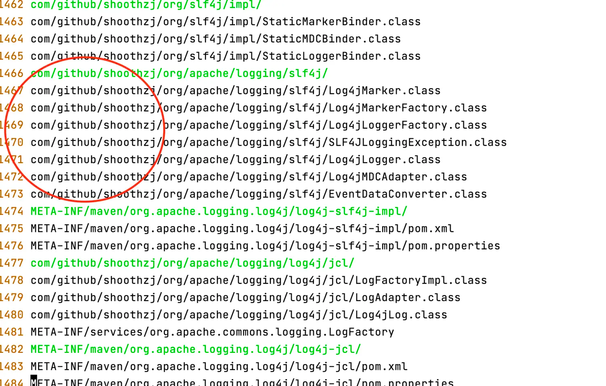

我们在很多场景下会碰到java包冲突的问题：

- 代码由第三方开发，无法对包名或依赖做管控
- 跑在同一个进程里的代码，更新步调不一致。比如底层sdk，jvm agent。这些组件更新频率较低

最出名的解决路数还是类加载机制，诸如flink，osgi都给我们提供了很多方案，这些方案都非常重型。在代码可信任的情况下，其中有一个很轻量级的解决方案就是maven-shade包。

举个例子，比方说我想在java agent中打印日志，但是又不希望和业务代码中的log4j等冲突，agent里依赖的pom文件是这样子的:

```xml
 <dependencies>
        <dependency>
            <groupId>org.slf4j</groupId>
            <artifactId>slf4j-api</artifactId>
            <version>1.7.30</version>
        </dependency>
        <dependency>
            <groupId>org.apache.logging.log4j</groupId>
            <artifactId>log4j-api</artifactId>
            <version>2.13.3</version>
        </dependency>
        <dependency>
            <groupId>org.apache.logging.log4j</groupId>
            <artifactId>log4j-core</artifactId>
            <version>2.13.3</version>
        </dependency>
        <dependency>
            <groupId>org.apache.logging.log4j</groupId>
            <artifactId>log4j-slf4j-impl</artifactId>
            <version>2.13.3</version>
        </dependency>
        <dependency>
            <groupId>org.apache.logging.log4j</groupId>
            <artifactId>log4j-jcl</artifactId>
            <version>2.13.3</version>
        </dependency>
    </dependencies>
```

这里我们log4j,slf4j可能用的版本太高或者太低，我们就可以通过打shade包的方式修改log4j和slf4j的包名,避免和业务冲突

```xml
<plugin>
                <groupId>org.apache.maven.plugins</groupId>
                <artifactId>maven-shade-plugin</artifactId>
                <version>3.2.4</version>
                <executions>
                    <execution>
                        <phase>package</phase>
                        <goals>
                            <goal>shade</goal>
                        </goals>
                        <configuration>
                            <artifactSet>
                                <includes>
                                    <include>org.slf4j:slf4j-api</include>
                                    <include>org.apache.logging.log4j:log4j-api</include>
                                    <include>org.apache.logging.log4j:log4j-core</include>
                                    <include>org.apache.logging.log4j:log4j-slf4j-impl</include>
                                    <include>org.apache.logging.log4j:log4j-jcl</include>
                                </includes>
                            </artifactSet>
                            <filters>
                                <filter>
                                    <artifact>*:*</artifact>
                                    <excludes>
                                        <exclude>META-INF/*.SF</exclude>
                                        <exclude>META-INF/*.DSA</exclude>
                                        <exclude>META-INF/*.RSA</exclude>
                                    </excludes>
                                </filter>
                            </filters>
                            <relocations>
                                <relocation>
                                    <pattern>org.slf4j</pattern>
                                    <shadedPattern>com.github.hezhangjian.org.slf4j</shadedPattern>
                                </relocation>
                                <relocation>
                                    <pattern>org.apache.logging</pattern>
                                    <shadedPattern>com.github.hezhangjian.org.apache.logging</shadedPattern>
                                </relocation>
                            </relocations>
                        </configuration>
                    </execution>
                </executions>
            </plugin>
```

通过上面的配置，artifactSet选择要修改的pom依赖，通过relocation修改包名，达到不冲突的效果。**mvn clean package** 后查看效果



可以发现，包名已经被修改完成,达到了避免冲突的目的。
