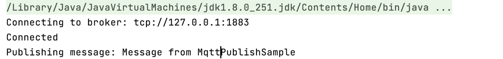
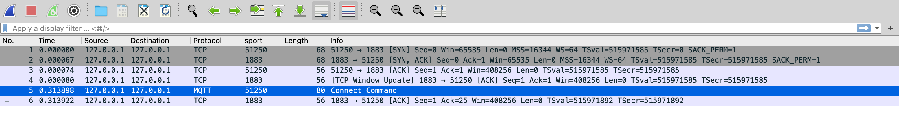
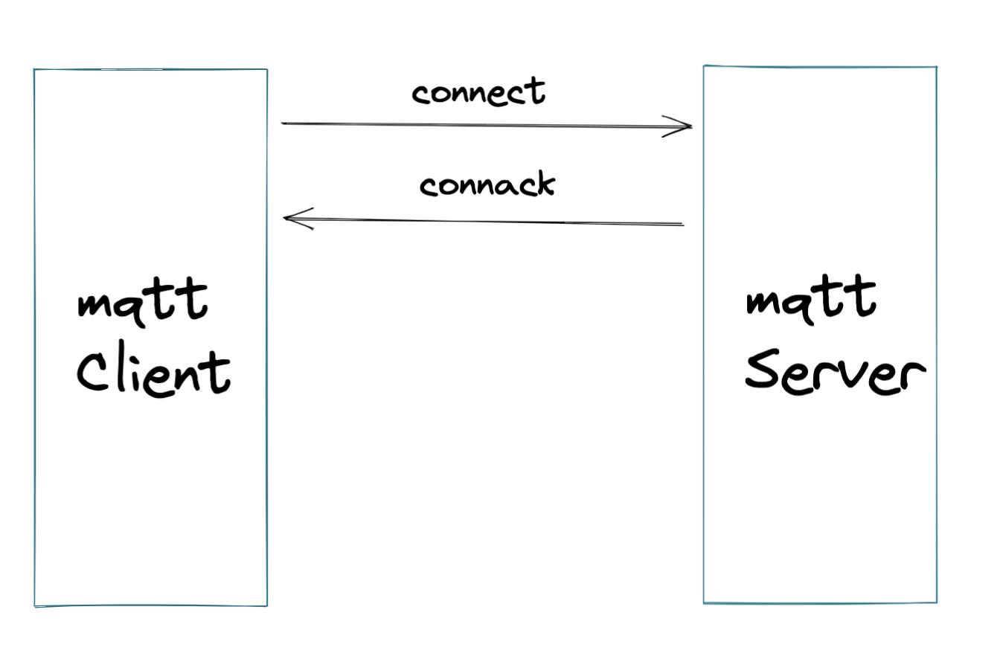

物联网是现在比较热门的软件领域，众多云厂商都有自己的物联网平台，而物联网平台其中一个核心的模块就是Mqtt网关。

使用Netty搭建高性能服务器是一个常见的选择，Netty自带Mqtt的编解码，我们很快就可以在Netty服务器中插入Mqtt的编解码handler，由netty已经编写好的模块帮助我们做mqtt的编解码，我们仅需自己处理mqtt协议业务的处理，如登录，订阅分发等。

NettyServer使用MqttHandler编解码

```java
package com.github.hezhangjian.demo.iot.mqtt.broker;

import io.netty.bootstrap.ServerBootstrap;
import io.netty.channel.ChannelFuture;
import io.netty.channel.ChannelInitializer;
import io.netty.channel.ChannelOption;
import io.netty.channel.ChannelPipeline;
import io.netty.channel.EventLoopGroup;
import io.netty.channel.nio.NioEventLoopGroup;
import io.netty.channel.socket.SocketChannel;
import io.netty.channel.socket.nio.NioServerSocketChannel;
import io.netty.handler.codec.mqtt.MqttDecoder;
import io.netty.handler.codec.mqtt.MqttEncoder;
import io.netty.handler.logging.LogLevel;
import io.netty.handler.logging.LoggingHandler;
import lombok.extern.slf4j.Slf4j;

/**
 * @author hezhangjian
 */
@Slf4j
public class MqttServer {

    public static void main(String[] args) throws Exception {
        EventLoopGroup bossGroup = new NioEventLoopGroup(1);
        EventLoopGroup workerGroup = new NioEventLoopGroup();
        try {
            ServerBootstrap b = new ServerBootstrap();
            b.group(bossGroup, workerGroup)
                    .channel(NioServerSocketChannel.class)
                    .option(ChannelOption.SO_BACKLOG, 100)
                    .handler(new LoggingHandler(LogLevel.INFO))
                    .childHandler(new ChannelInitializer<SocketChannel>() {
                        @Override
                        public void initChannel(SocketChannel ch) throws Exception {
                            ChannelPipeline p = ch.pipeline();
                            p.addLast(new MqttDecoder());
                            p.addLast(MqttEncoder.INSTANCE);
                        }
                    });

            // Start the server.
            ChannelFuture f = b.bind(1883).sync();

            // Wait until the server socket is closed.
            f.channel().closeFuture().sync();
        } finally {
            // Shut down all event loops to terminate all threads.
            bossGroup.shutdownGracefully();
            workerGroup.shutdownGracefully();
        }
    }

}
```

客户端采用eclipse mqtt client

```java
package com.github.hezhangjian.demo.mqtt.client;

import lombok.extern.slf4j.Slf4j;
import org.eclipse.paho.client.mqttv3.MqttClient;
import org.eclipse.paho.client.mqttv3.MqttConnectOptions;
import org.eclipse.paho.client.mqttv3.MqttException;
import org.eclipse.paho.client.mqttv3.MqttMessage;
import org.eclipse.paho.client.mqttv3.persist.MemoryPersistence;

/**
 * @author hezhangjian
 */
@Slf4j
public class MqttClientEx {

    public static void main(String[] args) throws Exception {
        String topic = "MQTT Examples";
        String content = "Message from MqttPublishSample";
        int qos = 2;
        String broker = "tcp://127.0.0.1:1883";
        String clientId = "JavaSample";
        MemoryPersistence persistence = new MemoryPersistence();

        try {
            MqttClient sampleClient = new MqttClient(broker, clientId, persistence);
            MqttConnectOptions connOpts = new MqttConnectOptions();
            connOpts.setCleanSession(true);
            System.out.println("Connecting to broker: " + broker);
            sampleClient.connect(connOpts);
            System.out.println("Connected");
            System.out.println("Publishing message: " + content);
            MqttMessage message = new MqttMessage(content.getBytes());
            message.setQos(qos);
            sampleClient.publish(topic, message);
            System.out.println("Message published");
            sampleClient.disconnect();
            System.out.println("Disconnected");
            System.exit(0);
        } catch (MqttException me) {
            System.out.println("reason " + me.getReasonCode());
            System.out.println("msg " + me.getMessage());
            System.out.println("loc " + me.getLocalizedMessage());
            System.out.println("cause " + me.getCause());
            System.out.println("excep " + me);
            me.printStackTrace();
        }
    }

}
```

然后我们先运行MqttServer，再运行MqttClient，发现MqttClient卡住了



这是为什么呢，我们通过抓包发现仅仅只有客户端发送了Mqtt connect信息，服务端并没有响应



但是根据mqtt标准协议，发送MqttConnect，必须有CONNAck



所以我们要在mqttConn后，业务上返回ConnAck消息，下一节我们在这个基础上自己实现Handler返回Connack消息

## 参考

- https://blog.p2hp.com/archives/4100
