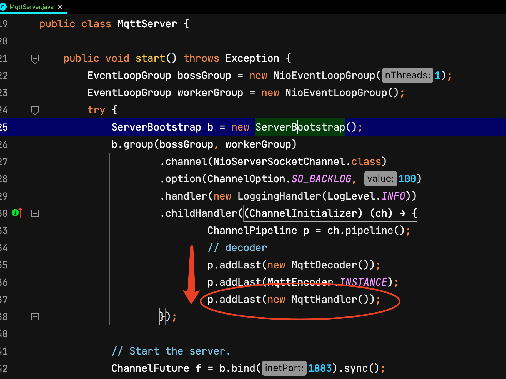

我们先创建一个MqttHandler，让他继承ChannelInboundHandlerAdapter, 用来接力MqttDecoder解码完成后的消息,这里要继承其中的channelRead方法

```java
package com.github.hezhangjian.demo.iot.mqtt.broker;

import io.netty.channel.ChannelHandlerContext;
import io.netty.channel.ChannelInboundHandlerAdapter;
import lombok.extern.slf4j.Slf4j;

/**
 * 处理Mqtt协议栈
 * @author hezhangjian
 */
@Slf4j
public class MqttHandler extends ChannelInboundHandlerAdapter {

    @Override
    public void channelRead(ChannelHandlerContext ctx, Object msg) throws Exception {
        super.channelRead(ctx, msg);
    }

}

```

然后把这个handler加入到netty的职责链中，解码顺序



打印出connectMessage如下

```
[MqttConnectMessage[fixedHeader=MqttFixedHeader[messageType=CONNECT, isDup=false, qosLevel=AT_MOST_ONCE, isRetain=false, remainingLength=22], variableHeader=MqttConnectVariableHeader[name=MQTT, version=4, hasUserName=false, hasPassword=false, isWillRetain=false, isWillFlag=false, isCleanSession=true, keepAliveTimeSeconds=60], payload=MqttConnectPayload[clientIdentifier=JavaSample, willTopic=null, willMessage=null, userName=null, password=null]]]
```

我们先忽略这些信息，无脑返回ack给他

```
final MqttConnAckMessage ackMessage = MqttMessageBuilders.connAck().returnCode(CONNECTION_ACCEPTED).build();
```

我们再运行起Server和Client，随后可以看到已经走过了Connect阶段，进入了publish message过程，接下来我们再实现更多的其他场景


附上此阶段的MessageHandler代码

```java
package com.github.hezhangjian.demo.iot.mqtt.broker;

import io.netty.channel.ChannelHandlerContext;
import io.netty.channel.ChannelInboundHandlerAdapter;
import io.netty.handler.codec.mqtt.MqttConnAckMessage;
import io.netty.handler.codec.mqtt.MqttConnectMessage;
import io.netty.handler.codec.mqtt.MqttConnectPayload;
import io.netty.handler.codec.mqtt.MqttConnectVariableHeader;
import io.netty.handler.codec.mqtt.MqttFixedHeader;
import io.netty.handler.codec.mqtt.MqttMessageBuilders;
import lombok.extern.slf4j.Slf4j;

import static io.netty.handler.codec.mqtt.MqttConnectReturnCode.CONNECTION_ACCEPTED;

/**
 * 处理Mqtt协议栈
 *
 * @author hezhangjian
 */
@Slf4j
public class MqttHandler extends ChannelInboundHandlerAdapter {

    @Override
    public void channelRead(ChannelHandlerContext ctx, Object msg) throws Exception {
        super.channelRead(ctx, msg);
        if (msg instanceof MqttConnectMessage) {
            handleConnect(ctx, (MqttConnectMessage) msg);
        } else {
            log.error("Unsupported type msg [{}]", msg);
        }
    }

    private void handleConnect(ChannelHandlerContext ctx, MqttConnectMessage connectMessage) {
        log.info("connect msg is [{}]", connectMessage);
        final MqttFixedHeader fixedHeader = connectMessage.fixedHeader();
        final MqttConnectVariableHeader variableHeader = connectMessage.variableHeader();
        final MqttConnectPayload connectPayload = connectMessage.payload();
        final MqttConnAckMessage ackMessage = MqttMessageBuilders.connAck().returnCode(CONNECTION_ACCEPTED).build();
        ctx.channel().writeAndFlush(ackMessage);
    }

}
```
