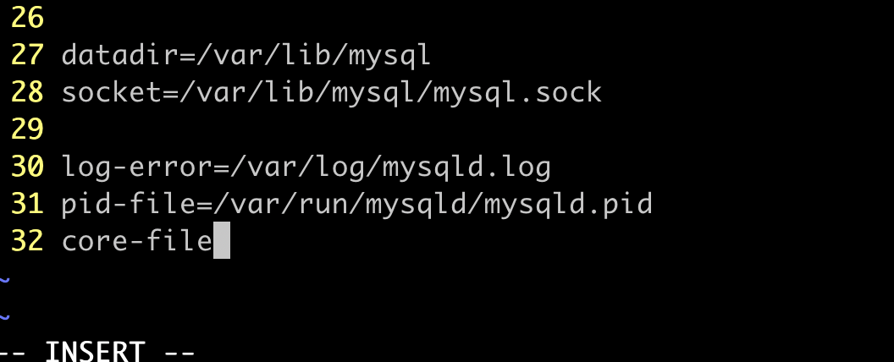
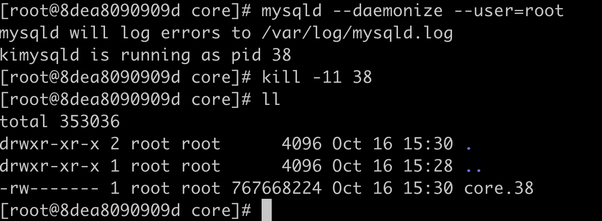

## 前提条件

## 添加配置

### [mysqld]下面添加`core-file`



### ulimit打开core file限制

```bash
ulimit -c unlimited
```

### 如需要，修改core file路径（如在容器内，需要特权容器权限）

```bash
echo "/opt/sh/mysql/core/core" > /proc/sys/kernel/core_pattern
```

### 使得core file携带pid信息

```bash
echo 1 >/proc/sys/kernel/core_uses_pid
```

## 通过kill命令获取core file

```bash
kill -11 $pid
```


