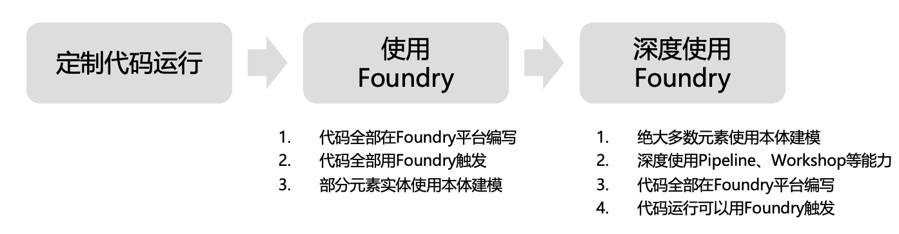

# TLDR

笔者推测Palantir起初以支持定制代码运行为基础，在构筑自己部署平台（Apollo，Palantir GitHub上也有很多开发者构建、Lint工具）的同时，逐渐抽象出Dataset、本体、Function、Action API，打造了坚实的Foundry平台，让应用从定制化开发逐步“长在平台上”。最终，Palantir 推出人工智能平台（AIP），实现数据驱动的智能决策。

# 前言

近年来，Palantir 无疑成为数据分析领域的焦点之一。作为一家以解决复杂问题为核心的公司，Palantir 为政府、国防和企业客户提供了强大的数据整合与分析能力。Palantir 的核心产品 Foundry 是一个面向数据整合与分析的平台，它如何从最初的定制化开发逐渐演变为如今的通用数据智能平台？笔者尝试基于公开资源推测梳理 Palantir Foundry技术平台的演进路线，分享一些分析与推测。本文仅代表个人观点，欢迎读者交流探讨。

# 阶段0 定制代码运行

从Palantir的Offering来看，其核心始终是为客户解决复杂问题，拥有大量的FDE。合理推测Palantir最早其实以定制代码运行交付作为基础，通过高度定制化的软件开发满足客户在政府、国防和企业领域的特定需求。

阶段0，此时都处于定制开发状态。

# 阶段1 从定制代码运行到Palantir平台运行

正如《人月神话》中所说，优秀的程序员都会有自己的library库，优秀的定制开发商也倾向于提炼可复用的技术框架。

对于定制代码来说，我们把定制代码分为编写态和运行态
- **编写态**，对应Palantir Code Repositories，可以看到Palantir的很多东西，其实跟Git很相似，有分支、合并等等。
- **运行态**，将Palantir Code Repositories的代码构建运行，支持多种触发方式，比如通过API调用来执行，定时执行等。
Apollo 平台进一步支持多环境部署（如云和边缘）。

# 阶段2 数据的平台化存储和管理

当开发工作逐渐迁移到 Palantir 平台后，数据的存储和管理成为下一个重点。如果代码已经运行在平台上，那么数据为什么不能也存储在平台中呢？

Palantir 在这一阶段引入了 Dataset 和本体（Ontology）模型，构建了平台化的数据管理能力。Dataset 作为数据的核心容器，支持结构化和非结构化数据的存储；本体则定义了数据之间的语义关系，为数据提供了更高级的抽象层。此外，Palantir 接入了时序数据库，增加了对时间序列数据的支持，满足了金融、工业等领域对实时数据处理的需求。

同时，也把数据集的变更增加为一个触发条件。例如，当某个 Dataset 发生变化时，平台可以自动触发预定义的操作，如运行一段代码或更新其他数据集。

# 阶段3 抽象Action Function

在本体已经定义了DataSet以及数据集之间关系的基础上，通过Action、Function的定义，同时Action、Function可以通过拖拉拽简单地生成，无需书写代码。对于难以无码的复杂逻辑，还可以通过定制代码来书写。

其实Workflow和Pipeline都是在更高层次、更简便地操作代码的手段而存在，底层实现上：
- Pipeline = Datasets+Builds+Schedules
- Workflow = Schedules + Builds + Jobs

# 阶段 4：AIP 的智能决策赋能

在Foundry坚实的基础上，Palantir 2023 年推出了 AIP（人工智能平台）整合大语言模型（LLM）与 Foundry 数据，自动化复杂决策。其核心功能包括：
- **自然语言处理**：用户通过对话界面查询数据或生成分析，如“预测下季度库存需求”。
- **自动化工作流**：基于 Ontology，AIP 驱动智能决策，例如优化供应链或调度资源。
- **实时推理**：结合时序数据，AIP 支持动态预测，如医疗资源分配或工业故障检测。

# 总结

图：笔者设想的企业使用Foundry路线图

本文分析了Palantir Foundry的技术实现路径，笔者认为Palantir Foundry 的技术演进展现了一个从“定制”到“平台原生”的清晰路径。应用从分散的定制代码，逐步迁移到平台上运行，扎根于平台的数据和触发机制，最终成为完全依赖平台功能的原生应用。
