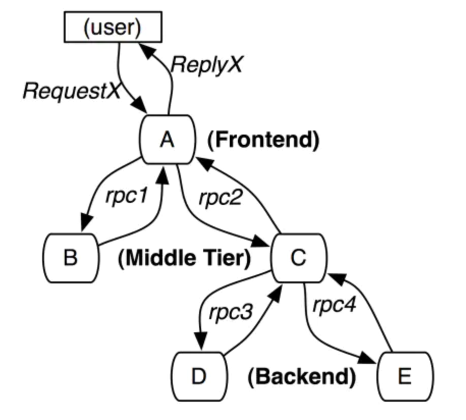
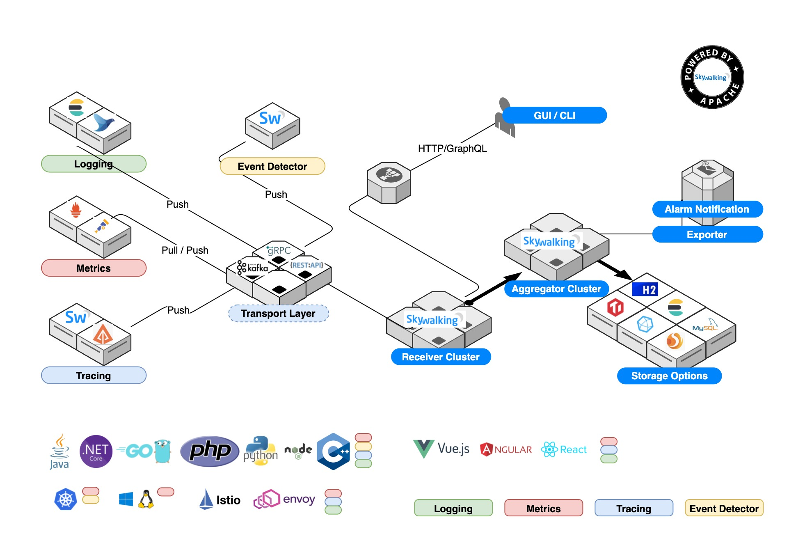
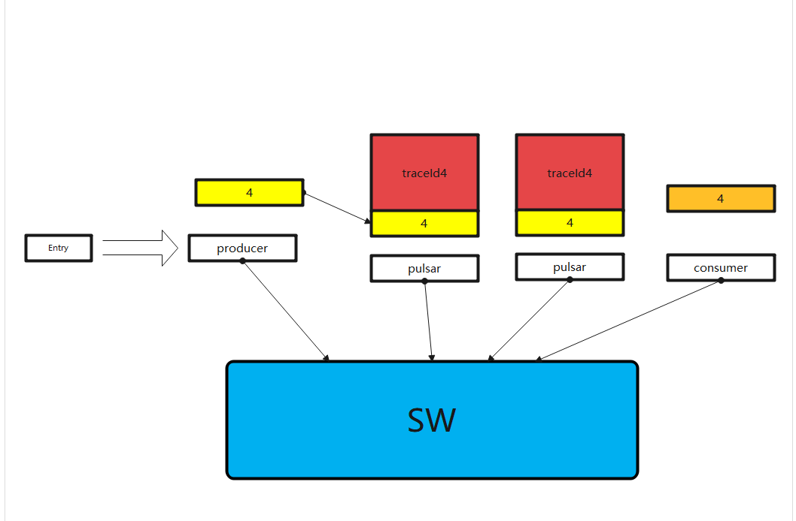
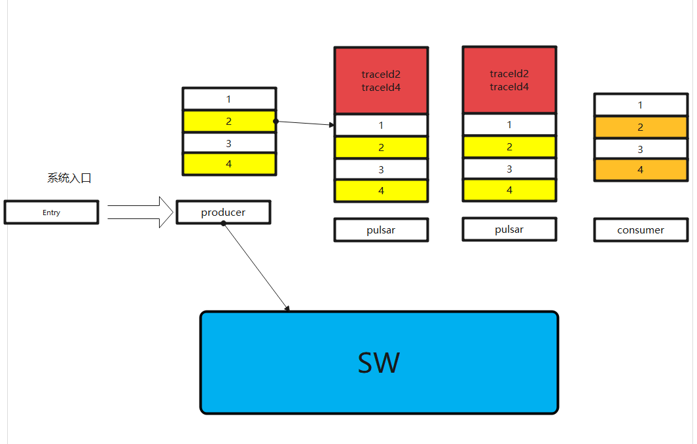

### 为什么要采样追踪对接SkyWalking

为了提升Pulsar的可维护性，我们希望能深入`pulsar`和`bookkeeper`的底层，做性能剖析，识别中间延时高的环节，然后很方便地进行定位分析。

为什么Pulsar原生的普罗监控无法满足

- 部门基础设施方面，所有环境都集成了ELK，大部分环境都没有普罗，且部门正在引入SkyWalking。
- 普罗的监控无法和用户的一条消息对应，较难处理单个客户保障。

幸运的是，这两个问题都可以通过采样跟踪来解决。并且在合理的采样跟踪配置下，测试环境可以达成百分百采样追踪，对于我们定位测试环境问题非常方便。

我们就想到了使用经典的采样追踪模式来对数据进行采样，将数据输出到SkyWalking进行下一步的分析、告警。并且在没有对接SkyWalking的环境，通过日志输出来进行下一步的分析、告警

### Sample Tracing Basic

- 通过`traceId`和`spanId`结合，识别一条链路。
- 每个`spanId`中间计算耗时
- 为了性能，不会每个`spanId`和`traceId`都收集分析，会进行采样（收集部分消息、收集时延较大的消息）

注：SkyWalking采用STAM来进行拓扑分析，并且引入了Segment等概念来表达进程内、进程外等含义，但大致原理相同。

### SkyWalking Architecture

### Trace Internal In Pulsar

目前，我们将追踪的头部消息放在`BrokerMetadata`处，以下为追踪数据流向

#### message

#### batch message

### Two ways output

#### Logging
可在ELK上展示，搜索时延大的消息。（注：如搜索4位数的消息）。

#### SkyWalking
可依赖SkyWalking进行分析，告警。

#### 对比

|                  | Logging                   | SkyWalking                        |
| ---------------- | ------------------------- | --------------------------------- |
| 采样方式         | SkyWalking Way            | SkyWalking Way                    |
| 输出格式         | Logging                   | SkyWalking protocol through kafka |
| 追踪数据传播方式 | protobuf、Broker Metadata | protobuf、Broker Metadata         |

### Beyond SkyWalking
在SkyWalking的采样算法之上，支持对时延大的消息再进行采样，输出到日志，进行分析、告警。

采样规则

- 全局一秒最多xx条，单topic一秒最多xx条
- 采样时延大于xx的消息

### Follow-up
- 将Pulsar和Bookkeeper的metric信息上报到SkyWalking，使得在SkyWalking分析、告警更多信息。
- 使用agent方式实现，避免和SkyWalking协议过度耦合

