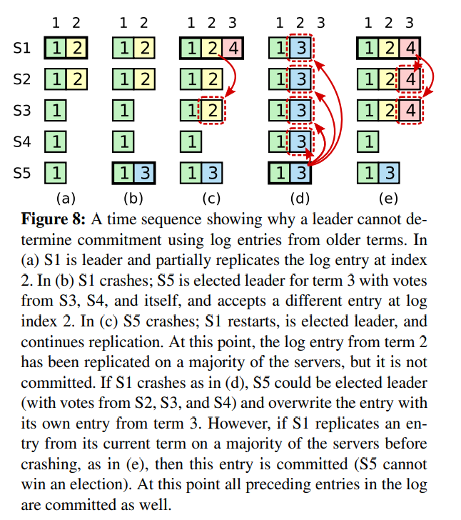

Raft主要使用了重叠的大多数技术来保证算法的安全


Raft首要追求的是可理解性

### Raft使用数个技术来提升可理解性。包括

- 问题分解：主备选举、日志复制、安全性
- 尽量减少状态空间（相比Paxos，Raft减少了不确定性）

### Raft新颖的特性

### 强leader

日志文件只单向传输，简化状态

### leader选举

Raft使用随机定时器来选举leader。只添加了很小的机制，却能简单、快速解决冲突

### Membership变更

Raft的Membership变更机制使用`joint consensus`方法，在变更过程中，两个不同配置的**大多数** 重叠。这使得在集群成员变更时，也能正常处理请求

## 复制状态机
### 补图
保证复制状态机的一致,也就保证了数据的一致

## 一致性算法拥有如下的典型属性
- 在非拜占庭场景下，保证了正确性。包括 网络延迟、分区、丢包、乱序等
- 当大多数节点在线的时候，功能可用
- 不依赖时间来保证日志的一致性。错误的时钟和极大地消息延时，在最差的场景下，可能会导致一致性问题
- 在最常见的场景下，当一轮大多数节点反悔的时候，就能完成一个命令。小部分节点响应缓慢并不影响系统的整体性能。

# Raft协议
## 简述
### Leader选举

新的leader必须在已存在的leader宕机后选出

### 日志复制

leader必须从客户端哪里接收日志请求，复制到整个集群，迫使其他人达成一致

### 安全

Raft的安全属性关键。如果任何服务器将一个entry log复制到状态机中，那么其他任意服务器都不能在相同的log index上放置不同的命令。

## 安全的详细内容

### Election Safety 选举安全

每一个任期内，至多只会有一个leader

### Leader仅追加

leader不会覆写或者删除已存在的entry，只会追加新的entry（todo 待确认，是写入的，还是commit的，从leader可能是一个老的节点来说，这里应该说commit的更为恰当）

### Log Matching 日志匹配

如果两个日志具有相同的任期值和相同的index，那么直到这个index之前的日志都是一样的

### Leader Completeness Leader完整性

如果一个日志在一个给定任期内提交了，那么这个日志会一直存在，存在在任何高任期的Leader之中

### State Machine Safety 状态机安全

如果服务器已在其状态机上将给定索引的日志条目应用于其状态机，则其他服务器将永远不会对同一索引应用不同的日志条目

## Raft基础

Raft将时间切分成任期时长间隔的任期。Raft保证一个任期内至多只有一个Leader。任期可以称为是Raft中的逻辑时钟。每个服务器之间都会互相传播任期值。

## Leader选举

Raft使用随机的选举时间来保证分裂投票场景少见并快速解决。将选举超时设定为一个范围。

Raft的作者们考虑过使用不同的Rank值，当分裂投票的时候，Rank值高的优先成为主节点，但在可用性方面有细微的问题。Rank值低的节点需要超时才能成为新的leader，这个时间间隔如果太短，会破坏已有的选举，集群太过敏感）

最终认为随机的措施更明显、更易懂

## 日志复制

Leader来决定何时将日志提交到状态机是安全的，叫做**committed**提交。Raft保证提交过的entry都是持久化的，然后最终会被所有的状态机执行。

只有当前的Leader在任期内，然后将其复制到大多数节点，才算做committed！（这里有和仅仅复制到大多数节点有着重要的区别）然后这里会将之前的日志提交。

Leader每次发送AppendEntries RPC请求时，确认在这之前的日志和从节点完全相同。

Raft可以accept、replicate、应用新的日志记录。在正常场景下，经过一轮大多数RPC调用，就可以复制完成。

## 安全

假如，当leader提交数个日志的时候，follower不可用，然后他当选了leader之后，提交的日志把之前提交的日志覆盖了怎么办？

这里在选举当选leader的上面加了个限制，保证了之后的leader包含了之前所有已提交的entry。

### 选举限制

Raft使用投票阶段来防止一个没有之前提交过日志的候选者当选leader。候选者必须联络大多数节点才能当选，这就意味着提交过的entry一定在其中的一个服务器中。

### 提交之前任期的entry

leader不能立刻得出结论：之前任期的日志复制到大多数节点就已经算commit了。



- a S1是leader，然后部分复制了日志2
- b S1宕机，S5接受了S3和S4的投票当选了任期3的leader，在index2接受了不同的entry
- c S5宕机，S1重启，当选了leader，继续复制
- d S1宕机，S5重启，然后用任期3的日志覆盖了其他节点
- e 然而如果S1在宕机前，把日志覆盖到大多数节点，那么S5就不能当选leader了

为了避免上图的问题，Raft绝不将复制的数量当作commit 日志的依据。只有当前任期下的entry log通过复制数量来计算。一旦当前任期的entry被提交，那么之前所有的entry都被间接commit了。

### 安全性保证

我们用反证法证明一旦**Leader Completeness Property**没有满足，我们就会推断出一个矛盾。假设任期T的Leader提交了一个log entry在任期T，但是这个log entry没有被将来一些任期的Leader拥有。假设有一个没有包含这个entry的最小的任期U的Leader，Leader U没有存储这个entry

- 1. 在选举的时候，提交的entry必须不在leader U的日志中（leader从不删除或复写日志）
- 2. Leader将这个entry复制到了集群中的大多数节点，并且leader U接收到了集群中大多数节点的投票。至少有一个服务器，即从leader T哪里接受了entry，并且给U投票。这是达成矛盾的关键
  3. voter 必须在接收leaderT的entry之前给U投票。否则它就要拒绝T的写入请求
  4. 当voter给U投票的时候，它始终持久化着这个日志，因为每个中间的leader都包含这个entry，leader不会删除这个entry，除非冲突，follower也不会删除这个entry
  5. voter给U投票，所以U的日志必须至少和voter的一样新，这就达成了第一个冲突
  6. 首先假设，如果voter和U都有同样的上一次log的任期，U的日志至少和vote一样。矛盾，因为最初假设U没有这个log，而voter有。
  7. 否则，leader U的上次log任期比voter的大。此外，它比T大，因为选民的上一个log term至少为T（其中包含来自T的提交entry）。 创建leaderU的最后一个log term的较早的领导者必须在其日志中包含已提交的条目（通过假设）。 然后，通过**Log Matching Property**，leaderU的日志还必须包含已提交的条目，这是矛盾的
  8. 这就完成了矛盾的证明。比T任期大的leader一定包含了任期T内提交的entry

### 时间和可用性

Raft可以选举并维持一个稳定的leader，只要系统满足如下的时间限制条件

```
broadcastTime << electionTimeout << MTBF
```

broadcastTime是进行一个并行rpc到所有服务器来回的平均时间。MTBF是单个服务器故障的平均时间。

广播时间必须比选举时间小一个量级，所以leader放心的发送心跳消息，维护自己的follower。加上随机的选举时延，这个不等式也让选票分裂变得不可能。 如果广播时间和选举时间差不多，选举leader不稳定。

选举超时应该比MTBF小几个数量级，要不然选举的leader就不稳定。
broadcast的时间差不多在0.5ms到20ms
选举超时应该在100ms到500ms。
典型的服务器MTBF时间应该在数月或以上
# 集群成员变更
成员变更的时候，中途必须没有两个相同任期的leader。不幸的是，任何将服务器们直接从老配置变换到新配置都是不安全的。不可能一次性地原子性地把所有服务器的配置变更，所以中集群在中途可能会分裂为两个多数派。
为了保证安全性，集群成员变更必须使用两阶段的方式。有很多种方式实现两阶段提交。例如，一些系统使用第一次提交来禁用旧的配置，使得旧的配置无法接受客户端的请求，然后第二次操作启动新的配置。在Raft中，集群首先切换到一个过度的配置，叫做`joint consensus`。一旦`joint consensus`被提交，系统接下来过渡到新的配置。`joint consensus`结合了新老配置
- Log entry在两种配置下都会复制。即新机器和老机器都会复制entry
- 不管是老配置还是新配置，都有可能当选leader
- Agreement(协议，包括选举和entry提交)需要老配置和新配置多数派都确认
补图 Figure11
集群配置通过复制日志中的特殊entry来进行存储、通信。

上述流程有三个问题
第一个问题是，新的服务器可能初始没有存储任何log entry。如果现在添加到集群中，会花费一些时间来跟上集群的数据，这中间有可能无法commit新的log entry。为了避免可用性的gap。Raft在配置变更之前引入了一个额外的阶段，新的服务器首先
第二个问题是，cluster的leader可能不是新配置中的服务器。这个场景，leader的变化发生在新配置提交的时候。
第三个问题是，移除的服务器可以打乱整个集群。这些服务器接收不到心跳，这些服务器会超时然后启动新的选举。他们将使用新的任期发送**RequestVote** RPC，会导致当前的leader变为follower。新的leader最终会被选举，但是移除的服务器将会再次超时，重复整个过程，最终导致集群较差的可用性。
为了解决这个问题，Server当认为有leader存在的时候，会忽略**RequestVote**请求。如果服务器在选举超时前接收到**RequestVote** RPC请求，它并不会更新它的任期或是给予它的投票。这并不影响正常的选举（每个服务器在选举之前等待最小超时时间）。并且，这有助于避免移除的server破坏选举：如果一个leader可以发送心跳到他负责的集群中的大多数节点，他将不会被更高任期的节点罢免。


成员变更过程中如果发生Failover，老Leader宕机， Cold,new中任意一个节点都可能成为新Leader，如果新 Cold,newLeader上没有 日志，则继续使用Cold ，Follower上如果有 Cold,new 日志会被新Leader截断，回退到 Cold，成员变更失败；如果新Leader上有  Cold,new日志，则继续将未完成的成员变更流程走完。


新成员先加入再同步数据，成员变更可以立即完成，并且因为只要大多数成员同意即可加入，甚至可以加入还不存在的成员，加入后再慢慢同步数据。但在数据同步完成之前新成员无法服务，但新成员的加入可能让多数派集合增大，而新成员暂时又无法服务，此时如果有成员发生Failover，很可能导致无法满足多数成员存活的条件，让服务不可用。因此新成员先加入再同步数据，简化了成员变更，但可能降低服务的可用性。

新成员先同步数据再加入，成员变更需要后台异步进行，先将新成员作为Learner角色加入，只能同步数据，不具有投票权，不会增加多数派集合，等数据同步完成后再让新成员正式加入，正式加入后可立即开始工作，不影响服务可用性。因此新成员先同步数据再加入，不影响服务的可用性，但成员变更流程复杂，并且因为要先给新成员同步数据，不能加入还不存在的成员。

# 日志压缩
每当有新的操作发生的时候，Raft的日志就会增长，然而在实际的系统中，日志并不能无边界地增长。
快照是最简单的压缩日志的方式。在快照中，整个系统的状态写入到持久化存储的快照中，然后在这之前的日志都可以丢弃。
todo 补图
其他方式，像日志清理或lsm树。在数据的一部分子集上面执行，它们均摊了压缩日志的消耗。

Leader创建snapshot，再分发给follower。有如下两个缺点
第一，Server必须选择何时进行快照，如果服务器快照进行地太频繁，将会浪费磁盘带宽和磁盘energy。如果快照太不频繁，会浪费磁盘的存储空间，然后增加了重放日志所需的时间。如果阈值设置地大，时间周期长的话，磁盘开销小。
第二，写快照会消耗较大的时间，我们不希望这个操作延迟了正常的操作。方案是使用**Copy on write**技术，这样子在不影响snapshot写入的情况下，集群可以接受新的更新。
# 客户端的交互
Raft实现了线性化的语义。**Linearizable semantics**。像es那样使用version，是达不到线性化的语义的。
在读取数据的时候需要额外的措施来保证线性化的语义。首先，leader必须知道最新有那些entry已经提交。**Leader Completeness Property** 保证了leader有所有的committed entries，但是在任期的开头，可能并不知道那些entry已被提交。（为了确认，可以发空请求来commit数据）
通过向大多数节点来发送心跳，来保证读请求的返回的是最新的。这里就依赖了前面所说的时钟。依赖时钟来实现安全。
# 性能
todo 补图
随机杀死leader，重新选举最短时间刚好是leader选举超时的一半，因为心跳超时时间刚好是选举超时的一半。

# 实现
## InstallSnapshot RPC接口
由leader调用，发送snapshot的一部分到从节点。Leader总是按顺序发送chunk
### 参数
- term leader的任期
- leaderId 使得follower可重定向client的请求
- lastIncludedIndex snapshot最后包含的index号
- lastIncludedTerm snapshot最后包含的最后一个任期号
- offset chunk在整个snapshot中的offset
- data[] 原始数据
- done 如果是last chunk则为true
### 返回体
term 当前任期，使得leader可以根据这个结果判断是否做操作
### 接收方的实现
- 如果接收到的任期小于当前任期，则立刻返回
- 如果接收到的chunk offset为0，则开始创建快照文件
- 在给定的offset处写入数据
- 如果done为false，返回且等待接下来的数据
- 保存snapshot文件，丢弃之前存在的所有快照文件
- 如果现有日志条目的索引和术语与快照的最后一个包含的条目相同，请保留其后的日志条目并回复
- 丢弃整个日志文件
- 把状态机重设为快照的内容（也使用快照内的集群信息）

## State 状态
### 所有服务器上的持久化状态
在响应RPC之前更新到持久化存储上
- 当前任期 server见过的最大任期值（初始值是0，单调递增）
- votedFor 在当前任期内获得投票的候选人ID（如果没有，则为null）
- log[] log entry;每一个包含一个状态机的命令，包含从leader获取的任期（初始index为1）
### 所有服务器上的可变状态
- commitIndex 已知要提交的最高日志条目的index（初始值是0，单调递增）
- lastApplied 已知要应用到状态机上的最高index（初始值是0，单调递增）
### leader上的可变状态
选举后重新初始化
- nextIndex[] 对每个服务器，将要送给另一个服务器的下一个log entry的index（初始化为leader的lastLogIndex+1）
- matchIndex[] 对每个服务器，知道的复制到该服务器的最大的log entry的索引。（初始化为0，单调递增）
## AppendEntryies RPC
被leader触发，用来复制log entry；也用于心跳。
### 参数
- term leader的任期
- leaderId 使得follower可重定向client的请求
- prevLogIndex 紧接新记录之前的日志条目索引
- prevLogTerm 紧接新记录之前的日志条目索引的任期
- entries[] 要存储的entries。心跳时为空，批量来提升性能
- leaderCommit leader的commit index提交索引
### 返回结果
- term 当前任期，使得leader可以根据这个结果判断是否做操作
- success 如果follower包含了匹配的prevLogIndex和prevLogTerm，就返回true
### 接收方实现
- 如果term < current term，返回false
- 如果不包含匹配的prevLogIndex和prevLogTerm，就返回false
- 如果有一个存在的entry和新的冲突（相同的index，不同的term），删除哪个entry和在其之后的所有entry
- 添加没在log里面的所有entry
- 如果leaderCommit > commitIndex, 设置commitIndex为leaderCommit、lastNewEntry的最小值
## RequestVote RPC
由candidate调用来收集选票
### 参数
- term 候选者的任期
- candidateId 候选者的请求投票
- lastLogIndex 候选者的最后log entry的索引
- lastLogTerm 候选者的最后log entry的任期
### 返回结果
- term 任期，可以让candidate根据任期做操作
- voteGranted true代表候选者收到了选票
### 接收方实现
- 如果term < currentTerm返回false
- 如果votedFor或candidateId是null，并且候选者日志至少比接受者的新，给予自己的投票
## Server遵守的规则 Rules for Servers
### 所有服务器
- 如果commitIndex > lastApplied: 增加lastApplied，把log[lastAplied]应用到状态机上
- 如果rpc请求或响应中，包含的任期T比当前的Term值大，则将当前的任期值设置为T，转换自己为follower
### Follower
- 向候选者和leader响应rpc
- 在选举超时的时间间隔内，没有接收到**AppendEntries** RPC请求或者投票给其他人，那么切换为候选者
### 候选者
- 一旦转化为候选者，开始选举
  - 增加任期号
  - 给自己投票
  - 重置选举定时器
  - 向其他服务器发送**RequestVote** RPC请求
- 如果接收到了大部分节点的投票，成为leader
- 如果**AppendEntries** RPC从新的leader处返回，变为follower
- 如果选举超时，启动新的选举流程
### Leader
- 选举完成后：发送空的**AppendEntries** RPC请求到每个服务器（心跳），在空闲期间重复此操作避免选举超时
- 从客户端哪里接收到命令；添加entry到本地的日志中，待把这个entry复制到状态机后响应
- 如果对一个follower有，last log index >= nextIndex，从nextIndex开始发送**AppendEntries** RPC请求
  - 如果成功：更新follower的nextIndex和matchIndex
  - 如果因为日志不一致的原因失败：降低nextIndex然后重试
- 如果存在N，且N>commitIndex,大多数节点的matchIndex[i]>=N，并且log[N].term == cuurentTerm,设置commitIndex=N
