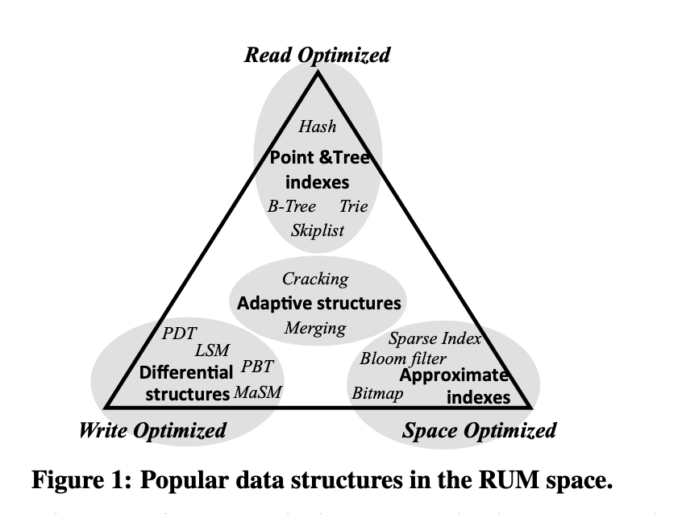
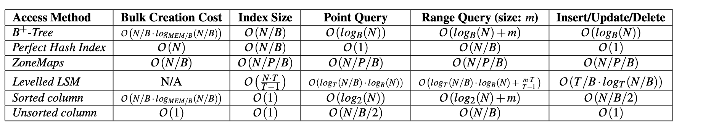

## RUM定理的背景
现在的基础设备复杂，多种多样。数据的保存和查询也多种多样，很多时候会为了很小的差异重新设计数据结构。这篇论文主要是指出了无论如何设计数据结构，都不可能在Read（读取）、Update(更新)、Memory(存储)三个方向上都做到最优，也希望指导接下来其他数据结构的设计，更希望能有一种自适应的系统，可以根据数据的查询、数据的写入、配置的硬件、人工的配置在Read、Update、Memory之间权衡。
## RUM开销介绍
我们将存储在数据中心的数据称作基础数据。那些用来辅助写入，辅助查询的数据成为辅助数据
### 读开销 RO
也称作读放大，通过读取到的辅助数据加上基础数据除以基础数据来计算。举个例子，在mysql中查询数据，中间经过的B树层级就是读放大

### 更新开销 UO

也叫做写放大，实例物理上写入磁盘的大小除以逻辑上需要更新的大小。

### 内存开销 MO

也叫做空间放大，全部的基础数据加上全部的辅助数据除以基础数据。

## RUM不可能达成举例

我们选择一个有代表性的基础数据：一个整数数组。我们将这个数据集合组织到N个块中的固定大小的元素，每一个持有一个数值。每一个块可以用一个单调递增的ID来指示。工作负载使用数据的方式有 点查询、点更新、插入和删除。

### 最小化RO

那我们就把bk的Id当做我们数据结构数组的下标，举例子，{1, 17}是两个元素的id，我们就开辟大小为17的数组array，然后通过array[i]来得到i的数据。现在已经达成了RO最小，但我们的索引非常稀疏，理论上我们的数组是无限大的。更新需要操作两次，将旧的数组元素置空，然后将新的数据存放在新的block中。

RO: 1  UO: 2 MO: 无穷大

### 最小化UO

为了最小化UO，我们将每次更新的数据直接插入到日志的最尾端，就算更新完成。查询需要遍历原来的数据和整个log文件。

UO: 1 RO: 无穷大 MO: 无穷大

### 最小化MO

最小化MO时，不存储辅助数据，而将基础数据密集地存储起来。 读取需要进行全表扫描，如果任意更新，也需要进行全表扫描

MO: 1 RO: N UO: 1

## 数据结构的RUM

| 参数 | N          | m            | B      | P        | T           | MEM  |
| ---- | ---------- | ------------ | ------ | -------- | ----------- | ---- |
| 含义 | 数据集大小 | 查询结果大小 | 块大小 | 分区大小 | LSM级别比例 | 内存 |
| 单位 | 元组       | 元组         |        |          |             | 页   |

|              | 批量创建 | 索引大小 | 点查询 | 范围查询(大小m) | 查询/更新/删除 |
| ------------ | -------- | -------- | ------ | --------------- | -------------- |
| 读取方式     |          |          |        |                 |                |
| B+树         |          |          |        |                 |                |
| 完美哈希索引 |          |          |        |                 |                |
| ZoneMaps     |          |          |        |                 |                |
| 层级LSM树    |          |          |        |                 |                |
| 排序列       |          |          |        |                 |                |
| 未排序列     |          |          |        |                 |                |

## 论文作者对将来系统的设想

作者认为，将来的系统应该是RUM可调的，来满足大多数场景的需要。通过一套可以轻松适应不同优化目标的访问方法来展望未来的数据系统。例如：

• 具有动态调整参数（包括树高，节点大小和拆分条件）的B +树，以便在运行时调整树大小，读取成本和更新成本。

• Approximate (tree) indexing that supports updates with low read performance overhead, by absorbing them in updatable probabilistic data structures (like quotient filters).

• Morphingaccessmethods,combiningmultipleshapesatonce. Adding structure to data gradually with incoming queries, and building supporting index structures when further data reorganization becomes infeasible.

• Update-friendly bitmap indexes, where updates are absorbed using additional, highly compressible, bitvectors which are gradually merged.

• Accessmethodswithiterativelogsenhancedbyprobabilistic data structures that allows for more efficient reads and up- dates by avoiding accessing unnecessary data at the expense of additional space.

## 论文中其他有意思的点

- 现代数据系统，通常在压缩的数据上运行，并尽可能晚地解压缩
