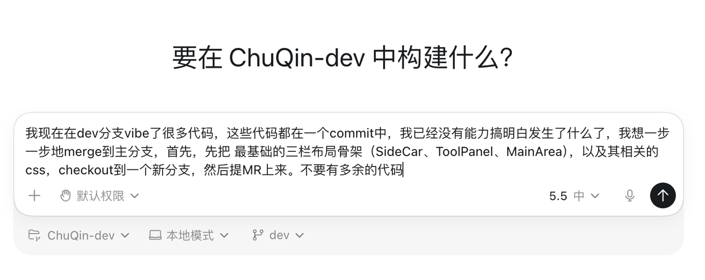
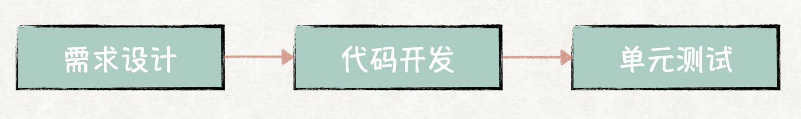
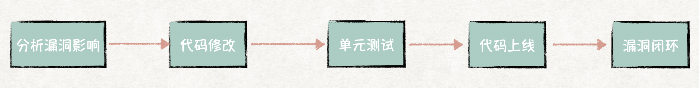
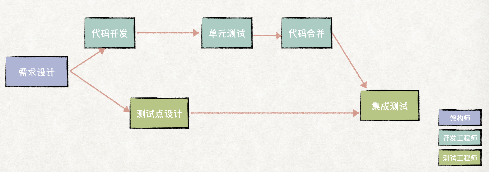
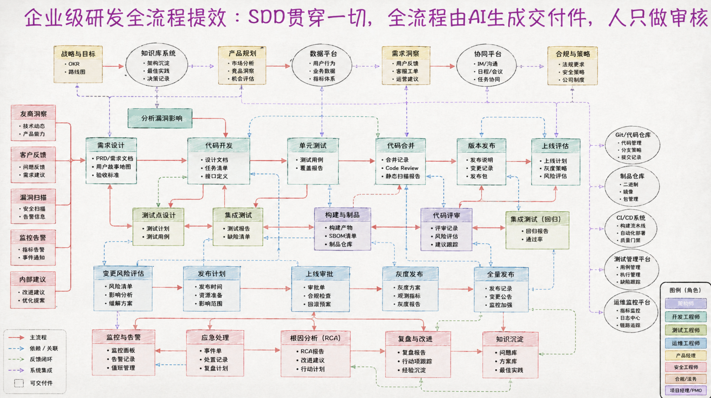

# TL;DR

AI辅助研发已经走过Chat、Copilot，进入Agent时代，为了让Agent更大程度地帮助人们提效，AI生成的产物，要直接成为研发流程中的交付件，并且要易于编辑审核。SDD将海量，人难以review的代码抽象成了更易编辑审核的SPEC，但目前业内大多数 SDD 实践，还主要停留在“代码生成”阶段。而在真实企业研发中，代码只占整个研发活动的一小部分。漏洞处理、现网事件、上线说明、影响评估.......未来整个流程逐渐演化为Agent输出可结构化、可审核的交付件，人仅审核的方向发展，最终"SDD会吞噬一切"。

# 为什么会有SDD，SDD是什么？

现在是2026年，距离GPT4发布已经过去了3年，AI辅助研发，经历了很大的改变，从Chat、Copilot再到Agent。现在没有用过Agent模式辅助开发的人，恐怕你已经有一些落后了。

Agent模式下，AI生成代码的速度越来越快，以原先的方式提交、检视代码，甚至合并冲突都非常耗时，这种模式下，人越来越没有能力掌控代码。

这是我在开发一个提效助手项目时跟Codex对话过的原话：

> 我在“[如何让AI真正替你干活](https://hezhangjian.com/agent-para)"中提到过提效的关键取决于"**AI生成的产物，是否是最终的交付件，是否易于编辑。** 代码本身是易于编辑的，所以它成为了AI率先提效的对象，但量变引起质变，海量的代码已经不再易于编辑和审核。

为此，人们在已有的软件工程下，追求新的抽象层次，代码不好维护，那我想办法维护别的不就好了？

这就是SDD的核心理念，SDD通过结构化的规格文档（Spec）作为可信生成源，让 AI 围绕规格进行实现，而人类主要审核规格本身，而不是陷入海量代码细节。这些规格通常以 Markdown 等易读、易维护的形式存在，例如 `Spec.md`、`design.md`、`tasks.md` 等。

> 这就好像，我生成一个短剧视频，比如一次生成了2min，我想修改里面的部分很难，但是如果我先用AI生成首尾帧图，每次生成5秒钟，我先调整首尾帧图，再生成一样。

> 不过从目前的实践来看，SDD还没能那么理想地屏蔽掉代码层，一些小修改，例如配置、端口、脚本、热修复，我们仍然会直接修改代码文件，而不会重新回到 Spec。

但无论如何，SDD已经算是目前较为优秀的一种实践。这同时也让我们理解了要让AI生成的产物，就是最终的交付件，要易于编辑。

# 企业级研发全流程提效的下一个阶段

目前业内主流的SDD的实践，比如**OpenSpec**，主要聚焦于代码生成流程：

但是在企业级研发中，真实的研发活动是一个由大量角色、流程、交付件组成的网状协同系统，单纯的写代码，只占真实研发活动中的很小一部分，比如还有 友商的洞察、漏洞检测报告漏洞处理。

那么这些步骤，其实像**OpenSpec**这样的工具还是帮不上忙的，我们举几个例子：

## 场景一：漏洞报告处理

企业今天可以通过扫描平台、运行时检测等工具，自动发现大量漏洞。但真正耗时的，其实并不是修改漏洞代码本身，而是整个处理流程：

代码修改只是其中的很小一个部分，还有很多阶段还没有让Agent介入，可能还只是在用"Chat"模式提效。接下来通过开发Agent，由Agent分析漏洞影响输出交付件，人确认，Agent基于漏洞处理的特点（修改尽量不要太大等等）给出修改意见，人确认，自然而然地达成全流程AI提效。

## 场景二：SDD、TDD融合

Agent把个人的能力放的这么大，我有时也跟朋友闲聊到，将来一个小的公司，老板不太懂的情况下，三个技术人员就够了，又有容灾能力，又能讨论决策出结果。

然而大企业却绝不可能只招聘数个技术人员，这就意味着没法**尽量让一个人负责工作的各个方面**，有些研发流程就很适合像"首尾帧"那样拆解。

过去很多团队推行 TDD（Test-Driven Development），开发人员不是先写代码，而是先写 测试用例、输入输出，然后再让代码去满足这些约束。

> 有些很极端的例子，比如
> func sum(x, y) {
>   return 42;
> }
> 先让40+2的用例通过。

某种程度上来说，TDD其实已经具备了一部分 SDD 的思想 **不再直接围绕代码本身开发，而是围绕“可验证的约束”进行开发。** 但是在过去这个成本非常高。现在充分利用Agent的能力，我们甚至可以做得比Agent直接生成代码更快更稳。

最终，这个流程的每一个红色箭头，都可以使用Agent快速提交，并且每一步都有可审核、可编辑的交付件，希望不会再出现文章开头的问题(笑)。
# 总结

我们在这里还只展开了两个流程，真正企业里的研发流程只会更加复杂，我让AI生成了一张图：

最终，随着Agent产出效率越来越高，整个研发流程都需要尽量使用Agent提效，这些原本依赖大量人力协同的研发交付流程，最终都会演化为"Agent生成交付件，人类负责最终审核与治理"。而整个企业研发体系，都会围绕这些交付件重新组织，最终**SDD会吞噬一切**。
