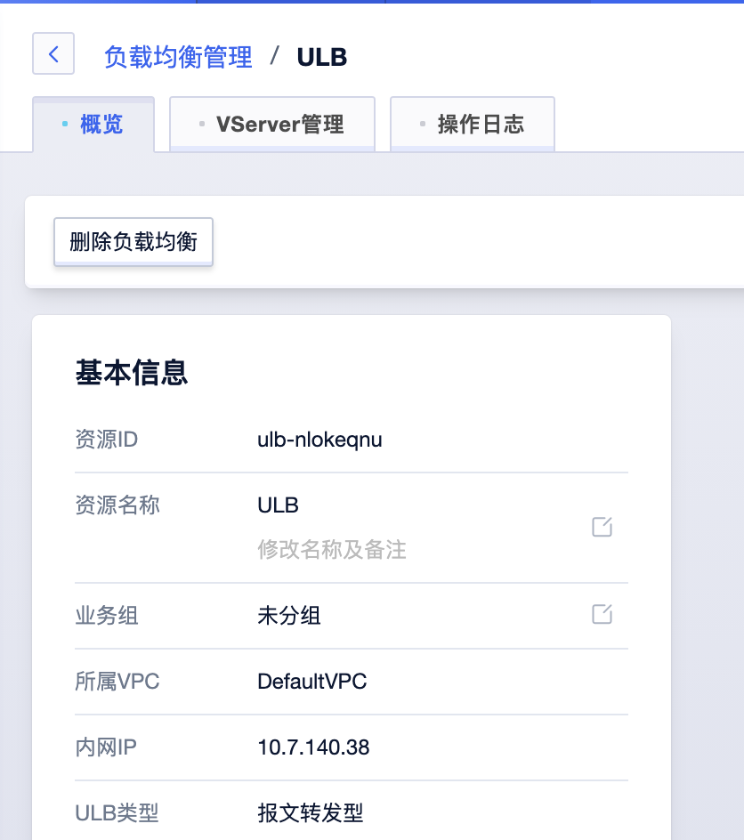
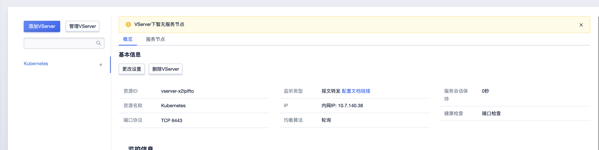
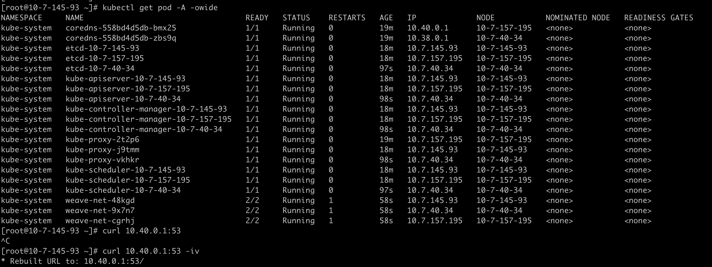

## 前言
最近因为业务的需求，在学习etcd，想了解一下`kubernetes`是如何使用etcd集群的，不如动手搭建一个`kubernetes`集群，也顺手体验一下友商UCloud。后面有时间仔细分析一下kubeadm搭建的时候都做了哪些事情

选择香港Region进行搭建，下载国外的镜像比较方便。

## 购买三台ECS

### 基础配置

三台4U16G，基础镜像选择Centos8版本

## ApiServer创建ELB

### 创建LB实例



### 添加一个6443端口的Vserver



这里Vserver和LVS上的Virtual Service的概念相同。

### 向6443端口添加Rs

把三台虚拟机的6643端口都添加到负载均衡上

现在6443端口显示异常不要紧，后面安装过程中，各个节点的6443端口才会逐渐可用，让各个节点访问。

## 初始化Master集群

### 虚拟机上安装必须组件

```bash
yum install -y yum-utils
yum remove -y runc
yum-config-manager --add-repo https://download.docker.com/linux/centos/docker-ce.repo
yum install -y docker-ce docker-ce-cli containerd.io
systemctl start docker
cat <<EOF | sudo tee /etc/yum.repos.d/kubernetes.repo
[kubernetes]
name=Kubernetes
baseurl=https://packages.cloud.google.com/yum/repos/kubernetes-el7-\$basearch
enabled=1
gpgcheck=1
repo_gpgcheck=1
gpgkey=https://packages.cloud.google.com/yum/doc/yum-key.gpg https://packages.cloud.google.com/yum/doc/rpm-package-key.gpg
exclude=kubelet kubeadm kubectl
EOF

# Set SELinux in permissive mode (effectively disabling it)
sudo setenforce 0
sudo sed -i 's/^SELINUX=enforcing$/SELINUX=permissive/' /etc/selinux/config

sudo yum install -y kubelet kubeadm kubectl --disableexcludes=kubernetes

sudo systemctl enable --now kubelet
kubeadm config images pull
```

### 初始化master-001节点

这里这个IP地址填负载均衡的地址，这样子才能搭建出高可用集群

```
kubeadm init --control-plane-endpoint "10.7.157.12:6443" --upload-certs
```

初始化成功，返回以下提示信息

```
Your Kubernetes control-plane has initialized successfully!

To start using your cluster, you need to run the following as a regular user:

  mkdir -p $HOME/.kube
  sudo cp -i /etc/kubernetes/admin.conf $HOME/.kube/config
  sudo chown $(id -u):$(id -g) $HOME/.kube/config

Alternatively, if you are the root user, you can run:

  export KUBECONFIG=/etc/kubernetes/admin.conf

You should now deploy a pod network to the cluster.
Run "kubectl apply -f [podnetwork].yaml" with one of the options listed at:
  https://kubernetes.io/docs/concepts/cluster-administration/addons/

You can now join any number of the control-plane node running the following command on each as root:

  kubeadm join 10.7.157.12:6443 --token bj4vpt.o999hbp96p1bvw5q \
	--discovery-token-ca-cert-hash sha256:8560fa9211dbfdb55609d22ef0f0b428c6cb73b6e85a70c7a9e13d88b0b8400c \
	--control-plane --certificate-key 85c86678b3d54b6017ac3fab2f2a92337f332c7172dfaf4b5a18ee1da679cd7d

Please note that the certificate-key gives access to cluster sensitive data, keep it secret!
As a safeguard, uploaded-certs will be deleted in two hours; If necessary, you can use
"kubeadm init phase upload-certs --upload-certs" to reload certs afterward.

Then you can join any number of worker nodes by running the following on each as root:

kubeadm join 10.7.157.12:6443 --token bj4vpt.o999hbp96p1bvw5q \
	--discovery-token-ca-cert-hash sha256:8560fa9211dbfdb55609d22ef0f0b428c6cb73b6e85a70c7a9e13d88b0b8400c
```

其他节点上执行kubeadm join

```
kubeadm join 10.7.157.12:6443 --token bj4vpt.o999hbp96p1bvw5q \
--discovery-token-ca-cert-hash sha256:8560fa9211dbfdb55609d22ef0f0b428c6cb73b6e85a70c7a9e13d88b0b8400c \
--control-plane --certificate-key 85c86678b3d54b6017ac3fab2f2a92337f332c7172dfaf4b5a18ee1da679cd7d
```

调整kubectl命令行

```
mkdir -p $HOME/.kube
	sudo cp -i /etc/kubernetes/admin.conf $HOME/.kube/config
	sudo chown $(id -u):$(id -g) $HOME/.kube/config
```
### 安装cni插件

```bash
kubectl apply -f "https://cloud.weave.works/k8s/net?k8s-version=$(kubectl version | base64 | tr -d '\n')"
```

至此，kubernetes搭建完成。


