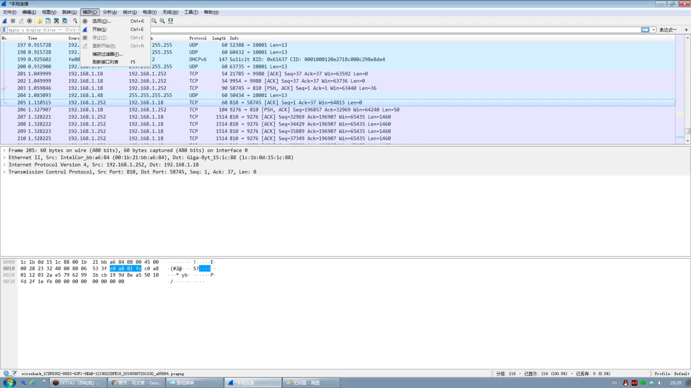
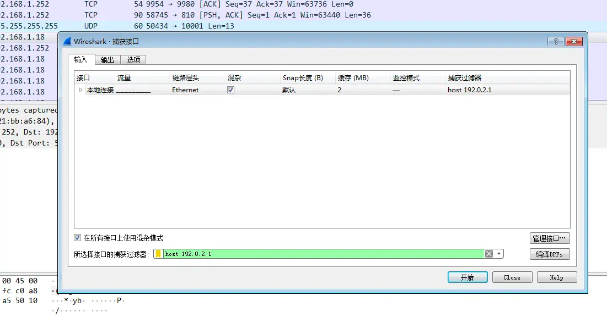

# 如何使用捕获过滤器

点击捕获，选项，然后在所选择的捕获过滤器上输入对应的捕获表达式





# 抓包过滤器

- type(类型) 限定符: 比如host，net，port限定符等
- dir(方向) 限定符: src dst
- Proto(协议类型)限定符: ether ip arp

## 二层过滤器举例

```
tcp dst port 135 //tcp协议，目标端口为135的数据包
ether host <Ethernet host> //让wireshark只抓取这个地址相关的以太网帧
ether dst <Ethernet host>
ether src <Ethernet src>
ether broadcast //Wireshark只抓取所有以太网广播流量
ether multicast //只抓取多播流量
ether proto <protocol>
vlan <vlan_id>
```

## 三层过滤器举例

```
ip #只抓取ipv4流量
ipv6
host 10.0.0.2
dest host <host>
src host <host>
broadcast #ip广播包
multicast #ip多播包
ip proto <protocol code> #ip数据包有多种类型，比如TCP(6), UDP(17) ICMP(1)
```

### 只抓取源于或者发往IPv6 2001::/16的数据包

net 2001::/16

### 只抓取ICMP流量

ip proto 1

### 只抓取ICMP echo request流量

icmp[icmptype]==icmp-echo
icmp[icmptype]==8

### 只抓取特定长度的IP数据包

ip[2:2] == <number>

### 只抓取具有特定TTL的IP数据包

ip[8] == <number>

### 抓取数据包的源和目的IP地址相同

ip[12:4] ==1 ip[16:4]

## 四层抓包过滤器举例

```
port <port>
dst port <port>
src port <port>
tcp portrange <p1>-<p2>
```

### 只抓取TCP中SYN或者FIN的数据包

tcp [tcpflags] & (tcp-syn | tcp-fin) != 0

### 只抓所有RST标记位置为1的TCP数据包

tcp[tcpflags] & (tcp-rst) != 0

### tcp头部的常用标记位

- SYN: 用来表示打开连接
- FIN: 用来表示拆除连接
- ACK: 用来确认收到的数据
- RST: 用来表示立刻拆除连接
- PSH: 用来表示应将数据提交给末端应用程序处理

### 抓取所有标记位都未置1的TCP流量

该报文可能用于端口探测,即如果
tcp[13] & 0x00 = 0

### 设置了URG位的TCP数据包

URG位,表示该数据包十分紧急,不进入缓冲区,直接送给进程
tcp[13] & 32 == 32

### 设置了ACK位的TCP数据包

tcp[13] & 16 == 16

### 设置了PSH位的TCP数据包

PSH代表这个消息要从缓冲区立刻发送给应用程序
tcp[13] & 8 == 8

### 设置了RST位的TCP数据包

tcp[13] & 4 == 4

### 设置了SYN位的TCP数据包

tcp[13] & 2 == 2

### 设置了FIN位的TCP数据包

tcp[13] & 1 == 1

### TCP SYN-ACK数据包

tcp[13] == 18

### 抓取目的端口范围的数据包

tcp portrange 2000-2500

###tcpdump捕获过滤器

常见命令介绍

```
tcpdump -w hzj.pcap -s0 -iany port 1028
```

上面的命令代表
-w hzj.pcap 存储在hzj.pcap这个文件中
-s 0 代表抓取字节数不限制,在大多数linux系统下,默认捕获每个帧的前96个字节

### tcpdump捕获一定范围的端口(9200-9400)

tcpdump portrange 9200-9400

### tcpdump -r 可以阅读捕获的文件(建议拷贝到wireshark中分析)
