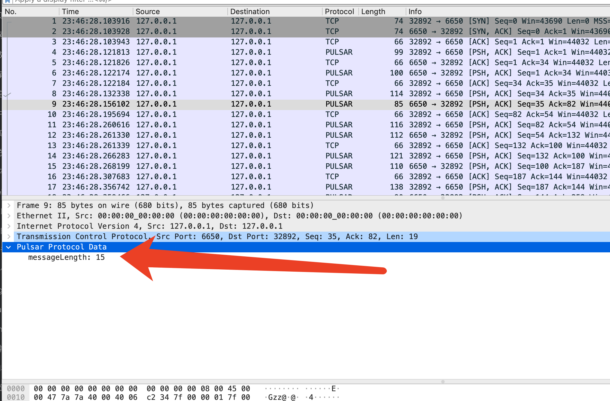

### 未书写插件前

wireshark的协议不支持之前，报文几乎难以分析，举例如下


### Wireshark插件路径

#### MAC


### 重新加载Wireshark中的lua插件

#### MAC


### 从一个新协议的样板开始

```lua
pulsar_protocol = Proto("Pulsar", "Pulsar Protocol")

pulsar_protocol.fields = {}

function pulsar_protocol.dissector(buffer, pinfo, tree)
    length = buffer:len()
    if length == 0 then
        return
    end
    pinfo.cols.protocol = pulsar_protocol.name
    local subtree = tree:add(pulsar_protocol, buffer(), "Pulsar Protocol Data")
end

local tcp_port = DissectorTable.get("tcp.port")
tcp_port:add(6650, pulsar_protocol)
```

我们从协议对象开始，命名为`pulsar_protocol`。构造函数两个参数分别为名称和描述。协议需要一个`fields`表和`dissecotr`函数。我们现在还没有任何`field`，所以`fields`表为空。对于每一个报文，`dissctor`函数都会被调用一次。

`dissector`函数有三个入参，`buffer`，`pinfo`，和`tree`。`buffer`包含了网络包的内容，是一个`Tvb`对象。`pinfo`包含了wireshark中展示packet的列信息，是一个`Pinfo`对象。`tree`是wireshark报文详情显示的内容，是`TreeItem`对象。

在`dissector`函数中，我们检查buffer的长度，如果长度为0，则立即返回

`pinfo`对象包含着列信息，我们可以将`pinfo`的protocol设置为pulsar，显示在wireshark的界面中。接下来在packet的结构中创建一个子树，最后，我们把协议绑定到6650端口上。让我们加载这个`lua`插件

```bash
mkdir -p ~/.local/lib/wireshark/plugins
cp $DIR/../../pulsar_dissector.lua ~/.local/lib/wireshark/plugins/pulsar_dissector.lua
```

结果符合预期


### 添加长度字段

让我们添加一个长度字段，pulsar协议中,长度字段即就是前4个字节，定义字段

```lua
message_length = ProtoField.int32("pulsar.message_length", "messageLength", base.DEC)

pulsar_protocol.fields = { message_length }
```

`pulsar.message_length`可以用在过滤器字段中。`messageLength`是子树中的`label`。第三个字段决定了这个值会被如何展示

最后，我们把长度值加入到Wireshark的tree中

```lua
subtree:add(message_length, buffer(0,4))
```

pulsar的协议是大端序，我们使用`add`函数。如果协议是小端序，我们就可以使用`addle`函数。



我们添加的`message_length`字段已经可以显示在Wireshark中了

### 添加额外信息

## protoc加入到wireshark

## 参考及附录

### proto field函数列表

https://www.wireshark.org/docs/wsdg_html_chunked/lua_module_Proto.html#lua_fn_ProtoField_char_abbr___name____base____valuestring____mask____desc__

### wireshark解析protobuf
https://ask.wireshark.org/question/15787/how-to-decode-protobuf-by-wireshark/
