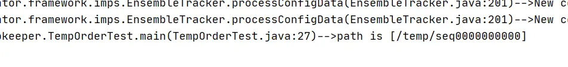
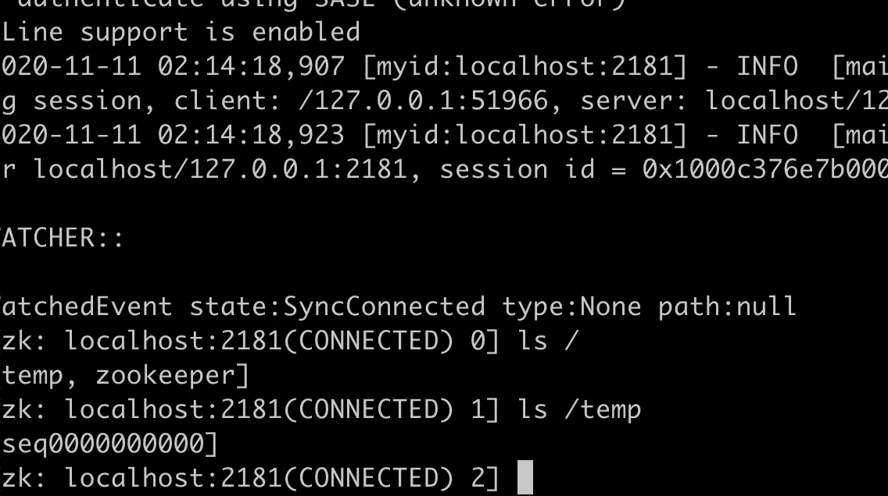
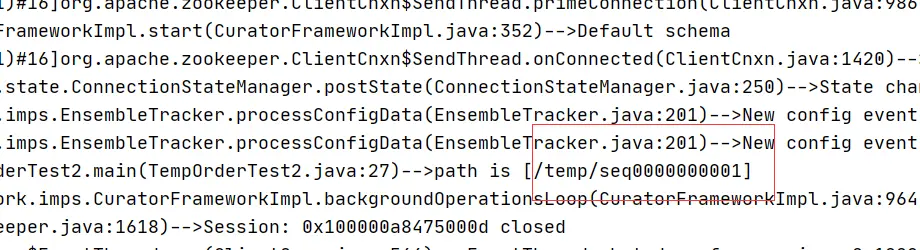
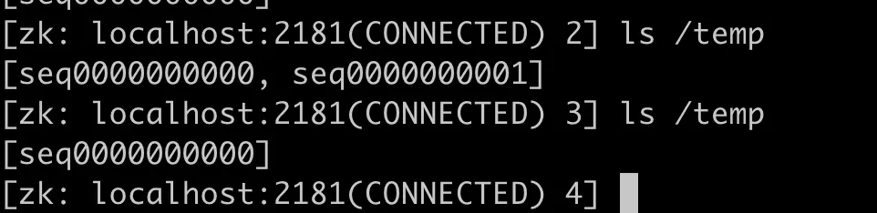
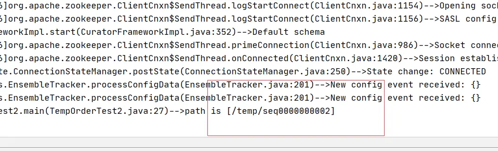
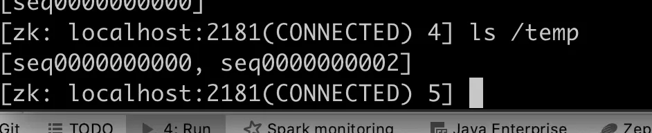
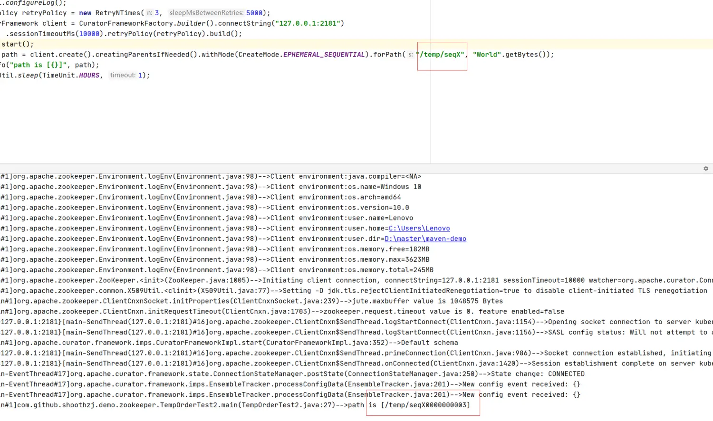
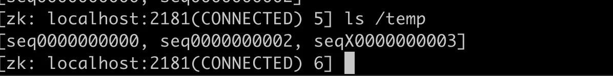

# 准备工作
## 运行zookeeper
```
docker run -p 2181:2181 -d ttbb/zookeeper:stand-alone
```
## 代码参考

```
https://github.com/hezhangjian/maven-demo/tree/master/demo-zookeeper/src/main/java/com/github/hezhangjian/demo/zookeeper
```

# 第一次运行代码
创建一个临时有序Znode，程序维持一个小时
```
package com.github.hezhangjian.demo.zookeeper;

import com.github.hezhangjian.javatool.util.CommonUtil;
import com.github.hezhangjian.javatool.util.LogUtil;
import lombok.extern.slf4j.Slf4j;
import org.apache.curator.RetryPolicy;
import org.apache.curator.framework.CuratorFramework;
import org.apache.curator.framework.CuratorFrameworkFactory;
import org.apache.curator.retry.RetryNTimes;
import org.apache.zookeeper.CreateMode;

import java.util.concurrent.TimeUnit;

/**
 * @author hezhangjian
 */
@Slf4j
public class TempOrderTest {

    public static void main(String[] args) throws Exception {
        LogUtil.configureLog();
        RetryPolicy retryPolicy = new RetryNTimes(3, 5000);
        CuratorFramework client = CuratorFrameworkFactory.builder().connectString("127.0.0.1:2181")
                .sessionTimeoutMs(10000).retryPolicy(retryPolicy).build();
        client.start();
        String path = client.create().withMode(CreateMode.EPHEMERAL_SEQUENTIAL).forPath("/seq", "World".getBytes());
        log.info("path is [{}]", path);
        CommonUtil.sleep(TimeUnit.HOURS, 1);
    }

}
```
## 运行第一次

## 运行完之后zk



## 第二次运行代码
创建一个临时有序Znode，创建完成后立刻关闭
```
package com.github.hezhangjian.demo.zookeeper;

import com.github.hezhangjian.javatool.util.CommonUtil;
import com.github.hezhangjian.javatool.util.LogUtil;
import lombok.extern.slf4j.Slf4j;
import org.apache.curator.RetryPolicy;
import org.apache.curator.framework.CuratorFramework;
import org.apache.curator.framework.CuratorFrameworkFactory;
import org.apache.curator.retry.RetryNTimes;
import org.apache.zookeeper.CreateMode;

import java.util.concurrent.TimeUnit;

/**
 * @author hezhangjian
 */
@Slf4j
public class TempOrderTest2 {

    public static void main(String[] args) throws Exception {
        LogUtil.configureLog();
        RetryPolicy retryPolicy = new RetryNTimes(3, 5000);
        CuratorFramework client = CuratorFrameworkFactory.builder().connectString("127.0.0.1:2181")
                .sessionTimeoutMs(10000).retryPolicy(retryPolicy).build();
        client.start();
        String path = client.create().creatingParentsIfNeeded().withMode(CreateMode.EPHEMERAL_SEQUENTIAL).forPath("/temp/seq", "World".getBytes());
        log.info("path is [{}]", path);
        client.close();
    }

}
```
## 运行第二次结果

## 运行后zk

因为是临时节点，所以存在一会后删除

## 第三次仍然运行第一次的代码
## 运行第三次结果

## zk



## 第四次，修改了zkPath的值。值得一提的是，同一个ZkPath下似乎共享临时有序节点的最大值。如果修改zkPath从/temp/seq到/temp/seqX,出现的并不是预估的0000,而是0003

也就是意味着，zk的临时node序号添加是根据父目录下一个标志计数的
## zk

