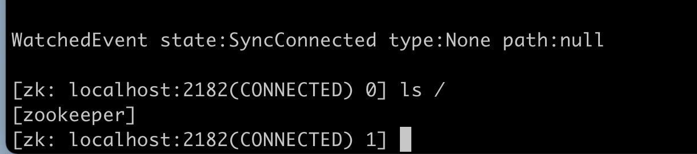

Java系的TLS一般都会要这么几个参数

- client.keystore
- client.truststore
- client.password
- server.keystore
- server.truststore
- server.password

### 生成证书

```bash
client_pass=zk_client_pwd
server_pass=zk_server_pwd
server_dname="C=CN,ST=GD,L=SZ,O=sh,OU=sh,CN=hezhangjian"
client_dname="C=CN,ST=GD,L=SZ,O=sh,OU=sh,CN=hezhangjian"
echo "generate client keystore"
keytool -genkeypair -keypass $client_pass -storepass $client_pass -dname $client_dname -keyalg RSA -keysize 2048 -validity 3650 -keystore zk_client_key.jks
echo "generate server keystore"
keytool -genkeypair -keypass $server_pass -storepass $server_pass -dname $server_dname -keyalg RSA -keysize 2048 -validity 3650 -keystore zk_server_key.jks
echo "export server certificate"
keytool -exportcert -keystore zk_server_key.jks -file server.cer -storepass $server_pass
echo "export client certificate"
keytool -exportcert -keystore zk_client_key.jks -file client.cer -storepass $client_pass
echo "add server cert to client trust keystore"
keytool -importcert -keystore zk_client_trust.jks -file server.cer -storepass $client_pass -noprompt
echo "add client cert to server trust keystore"
keytool -importcert -keystore zk_server_trust.jks -file client.cer -storepass $server_pass -noprompt
rm -f server.cer
rm -f client.cer
```

### 添加ZooKeeper配置

```properties
secureClientPort=2182
```


### 服务端启动

```bash
export SERVER_JVMFLAGS="
-Dzookeeper.serverCnxnFactory=org.apache.zookeeper.server.NettyServerCnxnFactory
-Dzookeeper.ssl.keyStore.location=$CERT_DIR/zk_server_key.jks
-Dzookeeper.ssl.keyStore.password=zk_server_pwd
-Dzookeeper.ssl.trustStore.location=$CERT_DIR/zk_server_trust.jks
-Dzookeeper.ssl.trustStore.password=zk_server_pwd"
/bin/bash $ZOOKEEPER_HOME/bin/zkServer.sh start
```

### 客户端启动

```bash
export CLIENT_JVMFLAGS="
-Dzookeeper.clientCnxnSocket=org.apache.zookeeper.ClientCnxnSocketNetty
-Dzookeeper.client.secure=true
-Dzookeeper.ssl.hostnameVerification=false
-Dzookeeper.ssl.keyStore.location=$CERT_DIR/zk_client_key.jks
-Dzookeeper.ssl.keyStore.password=zk_client_pwd
-Dzookeeper.ssl.trustStore.location=$CERT_DIR/zk_client_trust.jks
-Dzookeeper.ssl.trustStore.password=zk_client_pwd"
bin/zkCli.sh -server localhost:2182
```

### 启动成功


