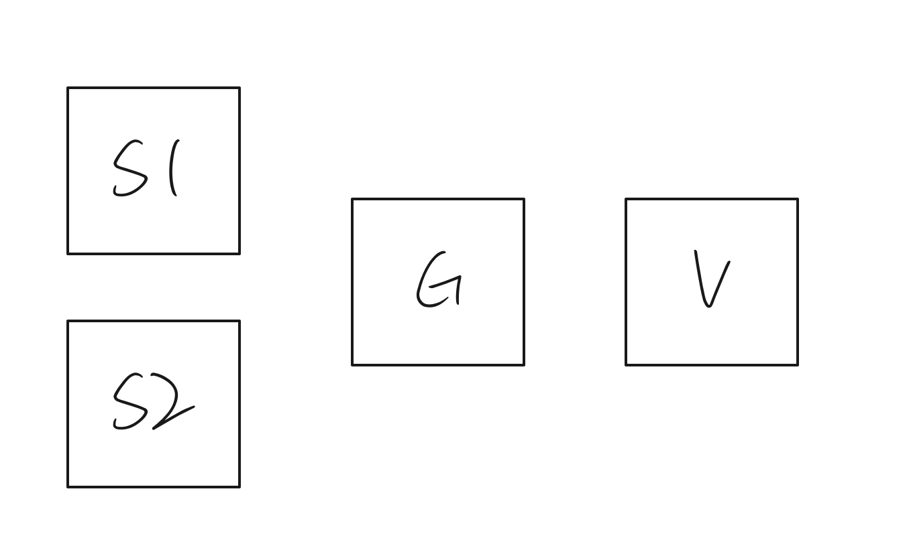
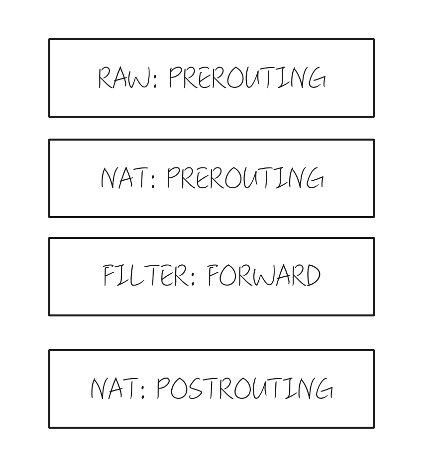
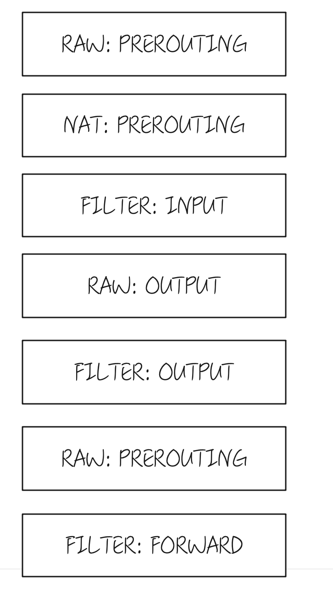

## 前言

iptables和ipvs都是常见的转发工具，可以进行报文的转发，比如从 `IPa,Port1`的消息，经过转发机器发向`IPb,Port2`,不管是在iptables，抑或是ipvs，进行过一次转发之后，就会留下一条转发记录，iptables是在nf_conntrack，ipvs是在ipvs自己的会话管理里，后面的来自`IPa,Port1`的消息，就会直接发向`IPb,Port2`。这个时候，假如强行有一个报文，试图把`IPc,Port1`的消息，转发到`IPb,Port2`该怎么办？在四元组冲突的情况下，该转发给谁？返程的报文是什么走向。是这篇文章试图分析的问题

本文基于Linux内核版本`5.4.0`

## 出场网元介绍



- S: 缩写服务的意思

- G: 缩写Gateway的意思

## Iptables和Iptables冲突

### 准备工作

假设S1和S2都需要经过G使用33333端口发送消息到V的33333端口，我们先配置G的iptables规则:

```bash
sysctl -w net.ipv4.ip_forward=1
iptables -t nat -I POSTROUTING -p udp -s ${S的子网} -o eth0 --sport 33333 -j SNAT  --to-source ${G的IP}:33333
```

接下来在两台S上，把发往V的报文的默认路由指向V

```bash
ip route add ${V的IP}/32 via ${G的IP}
```

实验前先执行如下命令，收集输出

```bash
~# conntrack -S
cpu=n found=0 invalid=0 ignore=0 insert=0 insert_failed=0 drop=0 early_drop=0 error=0 search_restart=0
```

这个命令的输出跟您的cpu相关，有几个cpu就会输出几行。接下来在V上开启抓包

```bash
tcpdump -port 33333 -ann
```

然后在两台S上执行命令发送报文，这里有个小技巧就是使用不一样长度的内容，这样tcpdump会打印报文的长度，一眼就可以看出来送达的报文是谁的

```bash
echo "Hello world"| nc -4u -p 33333 V的IP 33333
```

你会观察到，只有先发送的报文抵达了V。随后再执行`conntrack -S`，收集输出的时候，会发现`insert_failed`和`drop`都增加了1。

### 结论

iptables和iptables冲突的场景，先发送的先生效，后生效的没有发送（这一点你可以通过在G上抓包证实）。观察点就是命令`conntrack -S`的输出，`insert_failed`和`drop`都有所增加。

### Iptables流程图

我在做这个实验的时候，顺手打开了iptables的trace功能，记录一下报文的流程



发送失败的也会走完这个流程，然后在插入iptables规则的时候失败。

## Iptables和Ipvs冲突

### 准备工作

因为ipvs不会和ipvs冲突，所以我们尝试构造一下ipvs和iptables冲突的场景，让我们添加上允许V经过G发送报文到S1，让我们在G上配置ipvs所需的转发规则

```
ipvsadm -A -u ${G的IP}:33333 -s rr
ipvsadm -a -u ${G的IP}:33333 -r ${S1的IP}:33333 -m
```

## 实验流程

从V发送报文转发到S1,然后S2通过SNAT发送报文到V，观察情况

实施前的准备观察项

- ipvsadm -lnc观察会话
- ipvsadm -ln --stats 观察报文统计
- conntrack -L|grep 33333 观察会话

- 当V发送报文到S1后，

Ipvsadm -ln -stats统计值增加了，只有ipvs的会话表里有内容，iptables会话表里没有内容。

- 然后S2通过SNAT发送报文到V后，

ipvsadm -ln -stats统计值没有变化，iptables会话表出现内容。（这里我试过S1先返回报文做几次交互，但是是一样的结果）

但是在ipvs有效期间，通过S1不断发送报文，还是可以发送到V节点的。这个时候，会出现S1和S2同时都能发送报文到V。

- 让我们看看报文返程（即V发送到G的报文）会发送给谁？是S1还是S2。答案是S2。

返程的报文优先匹配了会话表，发送给了S2。如果conntrack老化，那么才会发送给S1

### V上来的流程


