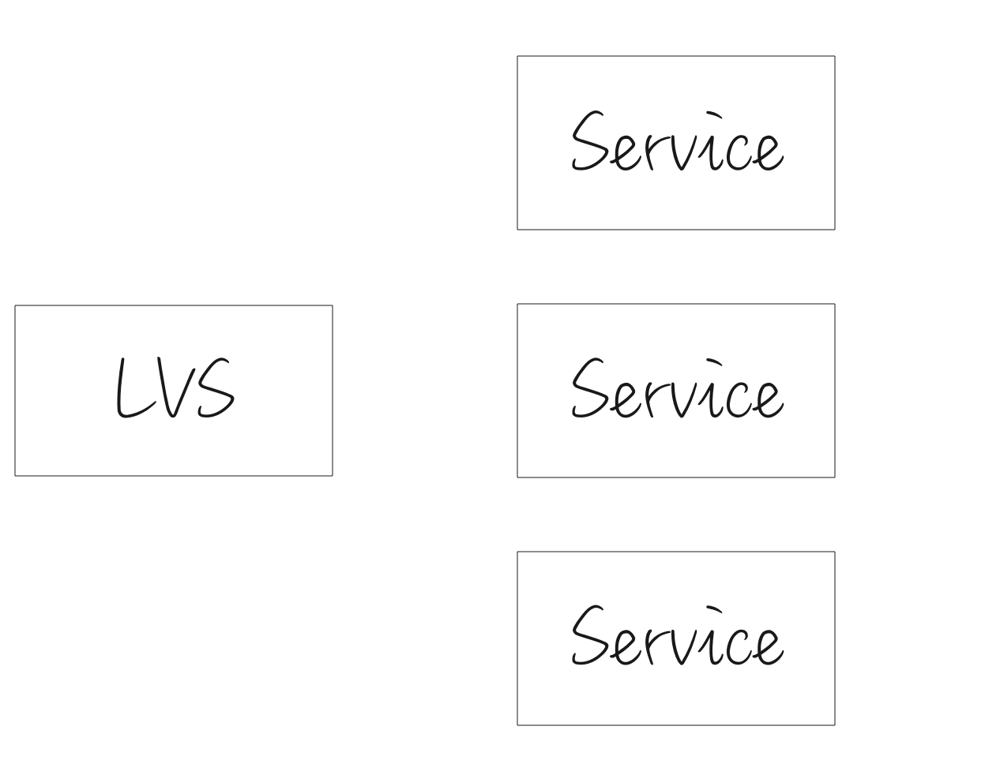

## 前言

在ipvs中，最小连接算法是一种负载均衡算法，常见的还有轮询算法，加权轮询算法等。让我们先做个基本的假设，每个**UDP**会话连接上的请求量大概一致。让**LB**无需观测后端服务的状态，仅仅根据会话信息，做出转发到哪个后端**Service**的判断，事实上，lvs也目前不能根据后端服务的cpu、内存或者是其他信息做出判断。直观上来说，最小连接数很符合大家的直观感受，保证了每个工作负载上承受的业务连接数是最少的。

但是，在LVS保留会话时间稍微较长的情况下，最小连接算法在扩容、升级（升级前后IP改变）、重启（重启前后IP改变）会有一些问题。

简而言之，就是**LVS**向后端转发**UDP**消息的时候，后端服务没有很好的拒绝手段，在**LC**模式下，导致**LVS**可能转发给后端服务，超过它处理能力的消息数，等到这些会话老化之后，**LVS**又开始转发给后端服务，超过它处理能力的消息数，如此反复，始终造成大量消息呼损，极难自愈

## 详细数据推导

以扩容为例，设

- 每秒消息量 m
- 保活时间  t
- 旧的节点数 a
- 新增节点数 b
- 使用新IP的请求占比 c (0<c<1)
- 在一段保活时间内的IP总数 d
- 单节点处理能力为x

那么，扩容时刻，老的节点上的会话数是**d/a**

扩容的时候，由于老的节点存在**mt/a**的会话，那么新IP上来的请求都会转发向新节点，直到把新节点的连接数冲到**mt/a**为止，

新节点接收请求的速率: **(m * c)/b**
新节点连接数和老节点持平的时间点: **(d * b)/(m * c *a)**

如果**新节点连接数和老节点持平的时间点**远远小于**保活时间**,这就会有问题。其他节点上的会话都是相对离散的，所以在保活时间t内，一直不断有消息进来，但新的节点一瞬间接收到了大量请求，又会在同一时间老化。在下一个周期t，又接收到大量请求，如此反复，极难自愈。这也因为lvs的udp转发不关心后端服务器是否成功处理报文，只要转发过去就算了。就是lvs无视后端的状态转发，相比tcp，至少还有是否接收tck连接，后端主动拆链等手段。

虽然**LVS**能限制后端服务器的连接数，但连接数限制在这个场景是不起作用的。如果您的服务满足上述的这个模式，还是建议您修改为rr算法更为适合。
