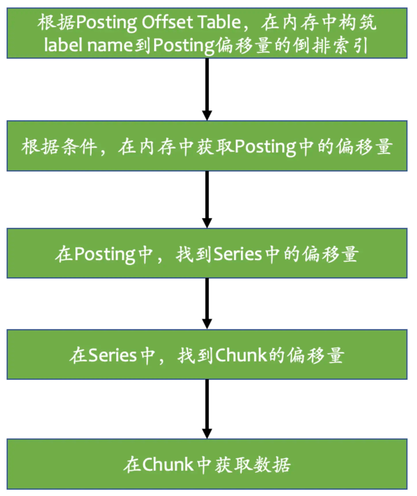

# prometheus 磁盘布局

采集到的数据每两个小时形成一个block。每个block由一个目录组成，并存放在data路径下。该目录包含一个包含该时间窗口的所有时间序列样本的块子目录、一个元数据文件和一个索引文件（将metric_name和label索引到目录下的时间序列）。 chunks 目录中的样本默认组合成一个或多个段文件，每个段文件最大为 512MB。 当通过 API 删除系列时，删除记录存储在单独的 tombstone 文件中（而不是立即从块段中删除数据）。

当前正在写入的块保存在内存中，没有完全持久化。通过WAL日志来防止崩溃丢失数据。预写日志分为数节(segments)保存在wal文件夹中。这些文件包含尚未压缩的原始数据； 因此它们比常规块文件大得多。 Prometheus 将至少保留三个预写日志文件。在高流量下，会保留三个以上的 WAL 文件，以便保留至少两个小时的原始数据。

```bash
./data
├── 01BKGV7JBM69T2G1BGBGM6KB12
│   └── meta.json
├── 01BKGTZQ1SYQJTR4PB43C8PD98
│   ├── chunks
│   │   └── 000001
│   ├── tombstones
│   ├── index
│   └── meta.json
├── 01BKGTZQ1HHWHV8FBJXW1Y3W0K
│   └── meta.json
├── 01BKGV7JC0RY8A6MACW02A2PJD
│   ├── chunks
│   │   └── 000001
│   ├── tombstones
│   ├── index
│   └── meta.json
├── chunks_head
│   └── 000001
└── wal
    ├── 000000002
    └── checkpoint.00000001
        └── 00000000
```

## prometheus概念

- Label: 标签，string格式的kv组合
- series: 时间序列，label的组合
- chunk: 时间，value的数据

## prometheus索引格式

```
┌────────────────────────────┬─────────────────────┐
│ magic(0xBAAAD700) <4b>     │ version(1) <1 byte> │
├────────────────────────────┴─────────────────────┤
│ ┌──────────────────────────────────────────────┐ │
│ │                 Symbol Table                 │ │
│ ├──────────────────────────────────────────────┤ │
│ │                    Series                    │ │
│ ├──────────────────────────────────────────────┤ │
│ │                   Postings 1                 │ │
│ ├──────────────────────────────────────────────┤ │
│ │                      ...                     │ │
│ ├──────────────────────────────────────────────┤ │
│ │                   Postings N                 │ │
│ ├──────────────────────────────────────────────┤ │
│ │             Postings Offset Table            │ │
│ ├──────────────────────────────────────────────┤ │
│ │                      TOC                     │ │
│ └──────────────────────────────────────────────┘ │
└──────────────────────────────────────────────────┘
```

写入索引时，可以在上面列出的主要部分之间添加任意数量的0字节作为填充。顺序扫描文件时，必须跳过部分间的任意0字节。

下面描述的大部分部分都以 len 字段开头。 它总是指定就在尾随 CRC32 校验和之前的字节数。 校验和就计算这些字节的校验和（不包含len字段）

### 符号表

符号表包含已存储序列的标签对中出现的重复数据删除字符串的排序列表。 它们可以从后续部分中引用，并显着减少总索引大小。

该部分包含一系列字符串entry，每个entry都以字符串的原始字节长度为前缀。 所有字符串均采用 utf-8 编码。 字符串由顺序索引引用。 字符串按字典顺序升序排序。

```
┌────────────────────┬─────────────────────┐
│ len <4b>           │ #symbols <4b>       │
├────────────────────┴─────────────────────┤
│ ┌──────────────────────┬───────────────┐ │
│ │ len(str_1) <uvarint> │ str_1 <bytes> │ │
│ ├──────────────────────┴───────────────┤ │
│ │                . . .                 │ │
│ ├──────────────────────┬───────────────┤ │
│ │ len(str_n) <uvarint> │ str_n <bytes> │ │
│ └──────────────────────┴───────────────┘ │
├──────────────────────────────────────────┤
│ CRC32 <4b>                               │
└──────────────────────────────────────────┘
```
### 序列 series

保存一个具体的时间序列，其中包含系列的label集合和block中的chunks。

每个series都是16字节对齐。series的id为偏移量除以16。series ID 的排序列表也就是series label的字典排序列表。

```
┌───────────────────────────────────────┐
│ ┌───────────────────────────────────┐ │
│ │   series_1                        │ │
│ ├───────────────────────────────────┤ │
│ │                 . . .             │ │
│ ├───────────────────────────────────┤ │
│ │   series_n                        │ │
│ └───────────────────────────────────┘ │
└───────────────────────────────────────┘
```

每一个series先保存label的数量，然后是包含label键值对的引用。 标签对按字典顺序排序。然后是series涉及的索引块的个数，然后是一系列元数据条目，其中包含块的最小 (mint) 和最大 (maxt) 时间戳以及对其在块文件中位置的引用。`mint` 是第一个样本的时间，`maxt` 是块中最后一个样本的时间。 在索引中保存时间范围数据, 允许按照时间范围删除数据时，如果时间范围匹配，不需要直接访问时间数据。

空间大小优化: 第一个块的 `mint` 被存储，它的 `maxt` 被存储为一个增量，并且 `mint` 和 `maxt` 被编码为后续块的前一个时间的增量。 类似的，第一个chunk的引用被存储，下一个引用被存储为前一个chunk的增量。

```
┌──────────────────────────────────────────────────────────────────────────┐
│ len <uvarint>                                                            │
├──────────────────────────────────────────────────────────────────────────┤
│ ┌──────────────────────────────────────────────────────────────────────┐ │
│ │                     labels count <uvarint64>                         │ │
│ ├──────────────────────────────────────────────────────────────────────┤ │
│ │              ┌────────────────────────────────────────────┐          │ │
│ │              │ ref(l_i.name) <uvarint32>                  │          │ │
│ │              ├────────────────────────────────────────────┤          │ │
│ │              │ ref(l_i.value) <uvarint32>                 │          │ │
│ │              └────────────────────────────────────────────┘          │ │
│ │                             ...                                      │ │
│ ├──────────────────────────────────────────────────────────────────────┤ │
│ │                     chunks count <uvarint64>                         │ │
│ ├──────────────────────────────────────────────────────────────────────┤ │
│ │              ┌────────────────────────────────────────────┐          │ │
│ │              │ c_0.mint <varint64>                        │          │ │
│ │              ├────────────────────────────────────────────┤          │ │
│ │              │ c_0.maxt - c_0.mint <uvarint64>            │          │ │
│ │              ├────────────────────────────────────────────┤          │ │
│ │              │ ref(c_0.data) <uvarint64>                  │          │ │
│ │              └────────────────────────────────────────────┘          │ │
│ │              ┌────────────────────────────────────────────┐          │ │
│ │              │ c_i.mint - c_i-1.maxt <uvarint64>          │          │ │
│ │              ├────────────────────────────────────────────┤          │ │
│ │              │ c_i.maxt - c_i.mint <uvarint64>            │          │ │
│ │              ├────────────────────────────────────────────┤          │ │
│ │              │ ref(c_i.data) - ref(c_i-1.data) <varint64> │          │ │
│ │              └────────────────────────────────────────────┘          │ │
│ │                             ...                                      │ │
│ └──────────────────────────────────────────────────────────────────────┘ │
├──────────────────────────────────────────────────────────────────────────┤
│ CRC32 <4b>                                                               │
└──────────────────────────────────────────────────────────────────────────┘
```

### Posting

Posting这一节存放着关于series引用的单调递增列表，简单来说就是存放id和时间序列的对应关系

```
┌────────────────────┬────────────────────┐
│ len <4b>           │ #entries <4b>      │
├────────────────────┴────────────────────┤
│ ┌─────────────────────────────────────┐ │
│ │ ref(series_1) <4b>                  │ │
│ ├─────────────────────────────────────┤ │
│ │ ...                                 │ │
│ ├─────────────────────────────────────┤ │
│ │ ref(series_n) <4b>                  │ │
│ └─────────────────────────────────────┘ │
├─────────────────────────────────────────┤
│ CRC32 <4b>                              │
└─────────────────────────────────────────┘
```

Posting sections的顺序由`postings offset table`决定。

### Posting Offset Table

`postings offset table`包含着一系列`posting offset entry`，根据label的名称和值排序。每一个`posting offset entry`存放着label的键值对以及在`posting sections`中其series列表的偏移量。用来跟踪`posting sections`。当index文件加载时，它们将部分加载到内存中。

```
┌─────────────────────┬──────────────────────┐
│ len <4b>            │ #entries <4b>        │
├─────────────────────┴──────────────────────┤
│ ┌────────────────────────────────────────┐ │
│ │  n = 2 <1b>                            │ │
│ ├──────────────────────┬─────────────────┤ │
│ │ len(name) <uvarint>  │ name <bytes>    │ │
│ ├──────────────────────┼─────────────────┤ │
│ │ len(value) <uvarint> │ value <bytes>   │ │
│ ├──────────────────────┴─────────────────┤ │
│ │  offset <uvarint64>                    │ │
│ └────────────────────────────────────────┘ │
│                    . . .                   │
├────────────────────────────────────────────┤
│  CRC32 <4b>                                │
└────────────────────────────────────────────┘
```

### TOC

`table of contents`是整个索引的入口点，并指向文件中的各个部分。 如果引用为零，则表示相应的部分不存在，查找时应返回空结果。

```
┌─────────────────────────────────────────┐
│ ref(symbols) <8b>                       │
├─────────────────────────────────────────┤
│ ref(series) <8b>                        │
├─────────────────────────────────────────┤
│ ref(label indices start) <8b>           │
├─────────────────────────────────────────┤
│ ref(label offset table) <8b>            │
├─────────────────────────────────────────┤
│ ref(postings start) <8b>                │
├─────────────────────────────────────────┤
│ ref(postings offset table) <8b>         │
├─────────────────────────────────────────┤
│ CRC32 <4b>                              │
└─────────────────────────────────────────┘
```

## chunks 磁盘格式

chunks文件创建在**block**中的`chunks/`目录中。 每个段文件的最大大小为 512MB。
文件中的chunk由uint64的索引组织，索引低四位为文件内偏移，高四位为段序列号。

```
┌──────────────────────────────┐
│  magic(0x85BD40DD) <4 byte>  │
├──────────────────────────────┤
│    version(1) <1 byte>       │
├──────────────────────────────┤
│    padding(0) <3 byte>       │
├──────────────────────────────┤
│ ┌──────────────────────────┐ │
│ │         Chunk 1          │ │
│ ├──────────────────────────┤ │
│ │          ...             │ │
│ ├──────────────────────────┤ │
│ │         Chunk N          │ │
│ └──────────────────────────┘ │
└──────────────────────────────┘
```

## chunks中的Chunk格式

```
┌───────────────┬───────────────────┬──────────────┬────────────────┐
│ len <uvarint> │ encoding <1 byte> │ data <bytes> │ CRC32 <4 byte> │
└───────────────┴───────────────────┴──────────────┴────────────────┘
```

# 查询数据

## code

查询的prometheus方法签名

```go
Select(sortSeries bool, hints *SelectHints, matchers ...*labels.Matcher) SeriesSet
```

支持从block中，remote等各种地方查询获取数据

prometheus会在内存中维护一个数据结构

```go
	// Map of LabelName to a list of some LabelValues's position in the offset table.
	// The first and last values for each name are always present.
	postings map[string][]postingOffset
```

在内存中，保留每个label name，并且每n个保存label值，降低内存的占用。但是第一个和最后一个值总是保存在内存中。

## 查询数据流程



# 参考资料

- https://prometheus.io/docs/prometheus/latest/storage/
- https://github.com/prometheus/prometheus/blob/release-2.37/tsdb/docs/format/README.md
- https://github.com/prometheus/prometheus/blob/release-2.37/tsdb/docs/format/index.md
