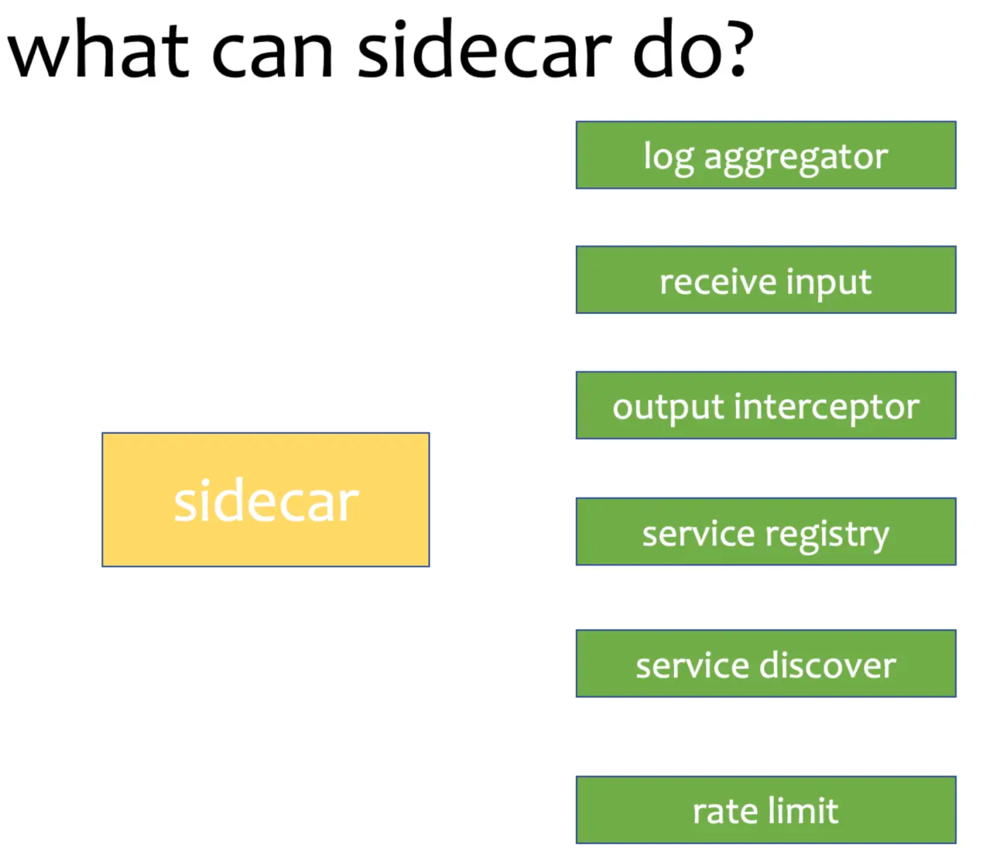
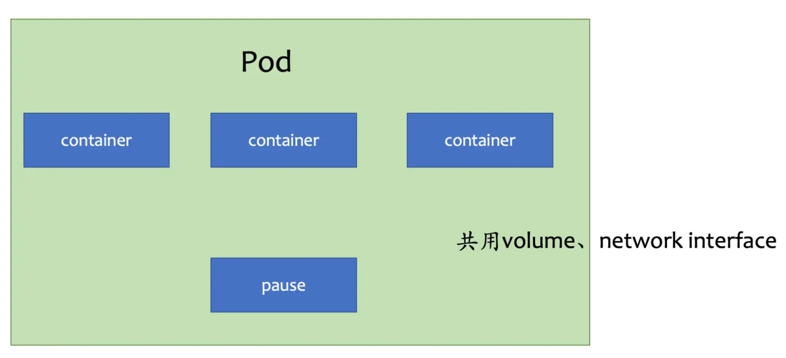

# 什么是sidecar？


sidecar，直译为边车。 如上图所示，边车就是加装在摩托车旁来达到拓展功能的目的，比如行驶更加稳定，可以拉更多的人和货物，坐在边车上的人可以给驾驶员指路等。边车模式通过给应用服务加装一个“边车”来达到**控制**和**逻辑**的分离的目的。

对于微服务来讲，我们可以用边车模式来做诸如 日志收集、服务注册、服务发现、限流、鉴权等不需要业务服务实现的控制面板能力。通常和边车模式比较的就是像**spring-cloud**那样的sdk模式，像上面提到的这些能力都通过sdk实现。



这两种实现模式各有优劣，sidecar模式会引入额外的性能损耗以及延时，但传统的sdk模式会让代码变得臃肿并且升级复杂，控制面能力和业务面能力不能分开升级。

本文的代码已经上传到[gitee](https://gitee.com/hezhangjian/sidecar-examples.git)

# sidecar 实现原理

介绍了sidecar的诸多功能，但是，sidecar是如何做到这些能力的呢？

原来，在kubernetes中，一个pod是部署的最小单元，但一个pod里面，允许运行多个container(容器)，多个container(容器)之间共享存储卷和网络栈。这样子，我们就可以多container来做sidecar，或者init-container（初始化容器）来调整挂载卷的权限



# 日志收集sidecar

日志收集sidecar的原理是利用多个container间可以共用挂载卷的原理实现的，通过将应用程序的日志路径挂出，用另一个程序访问路径下的日志来实现日志收集，这里用cat来替代了日志收集，部署yaml模板如下

```yaml
apiVersion: v1
kind: Pod
metadata:
  name: webserver
spec:
  volumes:
    - name: shared-logs
      emptyDir: {}

  containers:
    - name: nginx
      image: ttbb/nginx:mate
      volumeMounts:
        - name: shared-logs
          mountPath: /opt/sh/openresty/nginx/logs

    - name: sidecar-container
      image: ttbb/base
      command: ["sh","-c","while true; do cat /opt/sh/openresty/nginx/logs/nginx.pid; sleep 30; done"]
      volumeMounts:
        - name: shared-logs
          mountPath: /opt/sh/openresty/nginx/logs

```

使用kubectl create -f 创建pod，通过kubectl logs命令就可以看到sidecar-container打印的日志输出

```bash
kubectl logs webserver sidecar-container
```

# 转发请求sidecar

这一节我们来实现，一个给应用程序转发请求的sidecar，应用程序代码如下

```rust
use std::io::prelude::*;
use std::net::{TcpListener, TcpStream};

fn main() {
    let listener = TcpListener::bind("127.0.0.1:7878").unwrap();

    for stream in listener.incoming() {
        let stream = stream.unwrap();

        handle_connection(stream);
    }
    println!("Hello, world!");
}

fn handle_connection(mut stream: TcpStream) {
    let mut buffer = [0; 1024];

    stream.read(&mut buffer).unwrap();

    let contents = "Hello";

    let response = format!(
        "HTTP/1.1 200 OK\r\nContent-Length: {}\r\n\r\n{}",
        contents.len(),
        contents
    );

    println!("receive a request!");
    stream.write(response.as_bytes()).unwrap();
    stream.flush().unwrap();
}
```

我们再来写一个sidecar，它会每15秒向应用程序发出请求

```rust
use std::thread;
use std::time::Duration;

fn main() {
    loop {
        thread::sleep(Duration::from_secs(15));
        let response = reqwest::blocking::get("http://localhost:7878").unwrap();
        println!("{}", response.text().unwrap())
    }
}
```

通过仓库下的`intput/build.sh`脚本构造镜像，运行yaml如下

```yaml
apiVersion: v1
kind: Pod
metadata:
  name: webserver
spec:
  containers:
    - name: input-server
      image: sidecar-examples:input-http-server

    - name: input-sidecar
      image: sidecar-examples:sidecar-input
```
通过查看**kubectl logs input input-http-server**可以看到input-http-server收到了请求
```
receive a request!
receive a request!
```
# 拦截请求sidecar

应用程序代码，它会每15s向`localhost`发出请求

```scala
package com.hezhangjian.sidecar

import akka.actor.typed.ActorSystem
import akka.actor.typed.scaladsl.Behaviors
import akka.http.scaladsl.Http
import akka.http.scaladsl.model._

import scala.concurrent.{ExecutionContextExecutor, Future}
import scala.util.{Failure, Success}

object HttpClient {
    def main(args: Array[String]): Unit = {
        while (true) {
            Thread.sleep(15_000L)
            implicit val system: ActorSystem[Nothing] = ActorSystem(Behaviors.empty, "SingleRequest")
            // needed for the future flatMap/onComplete in the end
            implicit val executionContext: ExecutionContextExecutor = system.executionContext

            val responseFuture: Future[HttpResponse] = Http().singleRequest(HttpRequest(uri = "http://localhost:7979/hello"))

            responseFuture
                    .onComplete {
                        case Success(res) => println(res)
                        case Failure(_) => sys.error("something wrong")
                    }
        }
    }
}
```

我们再来写一个sidecar，它会拦截http请求并打印日志

```scala
package com.hezhangjian.sidecar

import akka.actor.typed.ActorSystem
import akka.actor.typed.scaladsl.Behaviors
import akka.http.scaladsl.Http
import akka.http.scaladsl.model._
import akka.http.scaladsl.server.Directives._

import scala.concurrent.ExecutionContextExecutor
import scala.io.StdIn

object HttpServer {

    def main(args: Array[String]): Unit = {

        implicit val system: ActorSystem[Nothing] = ActorSystem(Behaviors.empty, "my-system")
        // needed for the future flatMap/onComplete in the end
        implicit val executionContext: ExecutionContextExecutor = system.executionContext

        val route =
            path("hello") {
                get {
                    println("receive a request")
                    complete(HttpEntity(ContentTypes.`text/html(UTF-8)`, "<h1>Say hello to akka-http</h1>"))
                }
            }

        val bindingFuture = Http().newServerAt("localhost", 7979).bind(route)
        while (true) {
            Thread.sleep(15_000L)
        }
    }
}
```

通过仓库下的`output/build.sh`脚本构造镜像，运行yaml如下

```yaml
apiVersion: v1
kind: Pod
metadata:
  name: output
spec:
  volumes:
    - name: shared-logs
      emptyDir: {}

  containers:
    - name: output-workload
      image: sidecar-examples:output-workload
      imagePullPolicy: Never

    - name: sidecar-output
      image: sidecar-examples:sidecar-output
      imagePullPolicy: Never
```

通过查看**kubectl logs output output-workload**可以看到output-sidecar收到了请求

```bash
HttpResponse(200 OK,List(Server: akka-http/10.2.9, Date: Tue, 29 Mar 2022 00:15:47 GMT),HttpEntity.Strict(text/html; charset=UTF-8,31 bytes total),HttpProtocol(HTTP/1.1))
HttpResponse(200 OK,List(Server: akka-http/10.2.9, Date: Tue, 29 Mar 2022 00:16:02 GMT),HttpEntity.Strict(text/html; charset=UTF-8,31 bytes total),HttpProtocol(HTTP/1.1))
HttpResponse(200 OK,List(Server: akka-http/10.2.9, Date: Tue, 29 Mar 2022 00:16:17 GMT),HttpEntity.Strict(text/html; charset=UTF-8,31 bytes total),HttpProtocol(HTTP/1.1))
HttpResponse(200 OK,List(Server: akka-http/10.2.9, Date: Tue, 29 Mar 2022 00:16:32 GMT),HttpEntity.Strict(text/html; charset=UTF-8,31 bytes total),HttpProtocol(HTTP/1.1))
HttpResponse(200 OK,List(Server: akka-http/10.2.9, Date: Tue, 29 Mar 2022 00:16:47 GMT),HttpEntity.Strict(text/html; charset=UTF-8,31 bytes total),HttpProtocol(HTTP/1.1))
HttpResponse(200 OK,List(Server: akka-http/10.2.9, Date: Tue, 29 Mar 2022 00:17:02 GMT),HttpEntity.Strict(text/html; charset=UTF-8,31 bytes total),HttpProtocol(HTTP/1.1))
HttpResponse(200 OK,List(Server: akka-http/10.2.9, Date: Tue, 29 Mar 2022 00:17:17 GMT),HttpEntity.Strict(text/html; charset=UTF-8,31 bytes total),HttpProtocol(HTTP/1.1))
HttpResponse(200 OK,List(Server: akka-http/10.2.9, Date: Tue, 29 Mar 2022 00:17:32 GMT),HttpEntity.Strict(text/html; charset=UTF-8,31 bytes total),HttpProtocol(HTTP/1.1))
```
