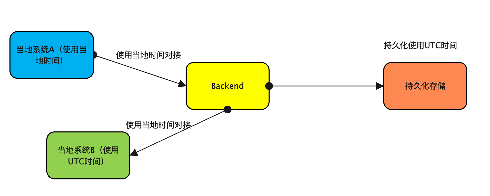

当代码只在当地（example：中国）部署的时候，可能不需要太考虑时区问题，很大可能你的部署机器、容器都是在当地时间。
这种情况下，代码里面统一用当地时间做处理没有任何问题。

但如果代码需要多地域部署，或者是部署的机器时区不一，比如XX单位机器统一采用UTC时间，YY单位机器统一采用当地时间，这么做不利于数据的导入导出，也不利于开发人员的维护

一个良好的处理方式可以是这样子的

- 存储数据都使用UTC格式存储
- 业务层跟不同的当地系统对接
