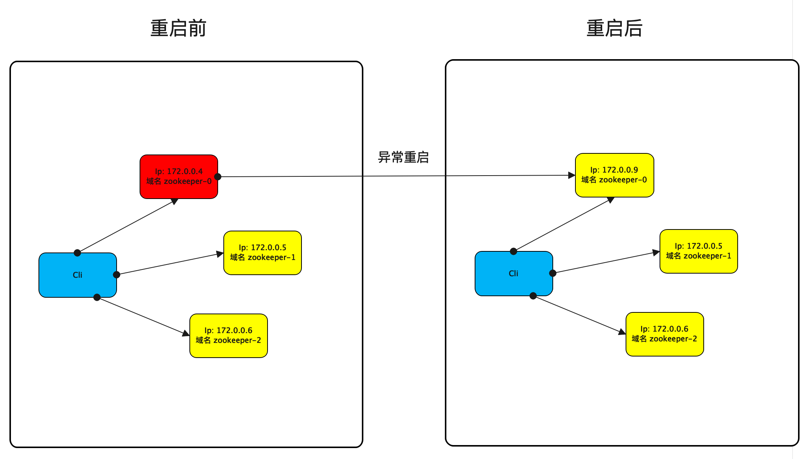

## 中间件在很多系统中都存在

在一个系统里面，或多或少地都会有中间件的存在，总会有数据库吧，其他的如消息队列，缓存，大数据组件。即使是基于公有云构筑的系统，公有云厂商只提供广泛使用的中间件，假如你的系统里面有很多组件没那么泛用，那么就只能自己维护，如`ZooKeeper`、`Etcd`、`Pulsar`、`Prometheus`、`Lvs`等

## 什么是中间件adapter

中间件`adapter`指的是和中间件运行在一起（同一个物理机或同一个容器），使得中间件和商用系统中已有的组件进行对接，最终使得该中间件达到在该系统商用的标准。像Prometheus的众多`exporter`，就是将中间件和已有的监控系统（Prometheus）进行对接的`adpater`。

## 为什么不修改中间件源码直接集成

原因可以有很多，这里我列出几点

### 源码修改容易，维护困难

很多时候不是社区通用需求，无法合并到社区主干。后续每次中间件版本升级，源码的修改就要重新进行一次。社区大版本代码重构，有的甚至不知道如何修改下去。并且对研发人员的技能要求高。

### 源码与团队技术栈不同，修改困难

这是最常见的，像`java`团队维护`erlang`写的`rabbitmq`

### 和其他系统对接，有语言要求

XX监控系统，只能使用X语言接入，但中间件使用Y语言写的，怎么办？adapter的能力就体现出来了。

## 为什么在商用系统中中间件做不到开箱即用

在商用系统中，对一个新引入的中间件，往往有如下能力上的诉求，原生的中间件很难满足

- 适配原有的监控系统
- 适配原有的告警系统
- 适配原有的证书系统
- 适配原有的备份系统（如果该中间件有状态）
- 适配原有的容灾系统（如果该中间件有状态）
- 自动化能力（适配部署、账号创建、权限策略创建）
- 对外暴露时封装一层接口
- 应用程序和中间件的服务发现

有时候，业务也会根据业务的需求对中间件做一些能力增强，这部分需求比较定制，这里无法展开讨论了。

我们来逐一讨论上面列出的能力诉求，凡是`adapter`能实现的功能，对中间件做修改也能实现，只不过因为上一节列出的原因，选择不在中间件处侵入式修改。

## 适配原有的监控系统

监控系统获取数据，往往是推拉两种模式，如果该中间件原生不支持和该监控系统对接。我们就可以让`adapter`先从中间件处取得监控数据，再和监控系统对接

## 适配原有的告警系统

如果中间件发生了不可恢复的错误，如写事务文件失败，操作ZooKeeper元数据失败，可以通过`adapter`来识别中间件是否发生了上述不可恢复的错误，并和告警系统对接，发出告警。

## 适配原有的证书系统

这一点也很关键，开源的中间件，根据我的了解，几乎没有项目做了动态证书轮换的方案，证书基本都不支持变更。而出色的商用系统是一定要支持证书轮换的。不过很遗憾的是，这些涉及到TLS握手的关键流程，`adapter`无法干涉这个流程，只能对中间件进行侵入式修改。

## 适配原有的备份系统

通过`adapter`对中间件进行定期备份、按照配置中心的策略备份、备份文件自动上传到文件服务器等。

## 适配原有的容灾系统

这个视中间件而定，有些中间件如`Pulsar`原生支持跨地域容灾的话，我们可能做一做配置就好了。另外一些，像`mysql`和`mongo`这种，可能我们还需要通过`adapter`来进行数据同步。不过这个时候`adapter`负责的职责就大了，还包括了容灾能力。

## 自动化能力

### 自动化部署

比如`ZooKeeper`、`Kafka`、`filebeat`在安装的时候，要求填写配置文件，我们就可以让`adapter`来自动化生成配置或更新配置

### 账号和策略的创建更新

像`kubernetes`、`mysql`、`mongo`，我们可以在安装的时候通过`adapter`来自动化创建或更新

## 对外暴露时封装一层接口

封装接口常用于中间件的提供者，出于种种原因，如中间件原本接口能力太大、中间件原本接口未做权限控制、中间件原本接口未适配期望的权限框架等。我们可以用`adapter`封装实现一层新的接口对外暴露。

## 应用程序和中间件的服务发现

### 应用程序发现中间件

应用程序与中间件的连接，说的简单一点就是如何获取`Ip`，如果是基于kubernetes的部署，那么不推荐配置`Ip`，最好是配置域名，因为`Ip`会跟着容器的生命周期变化。首先，你的应用程序并不会因为中间件的一个容器重启了来重建客户端，往往是通过一个简单重连的方式连接到新的中间件容器继续工作。其次，我们的运维人员也不会每时每刻盯着容器Ip是否变化来进行配置吧。以下图为例，域名的配置要优于Ip的配置。

截止到目前，我们只需要一个静态配置，使得应用程序可以连接到中间件。最好这个配置是可以修改的，这样我们还可以继承蓝绿、灰度发布的能力。

### 中间件到业务程序的发现

这个模式常用于负载均衡中间件如`Lvs`、`Nginx`自动维护后端列表，我们可以通过`adapter`来从注册中心获取后端服务的实例信息，并实时更新。

## 总结

在商用系统中，中间件并没有想象中的那么开箱即用，本文讲述了一些中间件集成到商用系统中需要具备的能力。在对中间件侵入式修改没有技术能力或不想对中间件进行侵入式修改的场景。选用团队常用的、占用资源少的语言来开发中间件`adapter`应该是更好的选择。
