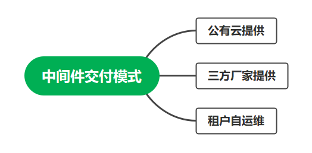
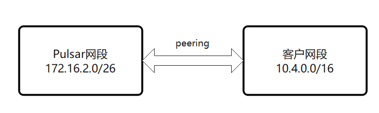
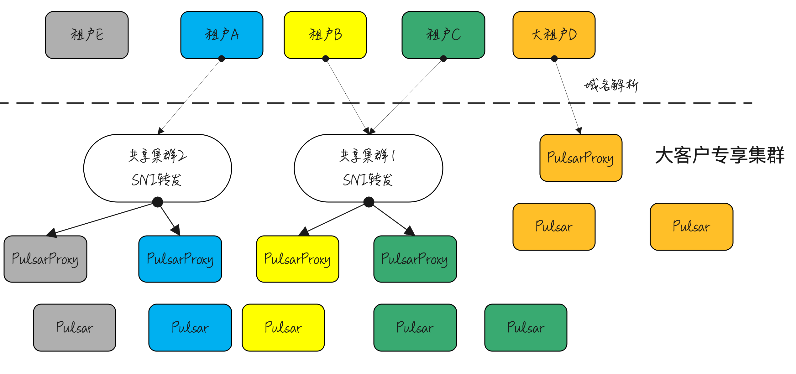
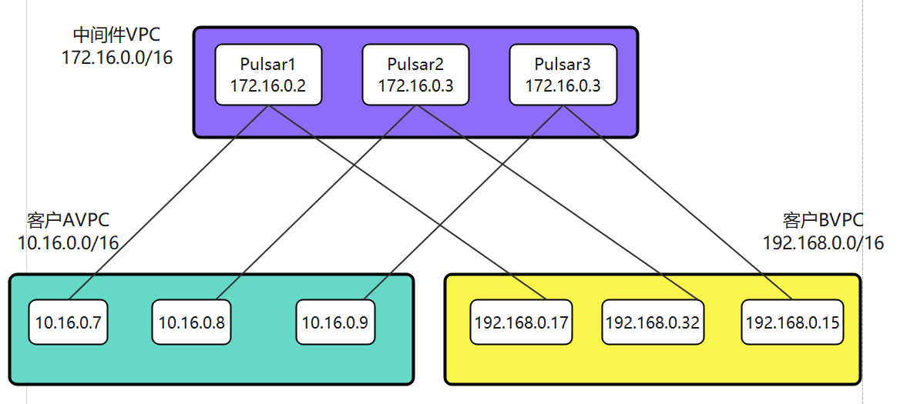
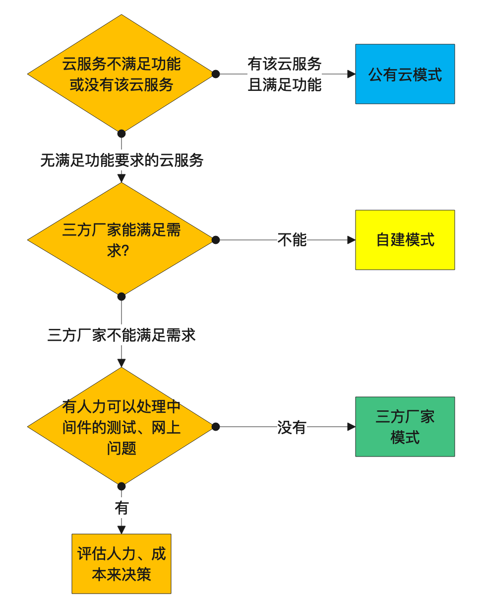

## 需要了解的概念

- DNAT映射：网络报文，目的地址转换。
- 胖客户端：像Cassandra 客户端、Kafka客户端，客户端感知中间件拓扑，即客户端感知中间件部署、均衡，把请求发给指定的中间件服务器。
- VPC：用户的私有网络环境。
- VPC Peering：多个网段不冲突的VPC之间网络打通的方式，可跨用户。
- 三方厂家：非公有云厂商的PaaS供应商。
- 中间件用户：需要在公有云上运行中间件的公有云用户。

## 前言

现在，在公有云上买`redis`和`kafka`这类组件已经变得非常普遍，由公有云提供的中间件往往能给你带来良好的体验，现在中间件在公有云上的交付模式大致分为三种。我对
`Pulsar`较为熟悉一些，大部分图例以**消息中间件Pulsar**举例。本文中成本指用在云服务或三方厂商上的成本，指人力成本时，会注明人力成本。

## 公有云模式

公有云提供的中间件有得天独厚的优势，主要优势在以下几点

### 低廉的成本

- 和三方厂家相比，对**中间件用户**来说，云厂商自运营的价格要低于三方厂家。
- 和租户自运维相比，对**中间件用户**来说，云厂商价格略高一点点，但省去了大量的运维人力。

### 使用方便

云厂商可以把中间件的ip地址申请在你的vpc内，对任何应用程序来说，连接都是最方便的。无论是容器化部署、虚拟机部署、还是本vpc和其他vpc
peering打通的场景，都可以通信。

### 监控、运维系统对接

得力于云厂商的积累，能够方便地和云厂商的告警、统计系统对接，接收告警通知和报表等。甚至可以在手机app上查看云中间件的监控指标。

### 安全

- 公有云有专门的团队时刻关注中间件安全漏洞，及时打上补丁
- 有些白帽组织会在发现漏洞并公开发布前通知一些大的使用者，大的厂家可以在漏洞公布前提前预防

主要的劣势有

- 云厂商提供的中间件有限，不是所有中间件的所有版本都支持
- 即使业务有强烈诉求，也很难在中间件上做定制修改

## 租户自运维模式

租户自运维，就是用户自己部署中间件维护，仅利用云上的基础设施。主要的优势有

- 可以在中间件上做定制修改
- 可按任意规则进行部署，节约成本
- 可部署任意版本中间件，比如代码一定要Kafka 0.11版本，公有云上该版本已停止售卖，代码不能改，那就只好自己部署Kafka的该版本了。

主要的劣势有

- 和运维系统对接，需要人力成本。因为业务本身也需要对接运维系统，这部分人力成本较低，常见的困难点在于中间件的技术栈和团队不符（如Java团队尝试在go语言开发的中间件上对接运维系统）。
- 中间件的网上运维、问题处理需要很大的人力成本，且对人员技术水平要求高。
- 安全问题、漏洞，可能处理不及时，存在安全隐患。

## 三方厂家模式

三方厂家的主要优势有

- 安全性方面，如果是社区主导者，有些白帽组织可能会提前告知发现的漏洞
- 如果是社区的主导者，可以将您的新的合理需求优先级提高开发。

主要劣势

- 运维上无法和公有云打通，三方厂家需要自己构建一套运维系统并通知到客户，对客户来说，也要适配三方厂家的运维方案。
- 成本比公有云模式高
- 易用性上面，网络是三方厂家的痛点，这点值得单独在下一小节详细描述

### 三方厂家网络模式

三方厂家最难做的就是，如何在**厂家用户**和**中间件用户**隔离的情况下，提供中间件的接入点，可行的方式有以下几种

#### VPC Peering打通模式

Peering可以说是最简单的网络打通模式，可以给用户不错的私网体验（如果走公网，数据至少要是tls加密的，不然会有数据在公网上被人监听的风险）。只需要跟用户规划一个不冲突的网段。

这个网段不需要很大，一般26、27就可以满足要求，27的网段已经可以部署30台虚拟机了，值得一提的是，这种打通模式下，一般不会选择容器化部署，都是虚拟机部署，原因有二

- 如果客户也使用k8s容器化部署，两个容器化集群互通，对网设的要求很高，限制很大。
- 仅仅部署一个中间件的话，加上k8s集群的部署，成本占比太高

VPC Peering的主要挑战有

- 自动化：自动化较为困难，需要考虑如何获取尽量少的客户权限，自动化完成整个流程。
- 成本：Peering的模式下，三方厂商几乎只能针对每个用户的集群单独Peering，很多地方无法均摊成本。想要客户购买，需要对客户有很强的吸引力。
- 网络规划受限，路由规则配置复杂：如果客户不仅仅和三方厂家建立了Peering关系，又和其他VPC建立了Peering关系，这三方网络不能冲突，还要互相配置路由规则。这需要进行细致的网络规划，毕竟网络一旦冲突，解决的代价很大。

#### LB接入模式

LB接入模式，在三方厂家模式下，只能通过公网的方式接入，一般给用户提供域名或ip地址接入，域名使用的较多，像华为云设备接入服务、Azure
物联网服务等都是提供域名，主要的原因

在EIP资源有限的情况下，将部分用户的域名解析成一个地址，既能节约EIP资源，也能在一些基础设施上共用资源，节约成本（如共k8s、共数据库、共Bookkeeper等）

LB接入的限制是，中间件需要支持可负载均衡访问，如果中间件的客户端是有状态的胖客户端（如Pulsar、Cassandra），需要中间有一层无状态的代理。

#### 华为云VPCEP模式

VPCEP，VPC终端节点，是华为云的云服务，可以将一个VPC的地址，映射到另一个VPC的地址，在客户端的视角来看，本质上是做了一次DNAT地址映射。

VPCEP的主要限制是连接中间件经过了DNAT映射。需要对应中间件支持DNAT的方式访问。另一方面其他云上不一定有该能力。三方厂商一般也希望做一个统一的方案来适配所有云厂商，所以目前使用的并不是很多。

三方厂商模式的劣势主要是

- 公网的方式下，时延高，难以满足有低时延要求的客户，且带宽费用也占比很大
- Peering模式，成本高，费用贵

并且如果公有云厂商没有提供新的用于用户和用户之间打通网络的方案，那么对三方厂商来说，在接入方面，恐怕很难再有所突破了。

注：这里的网络打通三种方式不限于三方场景和用户之间，还可以扩展到用户和用户之间网络打通进行通信，这里不再扩展了。

## 建议选型流程

中型和长尾用户可按照下图流程进行选型。

对于大型用户，可能会维护自己的核心中间件，紧密联系自己的业务，在上面做定制开发，不但降低成本，并且提升业务竞争力。非核心中间件，也可参照下图流程进行选型。

## 总结

|              | 公有云 | 三方厂商 | 自建 |
|--------------|-----|------|----|
| 机器成本         | 低   | 高    | 低  |
| 处理测试、网上问题工作量 | 低   | 低    | 高  |
| 运维系统对接开发量    | 低   | 中    | 中  |
| 接入灵活性        | 高   | 中    | 高  |
| 安全           | 高   | 高    | 低  |
