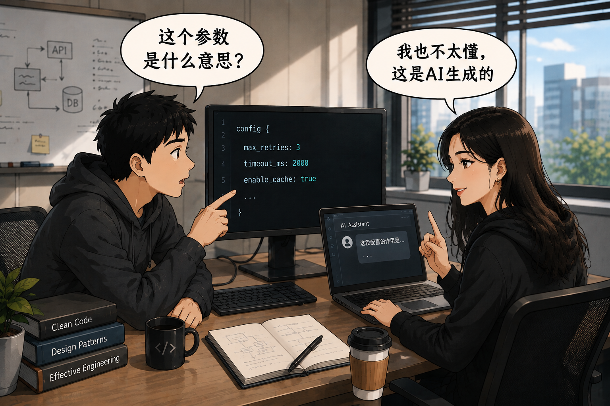

**"这是 AI 写的，我也不太懂。"**

这句话相信大家在工作中最近都经常听到，无论是代码，还是ppt、文档，越来越多的人用Agent生成交付件。当你仔细追问其中一些细节（比如代码中某个配置文件中的几个参数到底是干什么用的）时，你就会听到这句话，让人有时也有一些无奈。

RTS游戏中，有一个经典的概念，"战争迷雾"，玩家只能看到自己及盟友单位附近的视野，但地图上的其他地方都无法看到，今天AI Agent开发的仓库，也存在着**代码迷雾**。
# 代码仍是最重要的交付件

**一天完成一个library，三天完成PoC，七天完成一个产品初稿**。我们不缺乏效率神话。

有些人把今天 Agent 写代码的变化，类比成从汇编语言到高级语言的跃迁：未来人只需要写自然语言、Prompt 或者 Spec，代码只是生成出来的中间产物。我觉得现在还不是这样，这两者之间还不存在类似高级语言到机器代码那样的**完整映射**。

当前代码仓里充斥着各类SDD的交付件，不止一个人问过我SDD生成的文件是否要合并到代码仓库，因为这些文档都像是生产环境中的缓存，代码才是那个**Source of Truth**。

除了代码之外，软件工程还不存在更高层次、同时又能与代码形成完整映射的交付件。也就是说：**代码仍是最重要的交付件。**

# 代码迷雾现象原本就存在，Agent只是加剧了这一现象

我喜欢另一个比喻：拖拉机和传统农具耕地，最终都完成了同一件事情——把土地耕好。但两者之间存在一种微妙的差异。

使用农具的时候，你几乎了解土地的每一道沟壑、每一次翻土的力度，你知道哪里坚硬，哪里松软，哪里需要调整。这个过程慢，但人与土地之间建立了直接连接。

而拖拉机极大提升了效率，它可以在更短时间内完成更多工作，但你未必了解每一寸土地发生了什么。你看到的是结果，却不一定理解过程中的细节，这和今天使用 Agent 写代码很像，这层看不见的部分，就是**代码迷雾**。

**代码真实存在，也真实参与系统运行，但已经不在任何一个人的持续认知范围内。**

这个现象并非由于有了Agent才存在，今天没有人能够理解整个 Linux 内核，没有人能够理解整个 Chromium，也没有人能够掌握一个大型企业系统的所有细节。Agent时代下，一个高速迭代的项目，会飞快地产生**代码迷雾**，随着代码规模不断增长，我们既没有能力，也没有必要把所有迷雾全部**驱散**。

# 代码迷雾时代，我们应该怎么做

**现在如果你一定要手写每一行代码，那你一定会被人当做动物园里的猴子。** 

在 Agent 的帮助下，我们可以完成很多以前没能力、没时间，甚至不敢想的事情。这种感觉很好。这种感觉叫做**无敌**。

以前笔者可以算得上是经验丰富的开发者了，写过非常多的代码、组件，对一些仓库每个文件做什么了如指掌，最小化提交，优美的Commit记录。

但在 Agent 大幅提高代码生产效率以后，这种精细到代码颗粒度的维护方式开始出现效率瓶颈。如果仍然想着读懂、吃透每一行代码，很快人的理解速度就会成为整个开发过程的瓶颈。

对于个人来说，时间就是金钱，对于企业来说，如果不能充分提效，竞争对手就会充分地提效并超过你。

而且，以往团队的大颗粒PR提交，Committer真的认真看了吗？大部分时间大多数人都只是一个+1的机器。

所以我的第一个建议是：**抓大放小，在合适的地方维护合适的颗粒度。**

这并不是说以后我们只看架构、只看文档，不再看代码。

恰恰相反，我依然会在需要的时候进入某个模块，仔细读其中几十行代码，甚至单步调试，把一个问题彻底搞明白。区别只在于，我不再追求对整个 Codebase 都保持这种颗粒度的理解。

人的精力毕竟是有限的，关键是把精力放在哪里。

比如我让 Agent 帮我做一个后台系统，如果精力足够，我当然可以把每一个页面、每一个 Service、每一段实现都看一遍。但如果精力不够，我会优先维护几个我认为重要的东西：**前端菜单、存储结构、API 接口。**

菜单决定了这个系统对外呈现了哪些能力，存储结构决定了数据怎么组织，API 决定了模块之间如何交互。至于某个页面内部怎么实现、某个 Service 里面具体用了什么写法，我可以先允许它待在迷雾里面。

哪天这里出了问题，或者这一块开始变得重要，我再进去，**把这一小片迷雾驱散。**

所以颗粒度并不是只能向上，而是可以随时上下移动；关注的地方也不是固定的，而是取决于你认为当前什么东西最值得维护。

举个更具体的例子，这是我写在一个项目`Agents.md`里的一段提示词：

```
Implement features elegantly and with extensibility in mind. Split code into focused files/modules when that keeps the design clearer, reduces coupling, or makes future feature types easier to add.
```

我首先选择维护项目的定位、每个文件夹的作用，并要求 Agent 保持代码解耦，在合适的地方拆分为不同的文件、不同的模块。

代码维护不过来，那就重点维护代码结构。

代码结构也开始复杂，那就重点维护模块之间的关系、接口和文档。

文档越来越多，那就再建立文档的文档、目录的目录。

**这不是放弃下面的细节，而是不再要求所有细节始终处于自己的视野之内。**

我的第二个建议是**不要追求局部完美，保证整体持续向上**：

只要一个修改是必要的，并且经过了足够的验证，那就合并。没有必要因为其中几行代码自己没有完全理解，就让整个开发停下来。

今天 Agent 多写了一个模块，明天发现抽象得不好，那就重构；这次的设计不够好，下次继续调整。软件本来就是在一次次提交中逐渐演进出来的。

所以我不要求每一次提交都是完美的，也不要求每一行代码始终在人的视野里面。**只要每一次修改是必要且经过验证的，整个 Codebase 的结构、边界和能力是在往上走，那就继续往前。**

未来 Code 可能依然是最终最精确的交付件，但人未必需要始终工作在 Code 这个颗粒度上。

代码下面继续快速生长，人在更高的地方维护结构、边界和意图。需要的时候，再进入某一片代码，把那里的迷雾暂时驱散。
