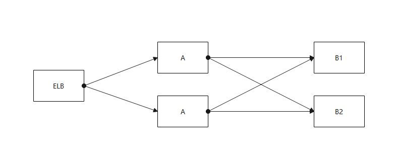
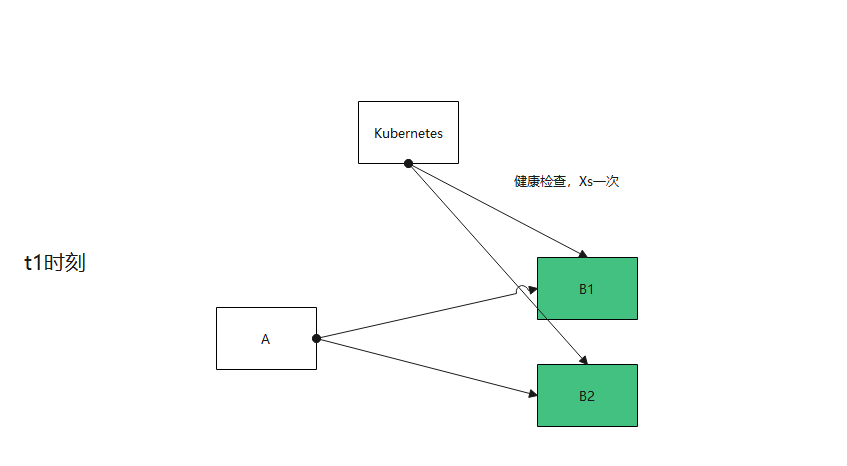
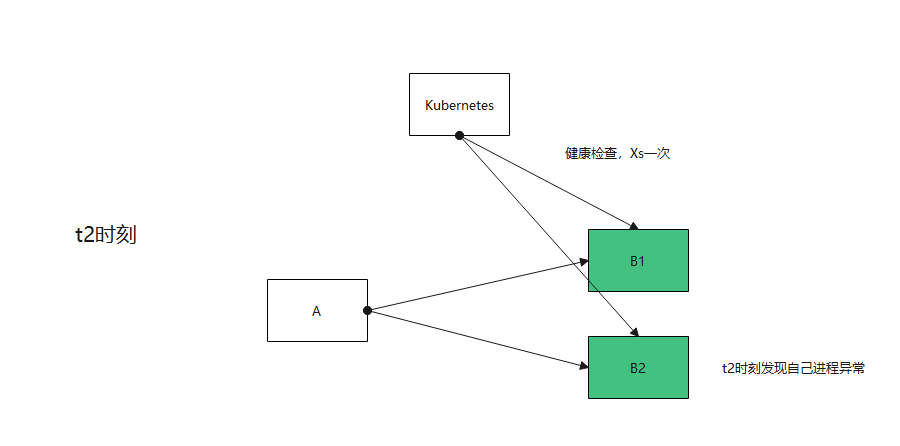
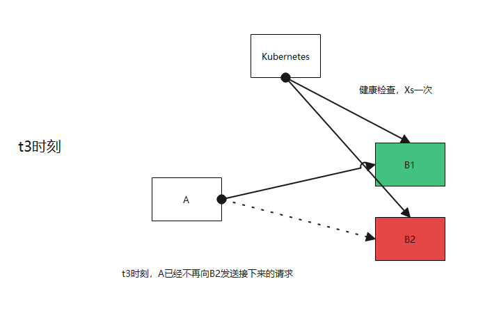

## 前言

基于k8s部署的微服务，健康检查已经成为其中非常重要的一环，无论是k8s自带的域名负载均衡，或是istio的负载均衡。都把健康检查（即Readiness）是否通过看为是微服务是否正常的标志。

如果正常，才会给应用程序转发报文请求。反之，则不会转发请求

即就是，在微服务功能正常的时候，健康检查返回正常，当微服务进程异常的时候，健康检查返回异常。

及时地让上游的服务/网关不转发给你。这里自然反应做不到**及时，立刻**的反应（健康检查是定期间隔探测，探测的周期在k8s
yaml中配置），如果要达到整个系统无失败，是要依赖一定程度的重试机制，如下图流程所示

## 如果服务有多个功能，一个好使，一个不好使怎么办？

这种健康检查自检无法通过，一般是系统依赖的某个资源不好使了，如数据库无法写入，消息中间件无法写入等，抑或是进程死锁等进程内部的故障。以上图的微服务B1举例，假如同时运行着tomcat和kafka生产者，那么也许当tomcat挂掉的时候，他的
**kafka**生产者还能正常运行。这个时候，可能有一些业务是不重要的，可以在异常的时候失败。比如元数据的创建、新用户的开户等。

这里健康检查的结果就可以以核心功能是否正常为准，次级功能通过**上报告警**
的方式及时处理。并且，除了一些网关模块，成熟的微服务框架都有熔断的功能，可以保证调用B1实例次级功能失败太多，后面都向B2实例调用。

## 如果我的两个功能都是核心功能怎么办

我觉得这里有三种方式可以探讨一下

### 健康检查做到接口级别

把健康检查做到接口级别，调用方根据你的接口级别的状态是否ok，决定是否调用这个实例

**优点** ：健康检查做到接口级别，不出错，可以应对任何多个功能依赖不同资源的场景。

**缺点** ：健康检查复杂，几乎很难有开源组件支持，基本上要自研

### 健康检查依旧通过，上游通过熔断处理功能故障

健康检查依旧通过，故障通过**上报告警**的方式及时处理，一些业务的呼损通过熔断机制解决。

不过，大部分的4层ELB都不支持熔断，Nginx也支持的有限，如果我们的服务挂在4层ELB，7层ELB的后面，就无法通过熔断机制搞定业务呼损的问题

### 健康检查不通过，上游可以放通

健康检查不通过，但是上游如果发现下游所有的实例都处于不健康状态，这种情况下，把他们当作健康状态处理，试一试能否发通。像servicecomb这个微服务框架就支持这个特性，但
**istio**还不支持。

## 总结

- 最好还是能做到一个微服务只有一个核心功能。
- 当你的服务挂在ELB、Nginx、K8sService、Istio的后端时，就把他定位成网关服务，核心功能单一，接收请求向下游转发，健康检查准确可靠（LB几乎无熔断能力）
- 如果服务处于架构的内侧，只有一个核心功能，其他功能在异常场景下可失败，健康检查的结果就以核心功能是否正常为准
- 如果服务处于架构的内侧，并且有两个核心功能。如服务B1，在上游有熔断的情况下，三种方式均可
- 如果服务处于架构的外侧，并且有两个核心功能。只能通过报告警的方式
