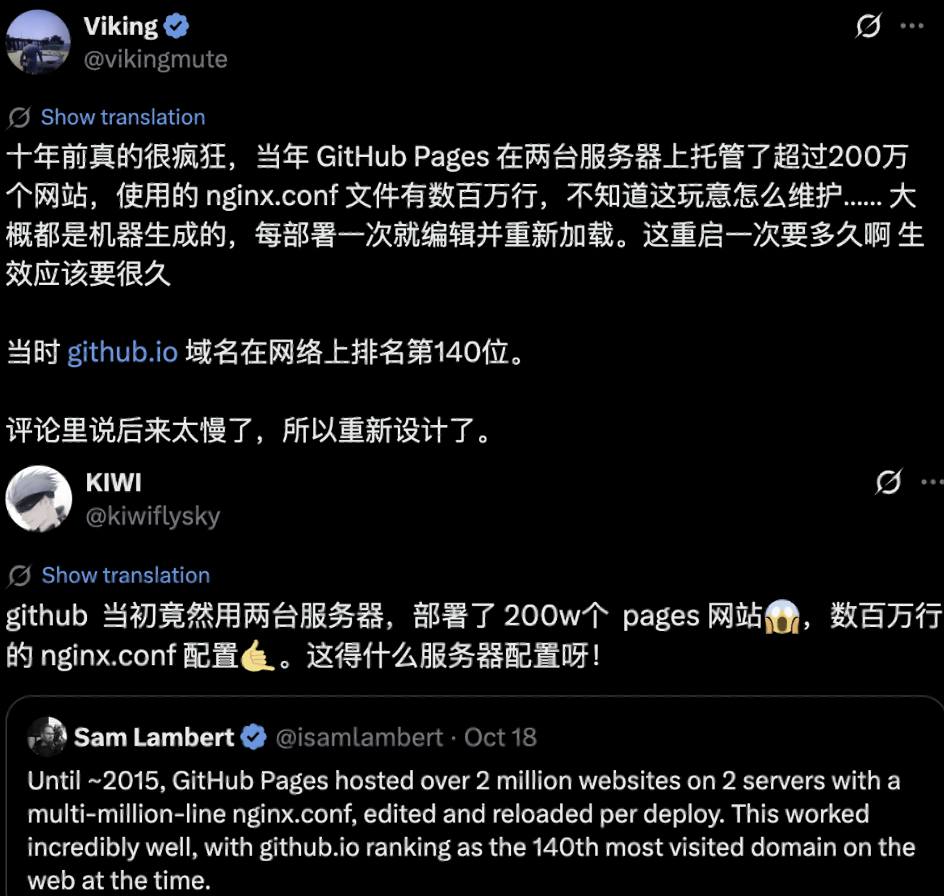
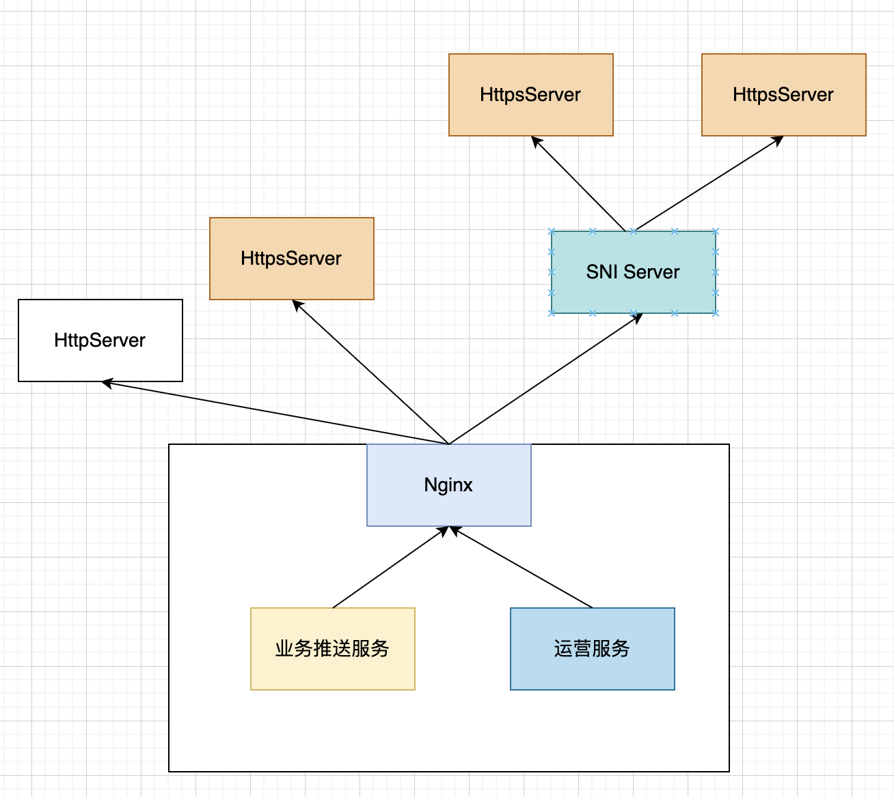
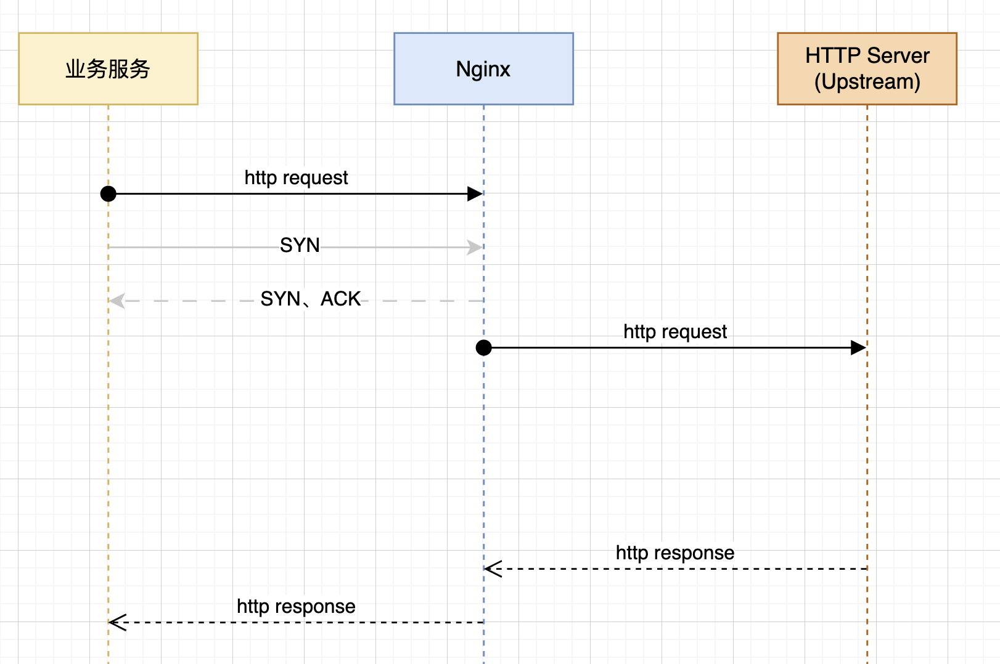

近日，在推特上看到了有关GitHub用两台服务器，部署了200万个pages网站的帖子，也想分享一下2019年左右，使用Nginx正向代理数千个配置文件的往事。

当时项目上主要用Nginx来做网络平面的隔离以及TLS的解码，无论是从外到内，还是从内到外的流量都会经过Nginx。

从外到内的流量虽然大，但是也就是几个端口提供服务。从内到外有个外出推送的功能，它是可以将不同用户的数据推送到用户的HTTP服务器，这里有数千个HTTP服务器，涉及到HTTPS的证书也有数千个，Nginx的配置就集中在这里。

每个用户变更HTTP服务器的时候也会涉及到Nginx的Reload，这和GitHub分享的场景也很相似。如果你的应用接受不了不定周期的Reload，不要采用这种方案。

在这个项目里面，我磨练了很多，对TCP、HTTP协议栈都有了很深的理解，也见识了各种各样的客户服务器，比如用C语言手写解析json的等等。

我还经历过一次这个规模级别平台的迁移，为了判断迁移后配置的准确性，写过脚本对这些http server一个一个进行测试。很怀念那时候的时光。

# 业务服务碰到的问题

主要就是海量客户的HTTPS Server多种多样，有些响应时间较长，有些可能还会定时关机。如果Server一直hang住，可能也会导致业务服务卡住。针对客户的HTTPS Server，长期发送不通的引入黑名单机制，每数分钟尝试通行一个业务，如果成功则从黑名单移除，不通的话继续在黑名单中等待。
# 生成配置文件时间长

由于Nginx服务上运营了数千个配置文件、数千个证书，这导致每次Nginx容器启动的时候要从配置中心/证书中心逐个获取，未优化前这个时间最长可以达到20分钟。通过批量拉取，挂载虚拟机路径缓存的方式解决。这避免了每次容器启动都从配置中心逐个拉取文件，启动时间从20分钟降到3分钟左右。
# 安全

安全主要就是先保护自己，避免推送到一个内网地址把系统自己打爆。比如恶意客户拿到了Kubernetes API Server的地址，配到海量业务推送上。其次，tls上证书，算法等级，是否过期等等。
# HTTP请求的各种错误

**connect() failed(110:Connection timed out) while connecting to upstream**

Nginx尝试发起TCP连接到HTTP Server，但是没有收到SYN+ACK响应，最终超时。

**connect() failed(111:Connection refused) while connecting to upstream**

Nginx 发起了 TCP 连接请求，收到了 **RST** 响应 —— 即目标主机明确拒绝了连接。

**upstream prematurely closed connection while reading response header from upstream**

HTTP Server接收了TCP连接，但是没有回复HTTP响应。

**peer closed connection in SSL handshake while SSL handshaking to upstream**

Nginx 在与上游建立 TLS 握手的过程中，对端在握手尚未完成时主动关闭了连接。

**SSL_do_handshake() failed(SSL: error:140770FC:SSL routines23_GET_SERVER_HELLO:unknown protocol) while SSL handshaking to upstream**

Nginx 与上游建立 SSL 握手时，收到的响应数据并非 TLS 握手数据（例如是纯 HTTP 响应），因此握手解析失败。
