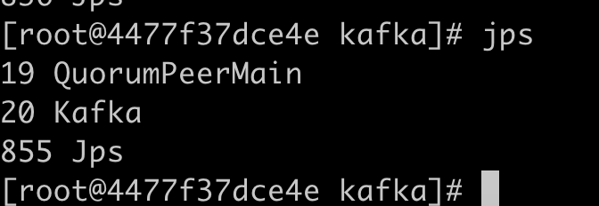
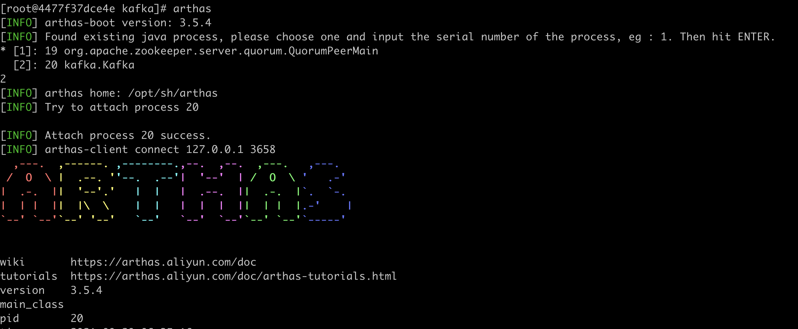
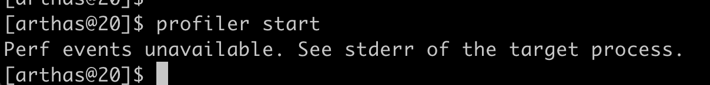
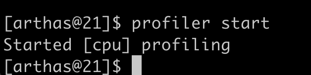
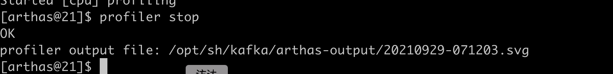
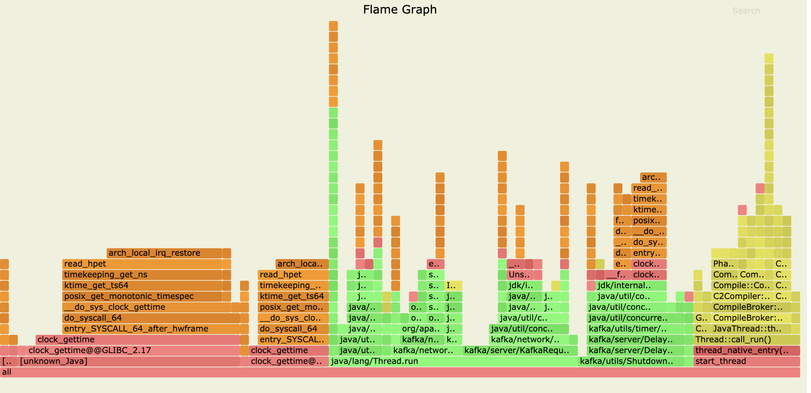

### 环境准备

需要有一个运行的java程序，如果你已经有了运行中的java程序，请跳过这一节，示例，我启动自制的kafka镜像

```bash
docker run ttbb/kafka:mate
```

### 找到java程序的pid

`ps -ef`或者`jps`均可，其中`jps`需要安装jdk



### 安装arthas

```bash
wget https://github.com/alibaba/arthas/releases/download/arthas-all-3.5.4/arthas-bin.zip
mkdir -p arthas
unzip arthas-bin.zip -d arthas
```

### 使用arthas连接到目标程序



### 开始profiler

```bash
profiler start
```

如果出现`Perf events unavailable. See stderr of the target process.`如图所示



需要在docker所在虚拟机上执行如下命令

```bash
echo 1 > /proc/sys/kernel/perf_event_paranoid
echo 0 > /proc/sys/kernel/kptr_restrict
```

如果是mac用户

```bash
docker run -it --privileged --pid=host debian nsenter -t 1 -m -u -n -i sh
```

执行上述命令进入docker所在的虚拟机操作即可

注意，在部分docker版本中，有可能还无法进行profiler采集，您可能需要以特权方式启动容器，不过，为了定位性能问题，这总是值得付出的，不是吗？



### 等待profiler一段时间

一般等待一分钟即可

### 结束profiler

```bash
profiler stop
```



### 结束

Congratulations，完成了火焰图的输出，现在你可以使用火焰图来分析执行时间较长的方法啦


