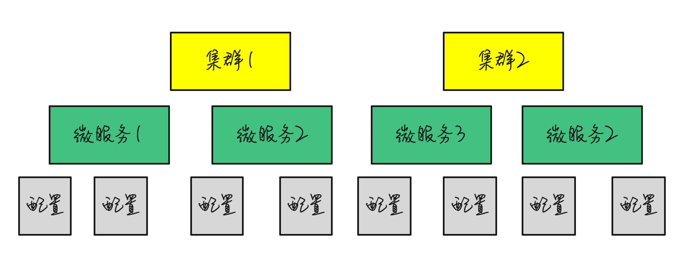
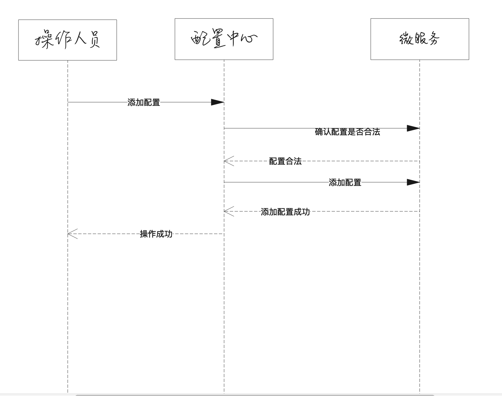
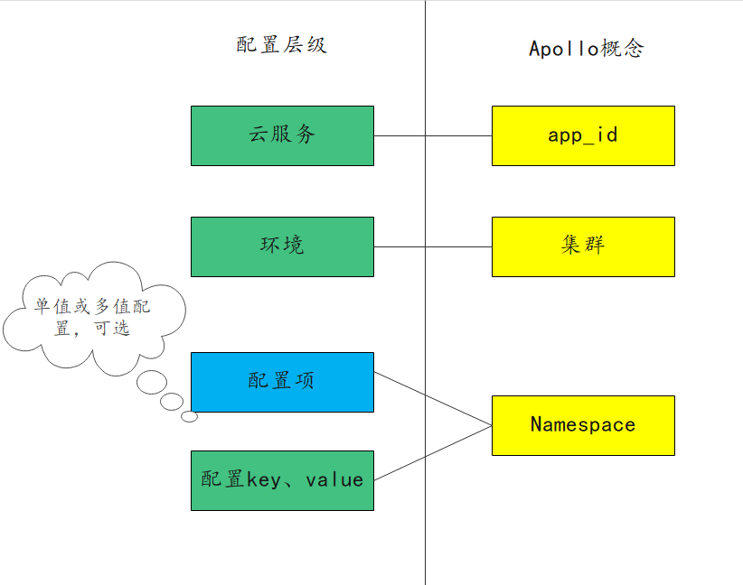
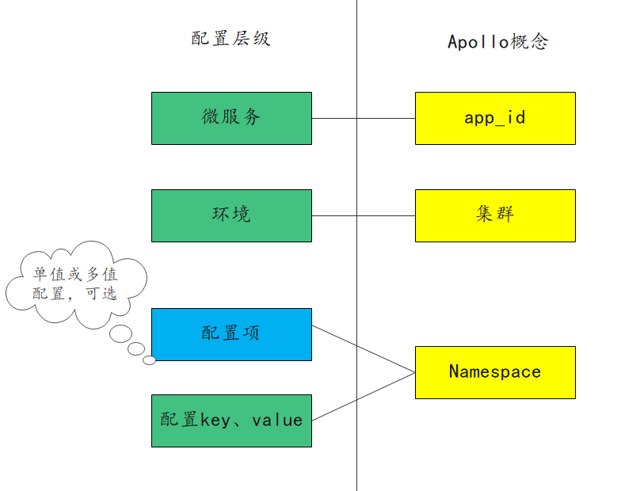

## 前言

  自17年入职华为之后，一直在使用配置中心，4年期间经历了自研配置中心到`Apollo`再到自研配置中心和`Apollo`并存的场景。总结了一下这几年的配置中心演进流程，想把我们在配置中心上的一些实践分享给大家，实现共同进步。`Apollo`是一款非常优秀的开源软件，是国人的骄傲。如果对`Apollo`存在理解错误，还望大家不吝赐教，谢谢。

## 使用到的配置分类

### 从场景分类

#### 运维配置，即程序只读的配置
人工配置。通过人工在配置中心界面进行配置，而程序只进行读取，如数据库配置、邮箱服务器配置、网卡配置、子网地址配置等。这部分配置数据不要求代码动态写入。
#### 业务配置，即程序可写的配置
我们是一个SaaS服务，每个用户在上面都有一些业务配置。如用户的证书配置、用户服务器的流控配置等，这些业务配置相对**运维配置**来说更加复杂，且可能会有唯一性限制，如按用户id唯一。这部分配置数据一般由用户操作触发，代码动态写入，并且通知到各个微服务实例。通常，我们希望这些配置能在界面展示，且支持人为修改。上述逻辑如果由各微服务自己实现，会存在大量重复代码，并且质量无法保证。我们希望由一个公共组件来统一实现这个能力。

### 从配置是否会有列表可分为单值配置或多值配置

#### 单值配置

整个配置下只是多对key、value。value不是很复杂的格式，往往是整数或字符串。


#### 多值配置

多值配置更加复杂，往往是**单值配置**在不同的key下，有不同的值。比如下面的配置，用户一和用户二的线程池大小和队列不同


## 第一阶段 自研配置中心

在做云服务之前，我们的配置中心层级数较少。我们以软件的形式交付给客户，软件运行时分为管理面和业务面，配置中心管理着管理面和业务面的配置，最为复杂的场景是多套业务面，这个时候需要保证不同集群、不同微服务下的配置不冲突，配置层级为 集群、微服务、配置。



此时的配置中心是完全自研的，不包含蓝绿、灰度配置这些功能，它独具特色的地方有以下两点：
### 单配置单表

- 在存储模型上，每个配置对应一张数据表。
- 对多值配置比较友好，尤其是复杂业务配置，可以支持各种主键约束。对单值配置，稍微重型了一些。
- 配置的强Schema限制。这些限制包括类型、大小、长度、是否敏感等限制。这种限制既能为界面修改配置提供良好的体验（如：不同格式不同的输入框、敏感字段，前台输入明文，后台入库加密等），也能在通过接口写入配置时做充分的校验。

### 通过回调方式来确保配置的可靠

举个例子，添加一个配置的流程是这样的



可能这里，有读者想要问了，这个流程能确保什么可靠呢。这个流程通过调用微服务接口来校验配置是否可靠，如IP地址是否合法、对端地址是否可达、配置数量是否超过规格等等，来保证配置基本可用。

总的来说，这个自研的配置中心在当时综合体验还是不错的。但是也有一些问题有待改进，比如单配置下配置项数量过多时，因为底层有部分接口单配置下所有数据都通过一个http请求来承载，会导致响应超时等问题。

## 第二阶段 Apollo

开始第二阶段实践的原因主要是，我们进行了组织切换，业务重心转向做云服务，同时团队进行DevOps转型。原先的老配置中心是由另一个团队维护的，组织切换完之后，如果还要使用，就要我们自己维护。所以我们需要在继续维护老配置中心和引入开源`Apollo`中间进行选择。除了上文中提到的运维配置和业务配置，这个时候我们的需求还有改变：

- 配置的层级愈发丰富了
- 要构建灰度发布微服务的能力

老配置中心一方面由于组织切换原因不提供维护了，另一方面不能支撑丰富的配置层级，也不具备灰度发布的能力。这个时候，`Apollo`的一些特性吸引了我们，这些特性正是老配置中心所缺乏的，例如（部分引用自`Apollo`github主页）

- 丰富的层级，从`app_id`到`cluster`,`namespace`,`key-value`的层级能满足我们region、集群、微服务的层级诉求
- 支持配置的灰度发布，比如点了发布后，只对部分应用实例生效，等观察一段时间没问题后再推给所有应用实例。
- 所有的配置发布都有版本概念，从而可以方便的支持配置的回滚。
- 应用和配置的管理都有完善的权限管理机制，对配置的管理还分为了编辑和发布两个环节，从而减少人为的错误。
- 所有的操作都有审计日志，可以方便的追踪问题。

因此我们选型引入了`Apollo`，我和我的主管，还有一个其他同事参与了这项工作。我们在Apollo开源代码的基础上做了比较大的改动，主要原因有以下几点

- 节约成本，将注册中心、数据库替换成我们当前正在使用的组件，因为这两个依赖不是`Apollo`的核心依赖
- 继承老配置中心强`Schema`的优点。
- 保留回调确认配置的流程，提前拦截错误的配置，降低代码处理异常配置的复杂度
- 通过spi或环境变量的方式兼容存量老局点使用老配置中心的场景

结合上述原因，我们最终是这么实践的

- 数据库切换为`postgre`数据库、注册中心切换到`servicecomb`

- 在namespace上实现了`Schema`，每个namespace都可以注册对应的`Schema`，`Schema`要求数据必须是json格式，且json内对应的value必须满足Schema定义的规范（如ip地址、小数、整数等）

  Schema举例

```json
  [
      {
          "name":"name",
          "type":"string"
      },
      {
          "name":"age",
          "type":"int",
          "max":120
      },
      {
          "name":"ip",
          "type":"ipv4"
      }
  ]
```
 那么数据应该是这样的
```json
  {
      "name":"hezhangjian",
      "age":23,
      "ip":"127.0.0.1"
  }
```

  

- 在添加或修改配置的时候，实现了回调功能，由回调业务服务确认配置能否添加或修改
- 配置分层：云服务对应`Apollo`的`app_id`，把内部的环境对应到`Apollo`上的集群，然后将微服务名+配置名拼接成配置名称。

下图展示了业务概念和`Apollo`概念的对应关系，有些配置是单值配置，有些是多值配置，所以配置项这一层级是可选的。



在这段时间的实践中，我们也发现如下问题

### 并发问题

其中最致命的就是并发问题，首先`Apollo`所有配置都存在一张表中，其次由于`Apollo`设计之初主要考虑的是运维人员手动在界面上操作，代码无并发语义（或者说没给客户端并发语义），使得我们通过代码写入配置时难以解决并发问题。

### 性能问题

打开`namespace`列表页面，需要显示这个`app_id`下的所有`namespace`,因为我们单`app_id`会存放单个云服务的所有配置，这个量很大，且界面不支持分页，导致页面加载缓慢

### 体验问题

`Apollo`的`namespace`界面未提供搜索功能（可能Apollo设计之初也没想支持这么多），想要从`namespace`中定位到我们想要查看或修改的namespace，只能借助浏览器的搜索能力。

## 第三阶段 Apollo与自研配置中心并存

除了上述几个问题，还有一些原因使得我们开始了第三阶段的实践

- 原来自上而下的配置分层模型，微服务间配置没隔离，不仅不易进行权限管理，而且不适合`DevOps` 单微服务自治的发布理念。
- 第二阶段对`Apollo`改动太多，组织结构变动，没有足够的人力维护
- 随着集群越来越多，回调功能需要网络的双向打通，网络维护不太方便
- 我们对`Apollo`界面以及接口基于业务做的改动较多，导致其他兄弟部门难以共用`Apollo`

当时大家对是否保留**Schema**、**回调检查**、**代码写配置**这三个功能点有较大的争议。我个人最希望保留**Schema**、**回调检查**，因为它们优点显著，而且接口是兼容的，可以与其他部门共用，但是增加了**Schema**这个概念和**回调检查**这个流程，会增加学习成本。而代码写配置，由于要解决并发问题，代码改动量较大，我不建议保留。

大家经过激烈的讨论，最终还是废弃了**Schema**、**回调检查**、**代码写配置**这三个功能点，仅仅把运维配置放在`Apollo`。

然后，我们把业务配置，放在了一个自研的强Schema的配置中心上，这个配置中心，仅负责单集群的配置，每个集群部署一套，满足了我们的业务需求。自研强Schema配置中心的核心要点有，单配置单表、通过注册中心回调来检测配置是否合法、借助mqtt协议来实现长链接推送，无单点瓶颈。

而我们的运维配置中心`Apollo`回归到了开源的版本，重整了配置的结构，



对运维配置而言好处有

- 配置模型适合单微服务发布
- 配置按微服务组织，一个页面上的namespace不会很多

缺点

- Schema缺失后，不会对操作人员在界面的配置进行校验，即使配置格式或者内容错误也能配置成功。界面上配置密码不支持明文（Apollo无法感知是否为敏感字段），必须提前使用其他工具将明文转换为密文，然后再进行配置。
- 回调检查功能去掉后，有些配置，如网卡网段配错，操作人员不能即时得到响应

## 最佳实践
业务配置经过我们的实践，确实不适合使用开源的`Apollo`。运维配置使用原生的`Apollo`，但是现在还不具备**回调检查**和**Schema**的功能，希望`Apollo`能在后续版本中支持**Schema**，或者弱化的**json**格式检查功能。下面是我们在如下场景下的最佳实践

### SRE在界面上的运维配置
通过`Apollo`来实现功能，至于配置如何组织，根据大家的组织结构、技术架构来对应`Apollo`上的概念，可按照`微服务->部署环境`或`部署环境 -> 微服务`的层级来组织配置
### 复杂的参数校验
建议在`Apollo`上面自建portal包裹一层，后端服务可先进行一层处理，这一层处理可以做比较复杂的格式化校验甚至**回调检查**，再调用`Apollo OpenApi`将配置写入`Apollo`。
### 业务配置的技术选型
最大的挑战是业务配置由用户触发，请求的并发不易处理。思路有两个，一个是在`Apollo`原生代码的基础上，通过数据库分布式锁来解决并发问题。第二个是借鉴我们的思路，通过单配置单表、mqtt协议实现通知等核心技术点，自研业务配置中心。
### 业务配置的部署
需要根据业务配置的数量来考虑是否合设业务配置中心。单集群场景下，毫无疑问只需要一个业务配置中心，甚至如果使用`Apollo`实现，可以考虑和运维配置中心合设。多集群场景下，部署一个业务配置中心，还是多个业务配置中心，我们自己的实践中，一个集群往往要支撑数万用户，我们采取了每个业务集群部署一套业务配置中心的策略。
