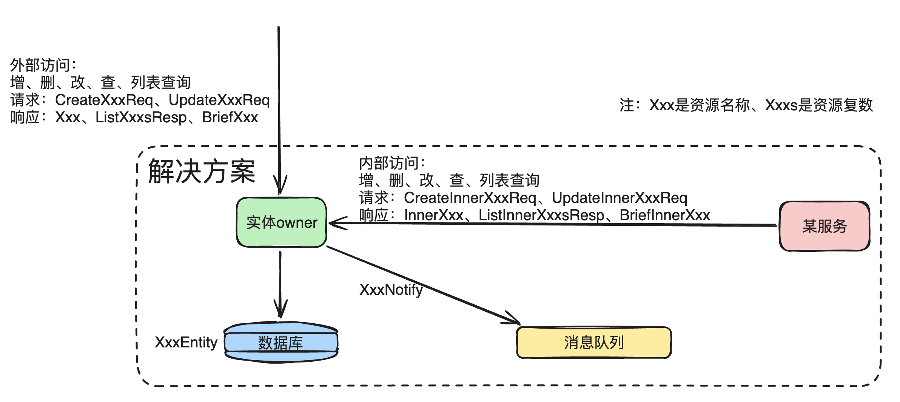
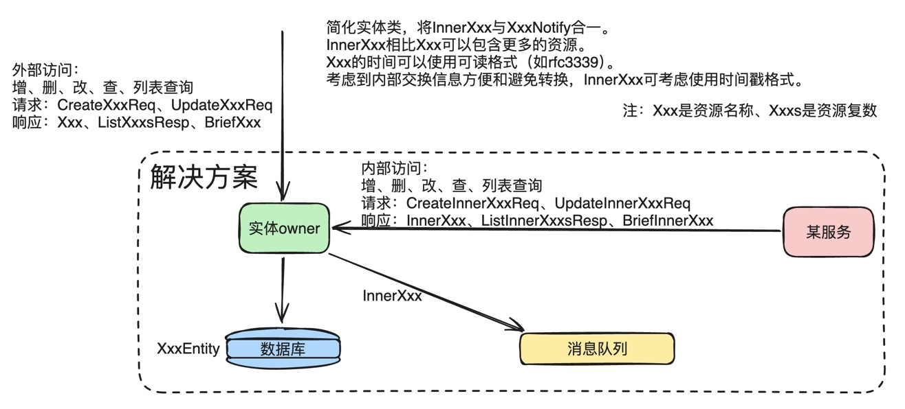

对于一个资源实体来说，在解决方案里，常见的操作场景有：

- 由外部/客户发起的增删改查、列表查询，访问协议一般为HTTP协议。
- 由系统内部组件发起的增删改查、列表查询，协议可能为HTTP协议，也可能是RPC协议如gRPC等。
- 由资源实体的owner服务跟数据库进行实体读写。
- 由资源实体的owner服务将变更广播到消息中间件里。

可以将实体命名如下：

实体类详细说明：

- CreateXxxReq 创建资源请求，包含除资源id之外的所有字段，有些变种里面可能会包含id字段。
- UpdateXxxReq 更新资源请求，包含除资源id之外支持更新的所有字段。
- XxxResp 资源响应，可用于Crate、Update接口的返回，包含所有字段。
- ListXxxsResp 资源列表响应，包含资源列表。
- List<BriefXxxResp> 资源列表响应，包含资源列表，每个资源包含部分字段，一般是id、name、createdTime、updatedTime等。

出于复杂性的考虑，可以将XxxNotify类跟InnerXxx进行简化合并，转化为:

swagger/openapi里，operationId可使用如下

| 操作       | operationId    |
|----------|----------------|
| 创建资源     | CreateXxx      |
| 删除资源     | DeleteXxx      |
| 更新资源     | UpdateXxx      |
| 查询单个资源   | ShowXxx        |
| 查询资源列表   | ListXxx        |
| 内部创建资源   | CreateInnerXxx |
| 内部删除资源   | DeleteInnerXxx |
| 内部更新资源   | UpdateInnerXxx |
| 内部查询单个资源 | ShowInnerXxx   |
| 内部查询资源列表 | ListInnerXxx   |
