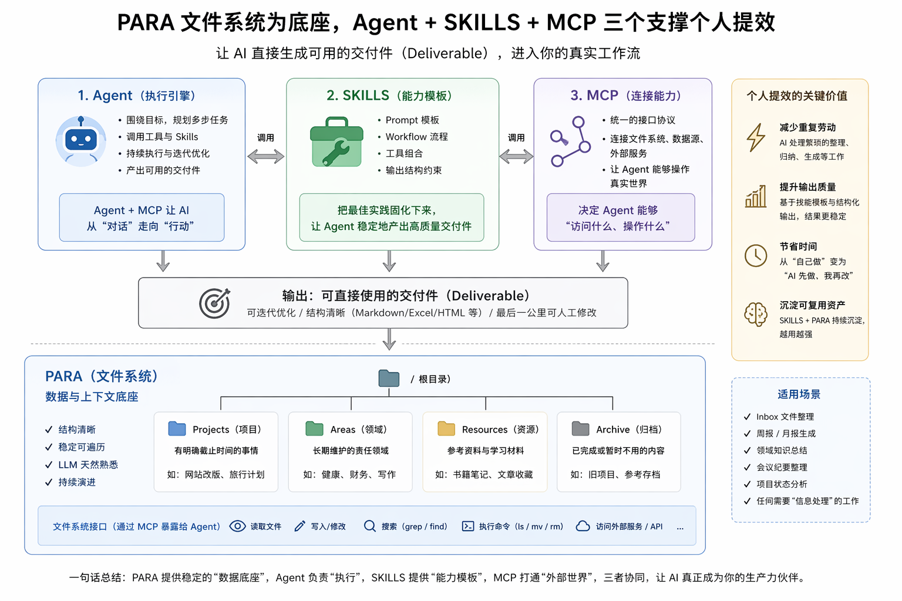

AI已经极大程度地更改、影响了这个世界的走向，我们可以看到一些趋势，比如 画师、网文写手、真人短剧逐渐地被替代，程序员的替代还没有那么快。

大家有没有想过这个原因呢？我认为核心就在于：**AI生成的产物，是否是最终的交付件。**

这和Leader分配任务给下属一样，如果下属的交付件可以直接用，那Leader可能就说，你这个代码日志一定要符合规范、你这个材料字号要调大一些；反之，可能Leader就用下属的没那么完美的交付件，自己再整理成最终的交付件。

而程序员的情况不同：**代码不是最终交付件，系统才是。**

代码只是中间产物，它需要：运行、集成、部署、监控、演进。这一整条链路还没有完全“标准化交付”，所以替代速度较慢。

那么结论其实很自然，个人提效的关键就在：让AI Agent直接生成交付件，这个交付件一定要是可通过迭代提示词、上下文不断优化的，最好这个产物是可编辑的（Markdown、Excel、Html），最后一公里的时候人可以做一定的修改。我在2月27日的朋友圈里也表达了类似的观点。


那么怎么更好地让AI Agent生成工作中用的交付件呢，我目前的实践是 **Agent+MCP+SKILLS+PARA**。Agent 负责执行，MCP 连接外部世界，SKILLS 提供可复用能力，PARA 提供稳定上下文，我们一个一个解释。
# Agent+MCP

Agent毋庸多说，相比于只能对话的LLM，是一个围绕目标，能够多步执行、调用工具并持续迭代的执行单元。Ask模式（只跟AI对话）是没法更进一步地提效的。

# SKILLS

SKILLS可以理解为一组可复用的能力模板（Prompt + Tool + Workflow 的组合）。例如
- 整理Inbox文件
- 生成周报
- 分析某个Area的内容
- 输出某种固定格式的文档
如果没有SKILLS，每一次都在“重新提示AI”，有了SKILLS，相当于把最佳实践固化下来，交给Agent反复使用。

# PARA

对于Agent来说，与其给 AI 造新工具，不如给它一个它已经「会用」的旧接口。在于 LLM 的训练数据。LLM在训练阶段已经看过了很多文件系统的操作，grep、ls、find等等。LLM会非常善于在文件系统里探索他想用的内容，而不是拼凑一个高度定义的DSL。

PARA呢，和文件系统强强联合，给Agent提供了一个稳定、可理解的上下文环境。



# 个人实践案例

## 我的PARA目录

PARA是一个指导原则，每个人的PARA都可以有一些定义，比如我的PARA目录是这样子的，适配了我平时使用的OneDrive(它会强制有一些顶层文件夹，我自认为巧妙地利用起来了)，同时我还有把一些作为Blogs发布的诉求。同时也放了一些`README.md`、`About.md` 方便Agent读取。

如果大家感兴趣的话，我可以单独写一个文章介绍一下。

```
生活/
Archive/
Areas/
Attachments/
Blog/
Documents/
Projects/
Resources/
Software/
About.md
README.md
```

下面的实践过程，本质上不是一次性的。

如果你每隔一段时间都需要做类似的事情，比如：

- 盘点近期工作成果
- 挑选可以对外分享的主题
- 判断哪些材料已经足够支撑一次输出

那么这个流程其实是高度稳定的：

1. 扫描目录
2. 识别活跃内容
3. 提取关键材料
4. 组织成候选结果

这类流程，就可以被固化为一个 SKILL，例如
```
Skill: summarize-workspace-for-sharing

输入：
- 一个工作目录路径

输出：
- 可用于分享的主题列表
- 每个主题对应的支撑材料
- 是否已经具备“可交付”的判断

内部流程：
- 扫描最近活跃文件
- 聚类主题
- 评估材料完整度
```

这样一来，下次再做同样的事情，就不需要重新写 Prompt，而是直接调用这个 Skill。

## 实践1：筛选个人成果用于会议分享

**向 Agent 提问**
```
这是我的个人工作文件夹，你可以看看我最近几个月的工作成果，看看有没有什么东西可以拿去"ApacheCon"分享的？
```

**Agent 回复**

```
我会先快速梳理这个工作区最近几个月的文件分布和活跃项目，找出适合做 ApacheCon 分享的候选主题，再回头看哪些材料已经足够支撑成一场 talk。

已探索 3 个列表，ran 1 command

我已经看到这个目录更像一个长期知识库，不只是单一项目，所以接下来我会缩小范围：重点看近 6 个月新增或活跃的 Apache / 开源 / AI研发 相关材料。
```
## 实践2：整理 Inbox，迁移到合适的 PARA 目录

个人文件夹里最容易失控的地方，通常不是 Projects，也不是 Resources，而是各种临时下载、微信传文件、会议附件、截图和草稿。它们会先堆在一个“待处理区域”里，时间久了以后，人自己都不太愿意翻。

这种场景其实很适合交给 Agent。因为它不需要一开始就“理解整个世界”，只需要先做一件很具体的事情：**识别这些文件分别属于什么类型，应该进入哪个目录。**

**向 Agent 提问**

```
这是我的 Inbox 目录，里面有很多最近积累的文件。你可以帮我分析一下这些文件分别属于 Projects、Areas、Resources 还是 Archive 吗？先不要直接移动，先给我一个整理建议和理由。
```

**Agent 回复**

```
我会先扫描 Inbox 里的文件名、扩展名、最近修改时间，以及部分文档内容，判断这些文件更像是项目资料、长期领域资料、通用参考资料，还是已经可以归档的历史内容。  
  
已探索 4 个目录，ran 2 commands  
  
初步看下来，这里面混合了会议纪要、下载的安装包、临时截图、正在推进项目的材料和几份标准文档。我接下来会先按“是否仍在活跃使用”进行第一轮分类，再给出建议路径和批量整理方案。
```
## 实践3：让 Agent 总结一个 Area 当前都积累了什么

有些 Area 是长期负责的，比如英语、软件工程、孩子教育、投资理财。这类目录的问题不在于“没有内容”，而在于**内容太多了，久而久之自己都不知道里面已经沉淀了什么。**

Agent 很适合做这种“盘点当前资产”的工作。它不一定直接帮你产出最终文档，但可以先把目录里的内容做一轮结构化总结，帮你建立重新利用这些内容的入口。

**向 Agent 提问**

```
这是我 Areas/软件设计 目录。你可以帮我看看这里现在主要沉淀了哪些内容？按主题帮我归一下类，再告诉我哪些内容已经比较完整，哪些内容还只是零散积累。
```

**Agent 回复**

```
我会先浏览这个目录下的子目录和关键文档，判断当前沉淀更偏向方法论、实践记录、工具使用，还是项目复盘，并整理出一个主题结构。  
  
已探索 5 个目录，ran 3 commands  
  
从目前看到的内容来看，这个 Area 里既有一些长期积累的方法论笔记，也有若干和具体项目相关但仍有复用价值的实践文档。我接下来会把它们拆成几个主题，并标出哪些已经可以整理成对外输出的文章或分享材料。
```

## 实践4：从一个目录里提炼周报 / 月报素材

很多人写周报、月报最痛苦的地方，不是“不会写”，而是**回头找素材太费劲**。尤其是当你的工作记录分散在会议纪要、草稿、截图、PRD、临时文档、代码仓库说明里时，人会本能地拖延这件事。

如果文件组织本身还算规整，Agent 就可以直接从目录里提炼候选素材，最后输出一个可编辑的 Markdown 初稿。

**向 Agent 提问**

```
这是我最近两周的工作目录。你可以帮我整理一版周报素材吗？先按“已完成事项、推进中的事项、问题和风险、下周计划”四个部分来归纳，尽量基于已有文件内容，不要凭空发挥。
```

**Agent 回复**

```
我会先查看最近两周活跃修改的文档和项目目录，提取其中能够反映工作进展的内容，再按周报结构组织成一版可编辑草稿。  
  
已探索 6 个目录，ran 3 commands  
  
目前已经看到几个高频修改的项目目录，以及两份会议纪要和一批方案文档。我接下来会优先提取能够代表实际推进结果的内容，避免把讨论中的想法误写成已完成事项。
```

# 参考资料
1. Agent：一切皆文件：https://mp.weixin.qq.com/s/ulmVG3_yrfy-7EofRgnyGw