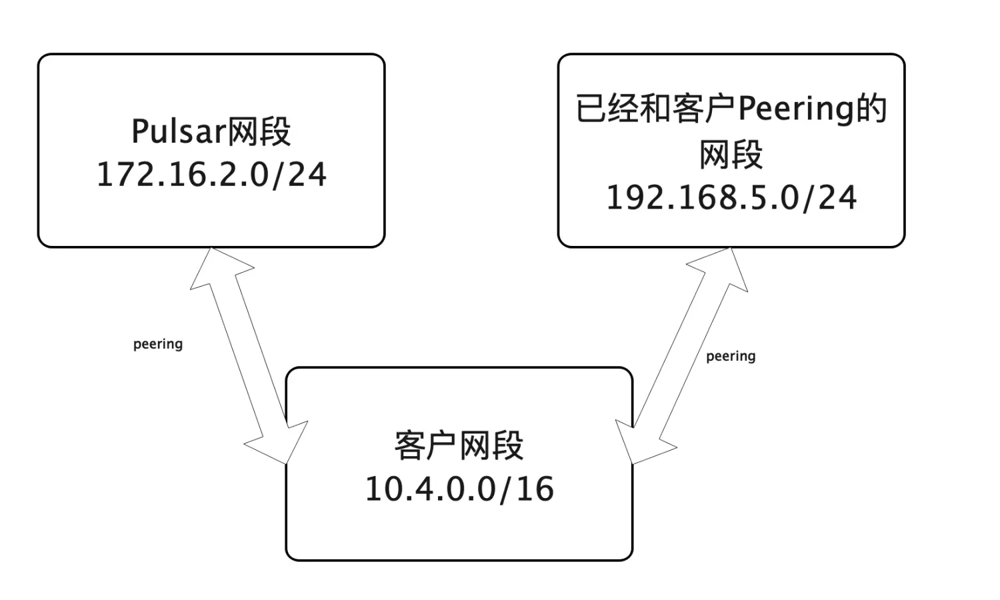

# 需要了解的概念

- VPC：用户的私有网段
- peering：多个VPC之间打通的方式，可跨用户

# 前言

今天微信推送Pulsar社区有个Hackathon比赛, 开始想的idea就是，实现`pulsar`在华为云上提供服务。因为是社区的比赛，是以一个三方系统的方式在华为云上提供服务，而非是以华为云的名义提供服务。分析了下可行性和能达到的效果，对比了`StreamNative`的官网上提供的`pulsar`服务在阿里云托管的能力，能提供的能力差不多，最多只不过是实现了在华为云托管的能力，没有从0到1的突破。

现在，在公有云上买`redis`和`kafka`这类组件已经变得非常普遍，由公有云供应商提供的中间件往往能给你带来良好的体验，相比三方厂家在云上进行托管，我个人认为云厂商的优势主要在以下三点

## 网络打通容易

下文说一下不是公有云的供应商能以什么样的方式暴露自己的服务。云厂商可以把中间件的ip地址申请在你的vpc内，对任何应用程序来说，连接都是最方便的。无论是容器化部署、虚拟机部署、和其他vpc peering打通的场景，都可以通信。

## 低廉的成本

不考虑人力成本，云厂商自运营的价格要低于三方厂家。

## 监控系统对接

方便地和云厂商的告警、统计系统对接，接收告警通知和报表等。

其中**网络打通**和**成本**尤为重要，三方厂家好好做监控统计系统，也能给用户较为良好的体验。

# 三方厂家能提供什么样的Pulsar接入

## 统一接入

三方厂家自己作为公有云上一个用户，无论这个Region上有多少个租户，都用这一个用户提供服务，这也就意味着无法与每个用户进行私网通信。如果在华为云，利用华为云推出的**VPCEP**服务（此处应有链接），倒是可以给每个用户提供私网通信，不过这个是做了DNAT地址转换的，跟做了DNAT转换的中间件连接，是非常麻烦的。（懂的自然懂。如果有人想详细了解，可以留言，我可以写一个文章介绍里面的坑）

如果使用公网，又想避免扩容的时候动态申请EIP，动态申请EIP并不复杂，问题是EIP是有配额限制的，这才是关键。那么就需要一个统一的接入点，就需要部署pulsar proxy。到这一步，是每个用户申请一个EIP的，如果还想继续节省EIP，那么可以统一域名接入，后端通过SNI的方式转发，个别流量大的客户，单独把域名指向单独的集群。

## Peering打通

Peering打通可以给用户不错的私网体验，需要用户预留一个网段，网段不需要太大，能容纳pulsar所在的vm就行。采用peering打通一般绝不会选择容器化部署，想要两个容器化的集群互通，对网设的要求很高，暂且忽略Service的存在，这要求用户的vpc网段和pod网段和三方厂商的vpc网段和pod网段都不重叠！而且peering打通，给用户私有，再搭建一个k8s集群，对成本影响比较大。主要有如下两个问题

### 自动化

和客户peering打通，需要较大的权限，如何自动化，最大程度的减少需要的权限。

### 客户网段和其他网段又做了peering

这个问题其实还好，就是路由规则配置麻烦

# 总结
Peering打通对用户来说已经比较方便了，相信做到自动化也没有太大的技术难度，只是时间和人力投入的问题。统一接入因为网络打通的原因，不好使用`kop`、`mop`这些高级特性，此外还有不小的公网带宽成本，羊毛出在羊身上，比较大量的用户也会倾向于Peering打通的模式吧。
