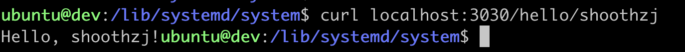

将程序(以rust程序为例)托管为`Systemd`运行比较容易，步骤分为以下几步

- 生成rust二进制文件
- 创建专用用户和用户组（可省略）
- 书写`.service`文件
- 通过`systemctl`启动

接下来我们以ubuntu、简单的rust web程序为例，演示一个简单的`rust`程序如何托管给`Systemd`运行

## 生成rust二进制文件

### 添加依赖

```
tokio = { version = "1", features = ["full"] }
warp = "0.3"
```

### 书写简单代码

```rust
use warp::Filter;

#[tokio::main]
async fn main() {
    // GET /hello/warp => 200 OK with body "Hello, warp!"
    let hello = warp::path!("hello" / String)
        .map(|name| format!("Hello, {}!", name));

    warp::serve(hello)
        .run(([127, 0, 0, 1], 3030))
        .await;
}
```

### 编译生成二进制

`cargo build --release`

二进制就在`target/release`中

## 创建专用用户和用户组

为了更细粒度地授权和文件权限控制，我们可以给守护程序创建专用的用户

```bash
sudo useradd vmproxy -s /sbin/nologin -M
```


## 书写`.service`文件

`.service`文件在`ubuntu`应该放到`/lib/systemd/system/`路径下。样例如下`vm-proxy.service`

```
[Unit]
Description=Vm Proxy
ConditionPathExists=/home/ubuntu/rust/vm-proxy/target/release/vm-proxy-rust
After=network.target

[Service]
Type=simple
User=vmproxy
Group=vmproxy
LimitNOFILE=1024

Restart=on-failure
RestartSec=10

WorkingDirectory=/home/ubuntu/rust/vm-proxy/target/release
ExecStart=/home/ubuntu/rust/vm-proxy/target/release/vm-proxy-rust

# make sure log directory exists and owned by syslog
PermissionsStartOnly=true
ExecStartPre=/bin/mkdir -p /var/log/vm-proxy
ExecStartPre=/bin/chown syslog:adm /var/log/vm-proxy
ExecStartPre=/bin/chmod 755 /var/log/vm-proxy
StandardOutput=syslog
StandardError=syslog
SyslogIdentifier=vm-proxy

[Install]
WantedBy=multi-user.target
```

`ConditionPathExists`、`WorkingDirectory`、 `ExecStart` 这三个参数需要根据自己的路径修改

## 通过`Systemctl`启动

```bash
sudo systemctl enable vm-proxy.service
sudo systemctl start vm-proxy.service
```

## 验证启动完成


