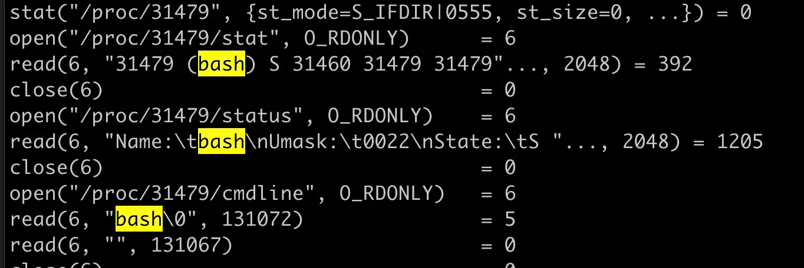

有很多场景需要我们的代码检测一个进程是否存在，常用的一种方式是通过调用脚本通过`ps -ef`的方式查看，然而其实这种做法并不怎么高效，会fork一个进程出来，还会影响`go`协程的调度

一种更好的方式是可以通过解析`/proc`文件夹来得到想要的信息，其实可以通过`strace`命令查看，`ps -ef`也是读取了这个路径下的信息



下面分别是java和go的轮子示例

使用正则表达式`[0-9]+`的原因是`/proc`路径下还有一些其他文件，其中pid都是数字。

## java

```java
private static final Pattern numberPattern = Pattern.compile("[0-9]+");

    public static boolean processExists(String processName) throws Exception {
        final File procFile = new File("/proc");
        if (!procFile.isDirectory()) {
            throw new Exception("why proc dir is not directory");
        }
        final File[] listFiles = procFile.listFiles();
        if (listFiles == null) {
            return false;
        }
        final List<File> procDir = Arrays.stream(listFiles).filter(f -> numberPattern.matcher(f.getName()).matches()).collect(Collectors.toList());
        // find the proc cmdline
        for (File file : procDir) {
            try {
                final byte[] byteArray = FileUtils.readFileToByteArray(new File(file.getCanonicalPath() + File.separator + "cmdline"));
                final byte[] bytes = new byte[byteArray.length];
                for (int i = 0; i < byteArray.length; i++) {
                    if (byteArray[i] != 0x00) {
                        bytes[i] = byteArray[i];
                    } else {
                        bytes[i] = (byte) 0x20;
                    }
                }
                final String cmdLine = new String(bytes, StandardCharsets.UTF_8);
                if (cmdLine.contains(processName)) {
                    return true;
                }
            } catch (IOException e) {
                // the proc may end during the loop, ignore it
                log.error("read file exception ", e);
            }
        }
        return false;
    }
```

## go

```go
func ProcessExists(processName string) (bool, error) {
	result := false
	fileInfos, err := ioutil.ReadDir("/proc")
	if err != nil {
		return false, err
	}
	for _, info := range fileInfos {
		name := info.Name()
		matched, err := regexp.MatchString("[0-9]+", name)
		if err != nil {
			return false, err
		}
		if !matched {
			continue
		}
		cmdLine, err := parseCmdLine("/proc/" + info.Name() + "/cmdline")
		if err != nil {
			glog.Error("read cmd line failed ", err)
			// the proc may end during the loop, ignore it
			continue
		}
		if strings.Contains(cmdLine, processName) {
			result = true
		}
	}
	return result, err
}

func parseCmdLine(path string) (string, error) {
	cmdData, err := ioutil.ReadFile(path)
	if err != nil {
		return "", err
	}
	if len(cmdData) < 1 {
		return "", nil
	}

	split := strings.Split(string(bytes.TrimRight(cmdData, string("\x00"))), string(byte(0)))
	return strings.Join(split, " "), nil
}
```
