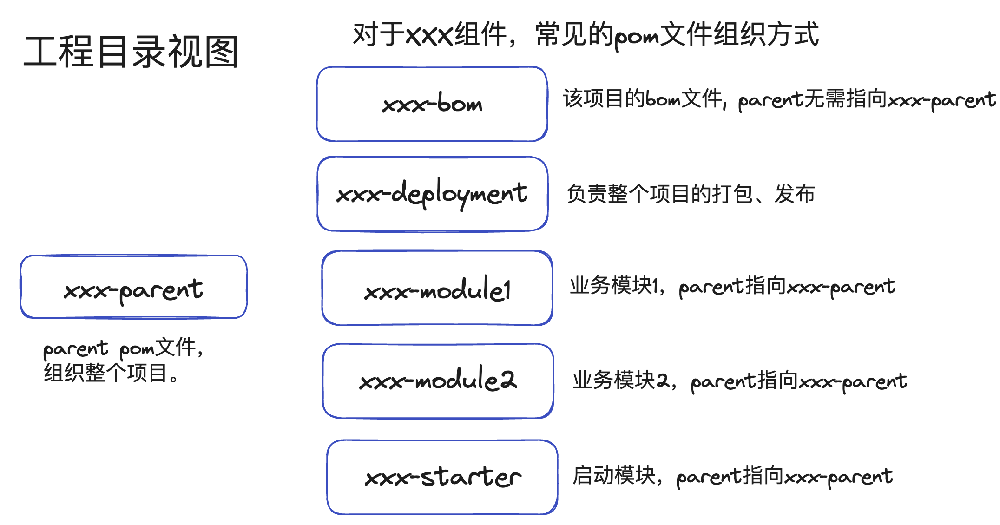
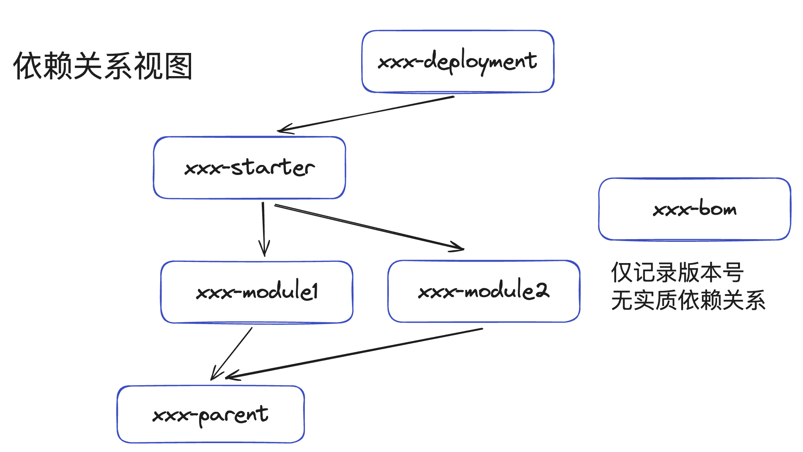
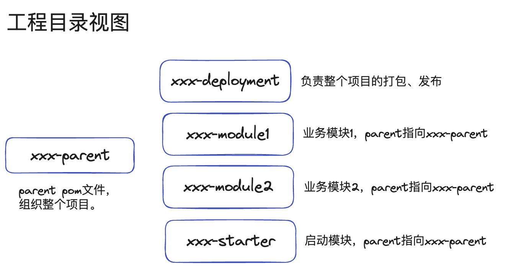

对于maven项目来说，模块的划分和pom（Project）文件可谓是至关重要，但往往在商业代码中，maven模块和pom文件并不得到大家的重视，最终导致模块杂乱、pom文件复杂难度，进而导致团队维护成本高。随意地exclude，随意地指定版本号，只会将项目带入依赖管理的地狱。本文讲述maven项目模块布局以及pom文件书写原则。

## maven项目模块布局

常见的一个需要打包发布、发布到maven仓库、并提供本项目bom的maven模块划分，以项目名xxx为例，当然，实际的项目可能会更加复杂，拥有`common`、`util`模块等。

### 工程目录视图



### 依赖关系视图



1. `xxx-parent`用来组织整个工程，常见的可以放一些诸如java版本、checkstyle、spotbugs等配置，`xxx-parent`也可以考虑以上层依赖/组织发布的parent作为parent
2. `xxx-parent`会有很多的依赖、插件配置，`xxx-bom`仅给其他项目提供版本号，没必要引入过多的依赖。

很多商业微服务，根本不涉及会将代码的一部分发布成library给其他人使用，那么可以进行简化，将bom去除



## 依赖管理原则

### 选择合理的maven parent

java基于jar包而不是源码的依赖方式是jar包版本冲突罪恶的源头，像Netty这样基于4.1，一直维护了100多个小版本的library何其之少。这导致了java应用程序依赖的jar包，需要一个微妙的关系才能搭配运行，比如springboot3.x才能对应hibernate 6.x版本等。对于一个springboot项目，我们没有必要也没有意义去定义hibernate的版本号，只需要将Spring的依赖指定为parent就可以了。

- 对于企业内部团队，可以选择由企业公共团队维护的maven parent，或者内部基于合适的parent构筑公共maven parent（如果有）
- 对于SpringBoot项目，可以使用SpringBoot维护的公共parent
- 对于Apache组织下的项目，常见使用Apache维护的父pom文件

### 依赖版本统一管理

对于大部分项目来说，子模块使用的依赖版本号都是一致的。尽量将版本号都通过parent或通过`<properties>` 统一管理引用起来，比如

```xml
<properties>
  <pulsar.version>2.10.0</pulsar.version>
</properties>

<dependencies>
  <dependency>
    <groupId>org.apache.pulsar</groupId>
    <artifactId>pulsar-client-api</artifactId>
    <version>${pulsar.version}</version>
  </dependency>
  <dependency>
    <groupId>org.apache.pulsar</groupId>
    <artifactId>pulsar-client-original</artifactId>
    <version>${pulsar.version}</version>
  </dependency>
</dependencies>
```

### 不要使用多个大项目的dependency management

对于一些bom文件较为简单的项目，比如`netty`、`jackson`等，引入没有问题。但引入多个大项目的dependency management，比如同时引入公司内的parent、springboot某个dependency parent、再比如同时引入两个springboot衍生项目作为dependency management，可能会导致依赖版本传递关系复杂，难以维护。

### 合理选择依赖的scope

举个例子：

对于library依赖，不应该把log4j2作为自己的compile级别依赖，只能作为runtime和test级别的依赖。

### 避免使用大量的exclude、指定版本号

大部分情况下，无需进行exclue、特殊指定某个组件的版本号，仅当版本冲突，或紧急漏洞修复。每一个exclude、指定版本号都应该有合理的原因。尽量不在某一个子模块里单独exclude、指定版本号。合理的exclude如

```xml
<!-- use log4j2 instead of logback -->
<dependency>
    <groupId>org.springframework.boot</groupId>
    <artifactId>spring-boot-starter-web</artifactId>
    <exclusions>
        <exclusion>
            <groupId>org.springframework.boot</groupId>
            <artifactId>spring-boot-starter-logging</artifactId>
        </exclusion>
    </exclusions>
</dependency>
```

## pom文件书写核心注意点

pom文件就和代码一样，优美的pom应该整洁、避免重复、在项目中拥有统一的风格。

### 有序地组织pom文件

某个节点下有大量的元素时，优先按照含义区分先后顺序，比如compile依赖在先，test依赖在后；比如按依赖顺序pulsar-api在先，pulsar-client在后，其次可以按照字母顺序排列。会大大提升整个pom文件的可读性。

依赖管理，可以按照compile、runtime、test，并按照依赖的重要程序排序。比如在opengemini-client-reactor中，将本项目的模块放在上面，三方依赖放在下面

```xml
<dependencies>
    <dependency>
        <groupId>io.opengemini</groupId>
        <artifactId>opengemini-client-api</artifactId>
        <version>${project.version}</version>
    </dependency>
    <dependency>
        <groupId>io.projectreactor.netty</groupId>
        <artifactId>reactor-netty-http</artifactId>
        <version>${reactor-netty.version}</version>
    </dependency>
</dependencies>
```

properties里面，可以按全局、依赖、插件分别归类，并在小类中按字母名称排序。示例如下:

```xml
<properties>
    <maven.compiler.source>8</maven.compiler.source>
    <maven.compiler.target>8</maven.compiler.target>
    <project.build.sourceEncoding>UTF-8</project.build.sourceEncoding>
    <src.dir>src/main/java</src.dir>
    <!-- dependency -->
    <async-http-client.version>3.0.0.Beta3</async-http-client.version>
    <junit.version>5.10.0</junit.version>
    <lombok.version>1.18.30</lombok.version>
    <log4j.version>2.20.0</log4j.version>
    <okhttp.version>4.12.0</okhttp.version>
    <jackson.version>2.13.4.1</jackson.version>
    <puppycrawl.version>10.12.3</puppycrawl.version>
    <reactor-netty.version>1.1.10</reactor-netty.version>
    <slf4j.version>2.0.7</slf4j.version>
    <!-- plugin -->
    <lombok-maven-plugin.version>1.18.20.0</lombok-maven-plugin.version>
    <maven-compiler-plugin.version>3.11.0</maven-compiler-plugin.version>
    <maven-checkstyle-plugin.version>3.3.1</maven-checkstyle-plugin.version>
    <maven-enforcer-plugin.version>3.4.1</maven-enforcer-plugin.version>
    <maven-enforce-plugin-maven.version>3.8.0</maven-enforce-plugin-maven.version>
    <maven-gpg-plugin.version>3.1.0</maven-gpg-plugin.version>
    <maven-javadoc-plugin.version>3.6.0</maven-javadoc-plugin.version>
    <maven-release-plugin.version>3.0.1</maven-release-plugin.version>
    <maven-release-plugin-scm-provider-gitexe.version>2.0.1</maven-release-plugin-scm-provider-gitexe.version>
    <maven-source-plugin.version>3.3.0</maven-source-plugin.version>
    <maven-surefire-plugin.version>3.2.1</maven-surefire-plugin.version>
    <nexus-staging-plugin.version>1.6.13</nexus-staging-plugin.version>
    <spotbugs-maven-plugin.version>4.7.3.6</spotbugs-maven-plugin.version>
</properties>
```

### 对maven revision的看法

maven从3.5.0版本开始，支持revision。允许其他模块引用父pom里面的版本号。IDEA对这个特性的支持还不是特别好，比如父pom里面定义

```xml
<groupId>com.shoothzj</groupId>
<artifactId>parent</artifactId>
<version>${revision}</version>

<properties>
  <revision>6.0.0</revision>
</properties>
```

主要的好处有两条：

1. 使得版本号修改只需要修改父pom一个文件，不需要大量修改多个文件。
2. 可以通过ci覆盖版本号，无需代码修改，就能发布。

如果您的项目不涉及这两条，那么大可不必使用这个特性
