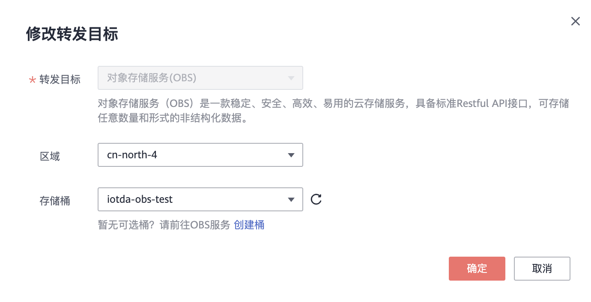
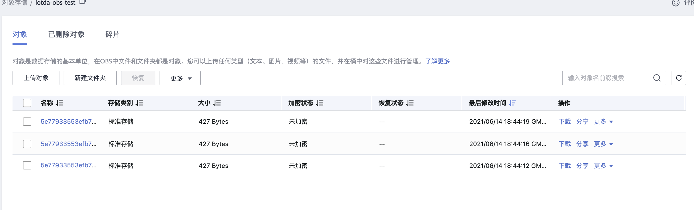
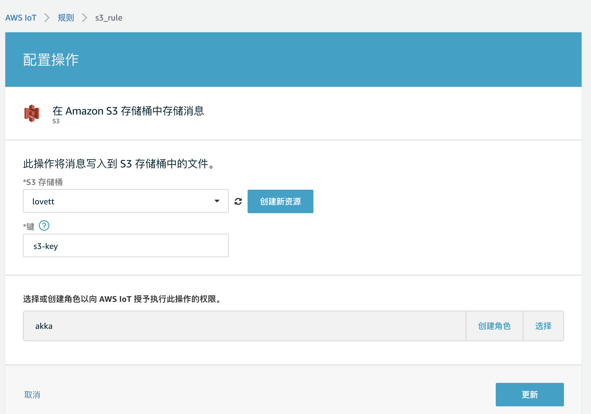
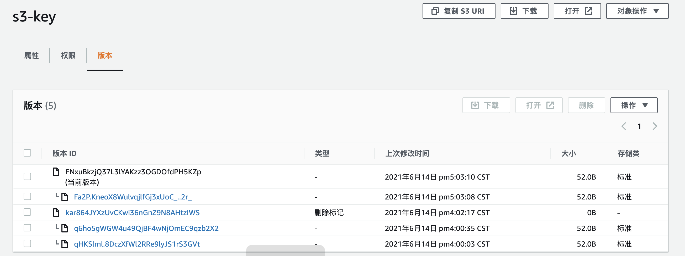
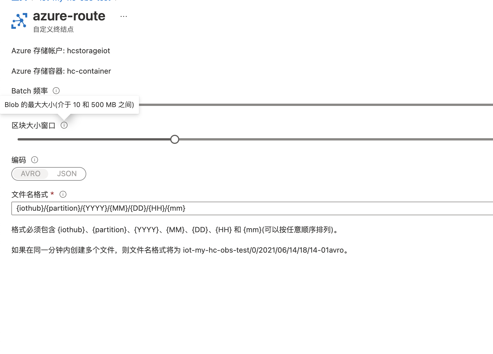
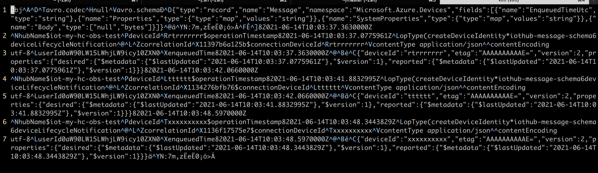

对于物联网平台来说，规则引擎是其中一个很重要的功能，也叫消息流转功能，将消息流转到各类中间件、云产品中。在华为、AWS、Azure、阿里这四个物联网平台中，阿里不支持流转到S3/类S3存储中。本文对比一下华为云、AWS、Azure把设备消息流转到S3/类S3存储的功能

## 参考资料

- https://docs.amazonaws.cn/general/latest/gr/iot-core.html#limits_iot

## 华为云

### 规则粒度和限制

- 规则配置粒度到**OBS**桶

- 限制单用户配置100条规则，每个规则10个Action

### 功能实现

针对华为云，我测试了设备的消息上报转发到华为云OBS的功能。

流转规则需要指定obs桶，随后运行之后，华为云OBS体现为

- 设备的每条消息都会在obs中存储为一个文件
- 名称采用deviceId+毫秒级时间戳+后面4位数字

### 关键路径截图

#### 配置规则时指定到obs桶

#### 单条消息单个文件

### 优势

可以非常轻易地查询出单个设备的消息，因为文件名携带有毫秒级时间戳，还可以指定具体

### 劣势

用来做MapReduce的话，文件数目太多，由于S3云厂商往往通过API调用次数收费，不仅是速度，成本也会很高。

## AWS

### 规则粒度和限制

- 规则配置粒度到桶及Key，相当于华为云OBS桶+文件名
- 限制规则每秒进行20k次运算
- 限制最多拥有1000条规则
- 限制每个规则最多10个action

### 功能实现

再次上报数据触发规则会把obs中的数据替换。（通过版本控制可以获取到老的数据）

### 关键路径截图

#### 配置规则指定粒度到Key

 

#### 仅有一个Key，新值覆盖旧值

### 优劣势

AWS的这个模式很适合存储每个设备的最新数据。不过由于规则数量上的限制，最多只能在S3上存储1000个键值对。可用性较低。可用于数量小于1000的设备，存储、查询最新数据。

## Azure转发

### 规则粒度限制

- 规则配置粒度到存储容器
- Azure可配置存储入存储容器的批量频率和大小限制
- 编码支持Avro和Json两种格式
- 最多100条路由

### 功能实现
自上报事件，到存储中出现数据，azure是最慢的，azure做了批量的缓冲，达到batch的大小和时间要求后才会写入存储。

### 关键路径截图

#### 配置路由规则

#### 存储中批量数据

因为选择了avro格式，所以vim打开是乱码，不过明显可以看到是多条数据

### 优势

Azure的这种方式，比较适合做MapReduce类操作，相对华为云来说，Azure的文件数量大大减少，如果用于做MapReduce这类操作，因为文件碎片小，作业速度会比华为云快，而且由于云厂商对存储，通常以api调用次数收费，价格也会比华为云低。

### 劣势

不易针对单个设备进行查询。
