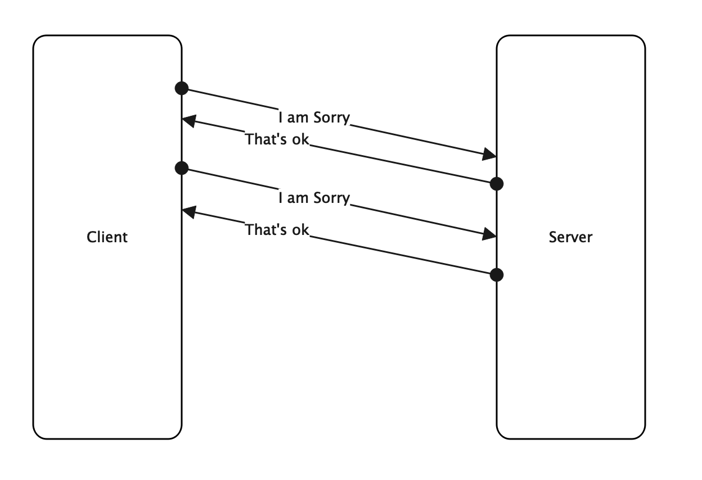
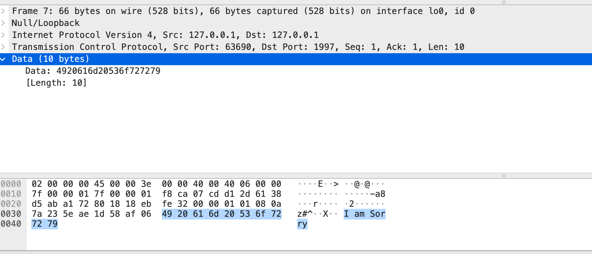
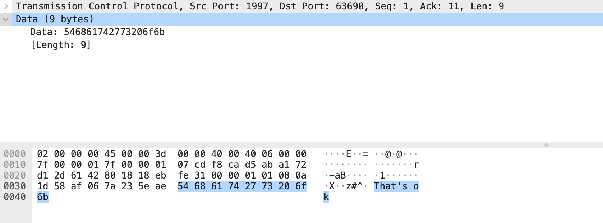
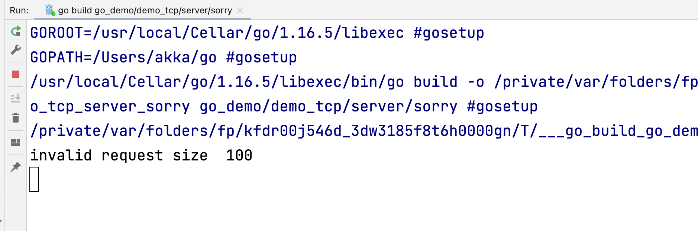
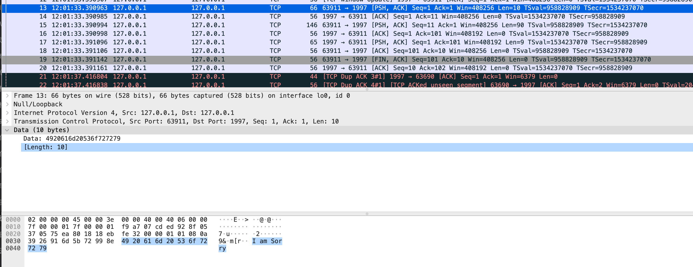
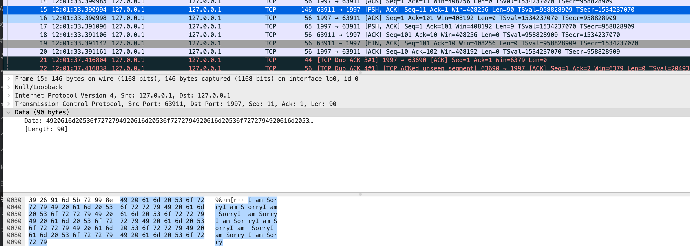
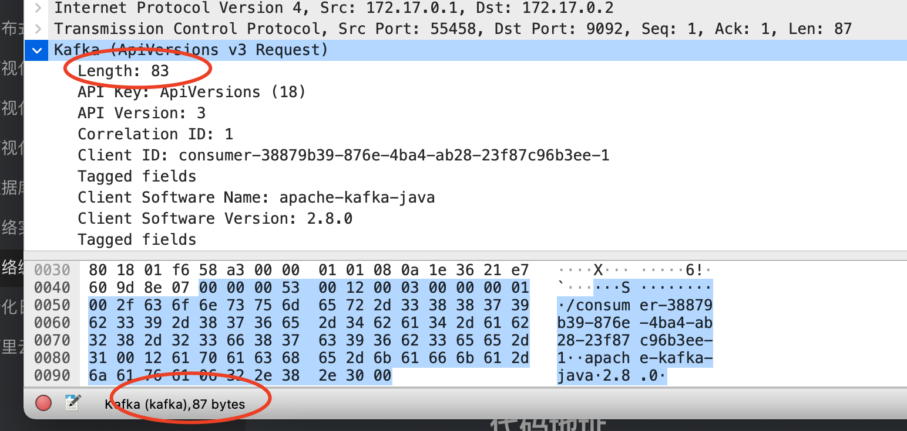
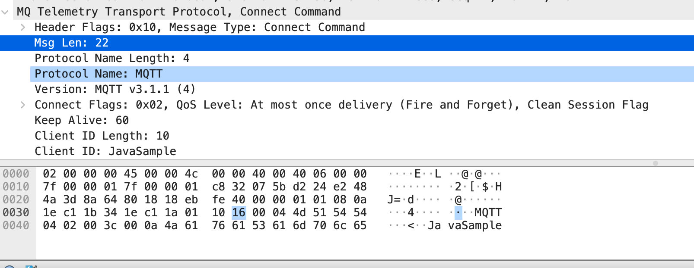
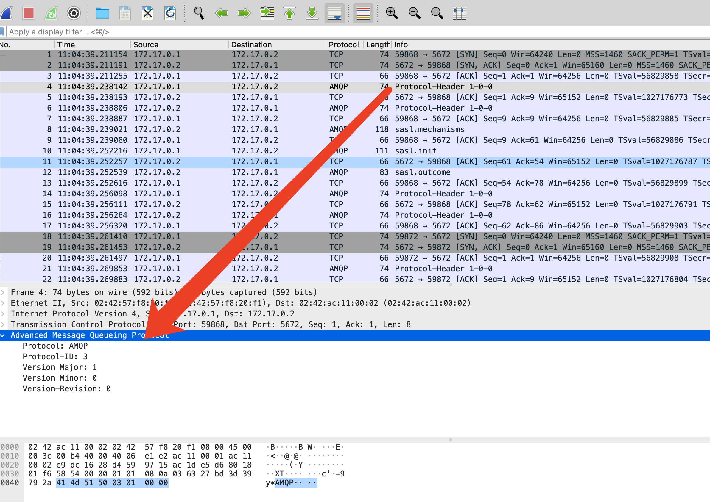
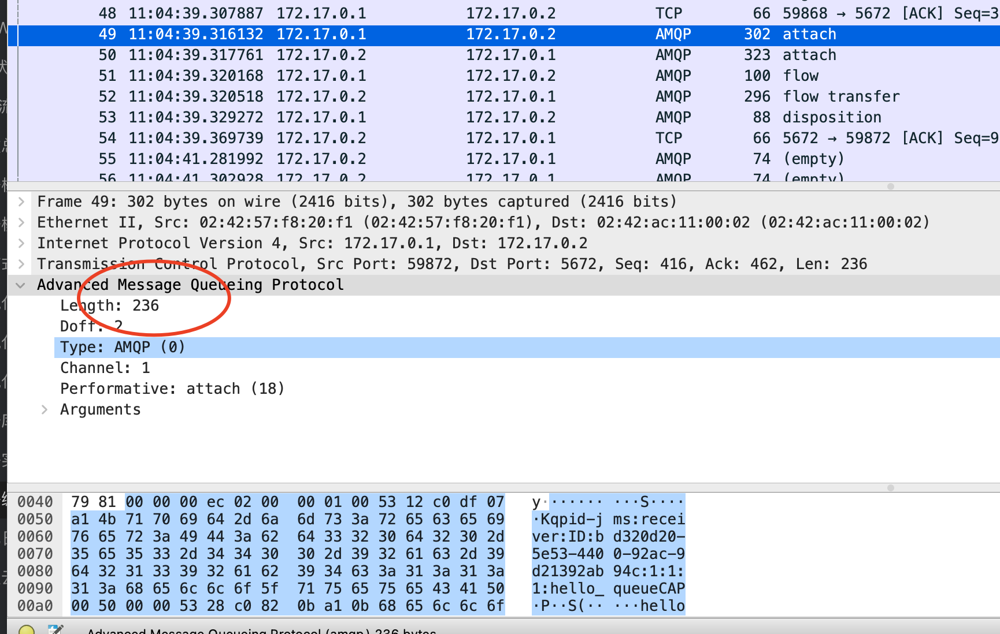

## 从简单通信协议开始

最近工作中又需要处理协议解析，我对协议解析和网络抓包其实还是小有研究，17年刚毕业的时候，就用Netty手写过SMPP协议的对接。（其实做协议解析是一个很枯燥的工作，如果协议解析可以像antlr那样子写grammar自动解析应该会很酷？）本文总结一下协议在tcp下编码拆包粘包的三种解决方案。

网上有一些人对拆包粘包的说法不是很认可，但是我觉得这个术语还是挺形象的。

首先，让我们来设计一个简单地通信协议，**Sorry**，客户端一直对服务器发送`I am Sorry`，服务端回复`That's ok`。如下图所示



让我们来写个demo程序实现这个协议

### 服务端

```go
package main

import (
	"fmt"
	"net"
)

func main() {
	listen, err := net.Listen("tcp", "localhost:1997")
	if err != nil {
		panic(err)
	}
	defer listen.Close()
	for {
		conn, err := listen.Accept()
		if err != nil {
			panic(err)
		}
		go handleRequest(conn)
	}
}

// handle incoming requests
func handleRequest(conn net.Conn) {
	// make a buffer to hold incoming data
	buf := make([]byte, 1024)
	// Read the incoming connection into the buffer
	reqLen, err := conn.Read(buf)
	if err != nil {
		fmt.Println("error reading: ", err.Error())
	}
	if reqLen != 10 {
		fmt.Println("invalid request size ", reqLen)
	}
	_, err = conn.Write([]byte("That's ok"))
	if err != nil {
		fmt.Println("error sending: ", err.Error())
	}
}
```


### 客户端

```rust
use std::io::{Read, Write};
use std::net::TcpStream;
use std::str::from_utf8;

fn main() {
    match TcpStream::connect("localhost:1997") {
        Ok(mut stream) => {
            println!("success connect to 1997");
            let msg = b"I am Sorry";
            let expect_resp = b"That's ok";
            stream.write(msg);
            println!("Send hello, awaiting reply");
            // use 9 byte buffer
            let mut data = [0 as u8; 9];
            match stream.read_exact(&mut data) {
                Ok(_) => {
                    if &data == expect_resp {
                        println!("Reply is ok")
                    } else {
                        let text = from_utf8(&data).unwrap();
                        println!("Unexpected reply: {}", text);
                    }
                },
                Err(e) => {
                    println!("Failed to receive data: {}", e);
                }
            }
        }
        Err(e) => {
            println!("Failed to connect: {}", e)
        }
    }

}
```

注意上面在服务端的实现中，我们校验了请求体的大小。

运行成功，我们在`Wireshark`上可以看到



目标端口为1997，这是客户端发出的报文。当然也能看到响应的报文



那么，如果客户端是个十分礼貌的人，他如果连续发送10个`I am Sorry`呢？我们将代码修改为

```rust
            for _ in 0..10 {
                stream.write(msg);
            }
```

服务端报错了，服务端收到了一个请求，大小为100。并不是新手预期的10个大小为10的消息，



那么实际在网络中是如何传输的呢？一定是1个大小为100的消息吗？答案是否定的。在我的这次测试中，在`TCP`层，分成了两组消息，第一个大小为10，包含一个`I am Sorry`



另一个大小为90，包含9个



## 揭秘时刻
### TCP协议
**TCP**和**UDP**不同，它是一个基于流的协议，**TCP**并不识别你定义的协议规则，只负责将这些报文打包发送，它可以基于`TCP_NODELAY`、`Nagle`算法等，任意的对你的报文进行切分发送。有两个典型的场景：第一个像上文中的例子，两个及以上的包在一个TCP数据包发送了，有个很形象的名字叫`粘包`。还有一个，因为报文过大，拆分成两个`TCP`报文发送，这叫拆包。

### 应用层读取

常见API，应用层读取也不保证单次操作一定仅仅读取一个`tcp`数据包，会根据你提供的buffer大小，尽量提供数据。你读取到的可能是上一个`TCP`包的末尾和下一个`TCP`包的开头部分。

### 总结

**TCP**是基于流的协议，并非基于报文。**TCP**提供了保序的语义保证，这要求应用程序，尤其是接收者，需要能够从报文流中提取出协议信息，**TCP**决不保证读取到的报文恰好是发送者一次`write`写入的报文，即使能在测试环境通过`case`，那也只不过是你运气好而已。

像我们上面，读取到100大小的消息。根据协议大小请求固定为10，我们就可以将100消息分割为10条协议报文。如果读取到的大小为96，那就先处理前90个字节，剩下6个字节，待后面4个字节到达之后再合并处理。下一节我们详细介绍一下几种常见方式。

## 常见TCP协议定义方式

### 定长编码

就像我们例子中的那样一样，定义一个定长宽度，然后切分

使用Go的gnet库的`Server`例子

```go
import "github.com/panjf2000/gnet"

type ExampleServer struct {
	*gnet.EventServer
}

func main() {
	codec := gnet.NewFixedLengthFrameCodec(10)
	gnet.Serve(&ExampleServer{}, "tcp://localhost:1998", gnet.WithCodec(codec))
}
```

### 基于分隔符

基于分隔符的编码也十分容易理解，双方约定好一个字符，并在正常报文中不出现这个字符（出现则需要转义），比较类似的是以太网的`7d7d`?这个计算机网络链路层相关的知乎，学太久了，忘记了。

```go
import "github.com/panjf2000/gnet"

type ExampleServer struct {
	*gnet.EventServer
}

func main() {
	codec := gnet.NewDelimiterBasedFrameCodec(0x11)
	gnet.Serve(&ExampleServer{}, "tcp://localhost:1998", gnet.WithCodec(codec))
}
```

### 基于固定行数的编码

这个也很简单，协议内容不换行，发送完再发送一个换行符，比较类似的有HTTP的`\r\n`

```go
package main

import "github.com/panjf2000/gnet"

type ExampleServer struct {
	*gnet.EventServer
}

func main() {
	gnet.Serve(&ExampleServer{}, "tcp://localhost:1998", gnet.WithCodec(&gnet.LineBasedFrameCodec{}))
}

```

### 长度编码

长度编码是使用最多的，最流行的一种编码方式。最简单的一种工作方式是，在报文的最开始数个字节（常见为4个字节，足以编码4个G长度，相比之下两个字节仅能存放64K消息），声明报文剩余内容的长度。以`Kafka`协议举例



Kafka这条消息，在**TCP**层占据的总长度为87字节，其中前4个字节`00 00 00 53`声明为83长度，为其余报文的长度。

这一模式还有很多变体，如

- 声明的长度包括其长度字段本身的长度
- 长度字段并不是打头的字段
- 长度字段的长度

等等。这也就是下面解码器，拥有的参数非常多的原因，都是为了适配这些变体

```go
import (
	"encoding/binary"
	"github.com/panjf2000/gnet"
)

type ExampleServer struct {
	*gnet.EventServer
}

func main() {
	encoderConfig := gnet.EncoderConfig{
		ByteOrder:                       binary.BigEndian,
		LengthFieldLength:               4,
		LengthAdjustment:                0,
		LengthIncludesLengthFieldLength: true,
	}
	decoderConfig := gnet.DecoderConfig{
		ByteOrder:           binary.BigEndian,
		LengthFieldOffset:   0,
		LengthFieldLength:   4,
		LengthAdjustment:    -4,
		InitialBytesToStrip: 4,
	}
	codec := gnet.NewLengthFieldBasedFrameCodec(encoderConfig, decoderConfig)
	gnet.Serve(&ExampleServer{}, "tcp://localhost:1998", gnet.WithCodec(codec))
}
```

事实上，长度字段编码格式是我见过开源代码使用最多的格式，像MQTT、KAFKA、SMPP等都使用这种格式。其中原因，个人觉得在于声明长度之后，buffer申请及释放，可以简化很多，性能最好。

## 其他网络协议使用的编码方式

### MQTT

使用长度字段编码格式



###  AMQP
AMQP的解析较为麻烦，它根据协议目前的状态，同时使用定长编码和长度字段两种编码方式。这就要求解码器不仅仅要处理报文，还要处理当前协议交互到那个状态了。

#### 定长场景



#### 长度字段模式



## 代码地址

- Go代码: https://github.com/hezhangjian/go_demo/tree/main/demo_gnet/codec
- Rust代码:https://github.com/hezhangjian/rust-demo/blob/main/demo-tcp-client/src/main.rs 
