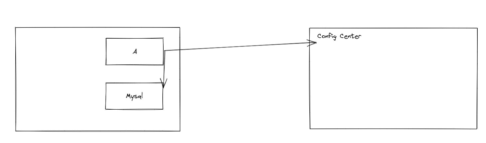

这是近期观摩某个产品安全加固时的心得，也请教过我们部门的安全专家、架构师。第一篇文章，我想先分析一下重要性和我心中的实现原则。后面可以贴出一些更详细的流程和代码样例

## 早期没有做好安全，后果很严重

李林峰老师，也就是《Netty权威指南》的作者，同样也在华为工作 :)
。在一本书就曾写过，见过很多产品在安全审核上投入了大量的时间和精力。我表示深深地认同。而这些，往往是因为产品在初期没有做好好的安全设计。以一个假想产品举例，

图中，A与B之间，A与配置中心之前，都存在放置敏感信息的可能。有意思的事情来了，当安全分析发现了A与B之前存在放置敏感信息的可能时，产品决定把A与Mysql之间的通信进行加密和认证，加密的源材料放在哪？决策放到配置中心。可是，当安全分析发现A与配置中心之间存在传递敏感信息的可能时？那产品又应该怎么做？总不能放在Mysql这里吧。

由此可见，如果没有一个完善的从上而下的安全设计，产品在搞安全增强或者说加固的时候，就像哪里破了刷哪里一样，把房间弄得乱七八糟，事倍功半。我相信更难受的是那些刷墙的开发人员。

## 自上而下安全设计的核心

作为一个开发人员，我还是站在开发人员的角度。我认为对于开发人员的核心就是有一个 证书可轮换、密钥可轮换的基础机制。毕竟开发人员最常碰到的安全问题就是：

- 通信中敏感数据没有加密
- 通信中双方没有做认证
- 敏感信息存储没有加密

拥有了证书可轮换、密钥可轮换的机制，开发人员就可以轻而易举地搞定这三件事情。

### 从设计、开发人员的思维、底层库开始，证书、密钥都是支持可替换的

- 底层库支持证书轮换、密钥轮换，同时注意轮换时老密钥的存留时间等
- 密钥更新时，如果需要彻底废弃老密钥，注意旧数据需要重新解密后用新密钥加密
- 开发人员也要认同密钥是可替换的，甚至不同用户的密钥可以是不一样的，不然如果平时测试覆盖不到密钥替换，真正实施的话，就会不敢实施，或者出现现网事故

### 证书、密钥的存储

往往，我们开发的任意两个组件之间，都可能会要求互相通信和认证，更不用提那些初始口令了，肯定是需要加密的，所以证书和密钥不适合存在产品自己开发的配置中心，或者是数据库中。更适合在安装部署阶段放置在更底层，更基础设施中，例如

- 专用的加密硬件
- 依赖公有云进行部署的，可以将证书存放在云上托管的Kubernetes集群的secret中，并对k8s集群进行加固，避免根密钥、根证书泄露

这些都可以由部署工具自动导入或人工手动导入。

### 设计证书、密钥的使用轮换机制

- 证书的粒度：是每个微服务一个证书还是每个业务场景一个证书
- 密钥的粒度：是每个客户一个工作密钥还是共享一个工作密钥
- 轮换时是否容忍业务损失，最大可损失时长是多久
- 还要注意每个微服务能获取到的证书和密钥，它只应该获取它需要的证书、密钥，理论上单一微服务不应该有获取根证书、根密钥的能力。
