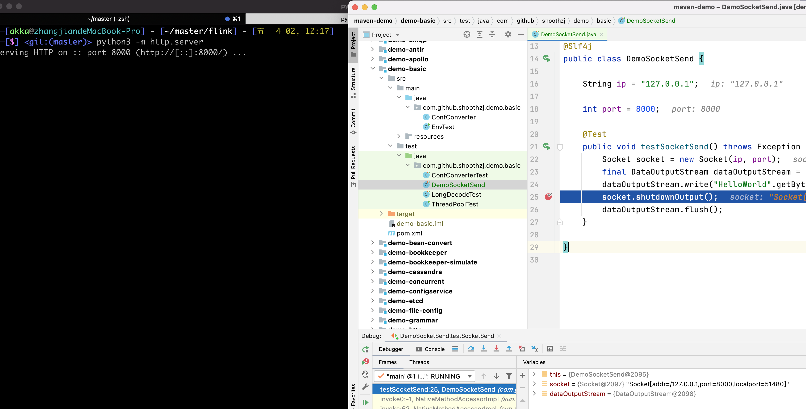
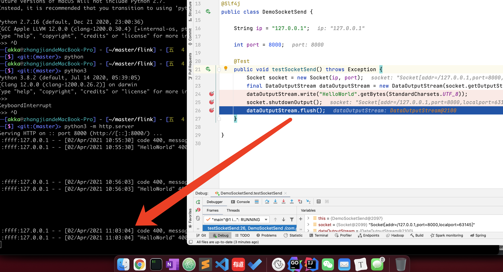

## 前言

记一次代码检视中领悟到的知识，和大家一起交流

## 正文

提交上来的代码大概是这个样子的

```java
Socket socket = new Socket(ip, port);
final DataOutputStream dataOutputStream = new DataOutputStream(socket.getOutputStream());
dataOutputStream.write("HelloWorld".getBytes(StandardCharsets.UTF_8));
socket.shutdownOutput();
dataOutputStream.flush();
```

这次主要是添加`shutdownOutput`的调用，及时关闭tcp会话，防止TW过多。

经过大家的讨论，主要的矛盾点在`shutdownOutput`和`flush`的顺序。首先想到的是 flush方法放在了output后面，这样还能起作用吗？但是提交代码之前是经过测试的，这样子是可以正常工作的。然后的想法就是，傻逼了，想错了，shutdown应该自带flush效果，os都发fin了，之前的buffer肯定出去了。

我做个实验，来探究下是不是这样子的，我从python开启了一个http server来开启实验

```bash
python3 -m http.server
```

java测试类代码

```java
package com.github.hezhangjian.demo.basic;

import lombok.extern.slf4j.Slf4j;
import org.junit.Test;

import java.io.DataOutputStream;
import java.net.Socket;
import java.nio.charset.StandardCharsets;

/**
 * @author hezhangjian
 */
@Slf4j
public class DemoSocketSend {

    String ip = "127.0.0.1";

    int port = 8000;

    @Test
    public void testSocketSend() throws Exception {
        Socket socket = new Socket(ip, port);
        final DataOutputStream dataOutputStream = new DataOutputStream(socket.getOutputStream());
        dataOutputStream.write("HelloWorld".getBytes(StandardCharsets.UTF_8));
        socket.shutdownOutput();
        dataOutputStream.flush();
    }

}

```

随后我在25行和26行打了断点

当运行到25行的时候，python server并没有收到数据



还没运行26行的时候，数据就已经发送到python服务器了



### 总结
这个时候证明我们的推测是正确的，`shutdownOutput`方法自带了`flush`效果。
我也尝试了配置`tcpNoDeplay`参数，配不配置tcpNoDelay，都是一样的效果。看起来jvm都有缓冲
那么已经调用了`shutdownOutput`方法之后，`flush`方法还有没有必要调用呢，从`clean code`的角度，`flush`方法的调用已经是没有任何必要的了，建议删除。一般场景下可能不会有问题，但是如果极端场景，比如在25行到26行之间，程序陷入了长gc，这行就有可能抛出IOException，影响原来的逻辑。
