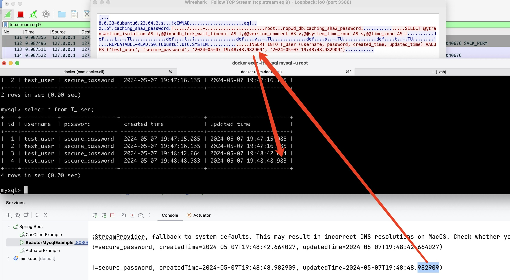

# 问题现象

在一个使用Spring R2dbc与Mysql8.x的项目中，当创建 一个REST资源，进行创建，返回的毫秒精度时间戳，和下一瞬间查询的时间戳不一致。sql及代码大概如下

```sql
CREATE TABLE person (
    id INT PRIMARY KEY,
    name VARCHAR(255),
    created_time DATETIME(3),
    updated_time DATETIME(3)
);
```

实体类定义

```java
@Entity
class PersonEntity {
    @Id
    private Long id;
    private String name;
    @CreatedDate
    private LocalDateTime createdTime;
    @LastModifiedDate
    private LocalDateTime updatedTime;
}
```

这里使用了`@CreatedDate`、`@LastModifiedDate`注解，并在Application类上配置了`@EnableR2dbcAuditing`注解用于在Repo操作实体的时候，自动更新时间戳。

```java
public interface PersonRepo extends ReactiveCrudRepository<PersonEntity, Long> {
}
```

创建代码类比如下，大概就是使用r2dbc操作数据，并将r2dbc返回的实体用于转换毫秒时间戳
```
 return createPersonReq
                .flatMap(req -> {
                    PersonPo personPo = new PersonPo();
                    personPo.setAge(18);
                    personPo.setName(req.getName());
                    return personRepo.save(personPo);
                })
                .map(person -> {
                    PersonResp personResp = new PersonResp();
                    personResp.setName(person.getName());
                    personResp.setCreatedTime(TimeUtil.format(person.getCreatedTime()));
                    return new ResponseEntity<>(personResp, null, HttpStatus.CREATED);
                });
```

然而创建的时候返回的时间戳和查询的时间戳不一致，现象举例：
创建的时候返回：`2024-05-08T08:11:47.333Z`，
查询的时候却返回：`2024-05-08T08:11:47.334Z`，

走读代码，发现代码基本上万无一失，那么问题出在哪里呢？

通过仔细观察时间戳的区别，发现时间戳的变化都在最后一位，且相差为一，醒悟到这估计是由于内存中纳秒时间戳精度在转化为数据库毫秒时间戳的时候，部分库的行为是截断，部分库的行为是四舍五入，导致了这个问题。

最终通过写demo，docker抓包复现了这个问题，如下图所示，mysql server会将接收的时间戳进行四舍五入，而java常见的format工具类都是截断，导致了这一不一致。同时，这也体现了，r2dbc返回的entity可能并不是实际存入数据的内容，而是"原始"的entity。



# r2dbc与mysql的时间精度失调问题

在这个问题里面，存在三个时间精度：

- 内存中的时间精度
- r2dbc发给mysql的时间精度，有趣的是，r2dbc发给mysql的时间精度，并不是sql中列定义的精度，而是mysql server所能支持的最高精度即微秒精度。
- mysql实际存储的时间精度

r2dbc返回的entity可能并不是实际存入数据的内容，而是经过r2dbc处理之后，发送到数据库之前的entity。问题的关键就在r2dbc并不根据列定义的精度处理数据，而是根据mysql server支持的最高精度处理数据。

解决问题的方式有几种：
- 将mysql列定义到微秒级别精度，优选方案
- 在进入r2dbc之前，将时间戳截断到mysql列定义的精度
- 在r2dbc返回的entity中，将时间戳截断到mysql支持的精度。这其实对开发者的心智负担较重，返回的entity并不是实际存储的，使用前要做进位，限制也比较大。

在进入r2dbc之前，将时间戳截断到数据库表定义的精度，也有两种方式

- 不使用`@CreatedDate`、`@LastModifiedDate`注解，而是在应用程序中手动设置时间戳
- 继续使用`@CreatedDate`、`@LastModifiedDate`注解，通过拦截器统一进位

通过拦截器的代码如下，定义基类，不然每个实体类都要书写拦截器。一般来说，一个项目里，时间戳的精度都应该统一，所以可以定义一个统一的拦截器。

```java

import lombok.ToString;
import org.springframework.data.annotation.CreatedDate;
import org.springframework.data.annotation.LastModifiedDate;

import java.time.LocalDateTime;

@ToString
public abstract class AuditableEntity {
    @CreatedDate
    protected LocalDateTime createdTime;

    @LastModifiedDate
    protected LocalDateTime updatedTime;

    public LocalDateTime getCreatedTime() {
        return createdTime;
    }

    public void setCreatedTime(LocalDateTime createdTime) {
        this.createdTime = createdTime;
    }

    public LocalDateTime getUpdatedTime() {
        return updatedTime;
    }

    public void setUpdatedTime(LocalDateTime updatedTime) {
        this.updatedTime = updatedTime;
    }
}
```

```java
import org.reactivestreams.Publisher;
import org.springframework.data.r2dbc.mapping.OutboundRow;
import org.springframework.data.r2dbc.mapping.event.BeforeSaveCallback;
import org.springframework.data.relational.core.mapping.event.BeforeConvertCallback;
import org.springframework.data.relational.core.sql.SqlIdentifier;
import org.springframework.stereotype.Component;
import reactor.core.publisher.Mono;

import java.time.LocalDateTime;
import java.time.temporal.ChronoUnit;

@Component
public class AuditableEntityCallback implements BeforeSaveCallback<AuditableEntity>, BeforeConvertCallback<AuditableEntity> {

    @Override
    public Publisher<AuditableEntity> onBeforeSave(AuditableEntity entity, OutboundRow row, SqlIdentifier table) {
        System.out.println("before save " + entity.getCreatedTime());
        entity.setCreatedTime(roundToMilliseconds(entity.getCreatedTime()));
        entity.setUpdatedTime(roundToMilliseconds(entity.getUpdatedTime()));
        System.out.println("before save " + entity.getCreatedTime());
        return Mono.just(entity);
    }

    @Override
    public AuditableEntity onBeforeConvert(AuditableEntity entity) {
        System.out.println("before convert " + entity.getCreatedTime());
        entity.setCreatedTime(roundToMilliseconds(entity.getCreatedTime()));
        entity.setUpdatedTime(roundToMilliseconds(entity.getUpdatedTime()));
        System.out.println("before convert " + entity.getCreatedTime());
        return entity;
    }

    private static LocalDateTime roundToMilliseconds(LocalDateTime dateTime) {
        LocalDateTime localDateTime = dateTime.truncatedTo(ChronoUnit.MILLIS);
        int dateTimeNano = dateTime.getNano() % 1000_000;
        if (dateTimeNano >= 500_000) {
            localDateTime = localDateTime.plusNanos(1_000_000);
        }
        return localDateTime;
    }
}
```

# jpa有没有问题呢？

出于好奇，我也做了jpa的尝试，jpa也是一样的行为


