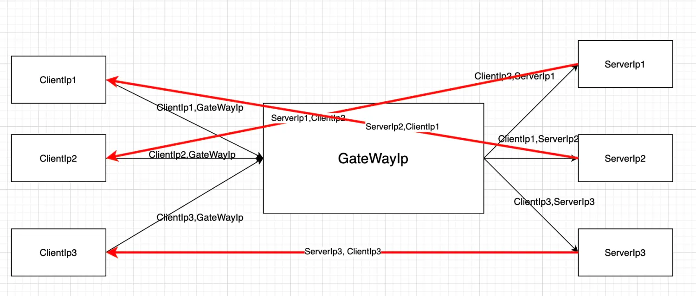
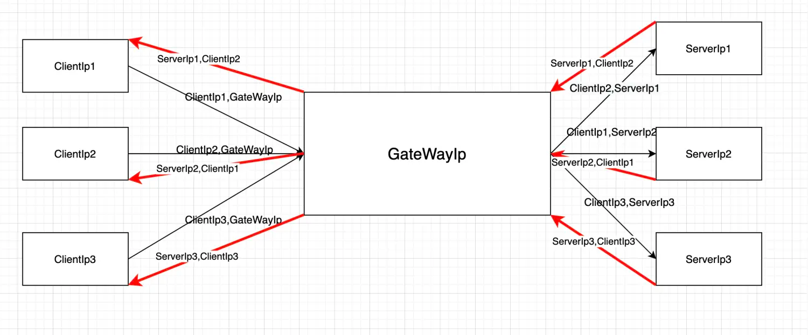

# 网关建设

今天给大家介绍三种常见的四层负载均衡、网络转发方案，可用于四层的网关建设。

## 利用ipvs实现(需要后端服务能连通外部网络)



该方案需要后端服务器与前端client网络打通，GatewayIp可以采用主备的方式保证高可用

配置都在GatewayIp上，需要配置的如下:

```bash
ipvsadm -A -u $GatewayIp:$port -s rr -p 600
# -u表示为udp协议，-t表示为tcp协议
# rr 为均衡算法，roundroubin的意思，lc则代表最短连接数
ipvsadm -a -u $GatewayIp:$port -r $ServerIp:$port -m
```

## Ipvs+Iptables实现

如果您不希望后端Server与客户端面对面打通，那么您可能会喜欢这种方式，将GatewayIP设置为ServerIp的默认网关，再由Snat转换将报文转换出去，这样子Server就不需要与客户端面对面打通了，图示如下:



配置默认路由也很简单

```
ip route add 客户端IP网段 via GateWayIp dev eth0
```
配置iptables
```
iptables -t nat -A POSTROUTING -m iprange -p udp --dst-range $client_ip_range -o eth1  -j SNAT  --to-source $GateWayIp
```

## Ipvs+Iptables+Iptunnel实现

默认路由有一个限制，就是说Server与Gateway都在一个子网内，有过商用经验的大家都知道DMZ之类的说法，就是说应用服务器和网关服务器在诸如安全组，子网等等上需要隔离。假设你需要将应用服务器和网关放在不同的子网，上面的方案就搞不定啊，这个时候需要使用ip隧道的方式来跨子网，图示如下，仅仅后边红色路线的ip发生了变化，原来的报文被ip隧道Wrap:


配置ip 隧道倒也不难

```
ip tunnel add $tun_name mode ipip remote $remote_ip local $local_ip ttl 255
```
# 总结

以上三种方案均没有单点问题，且都兼容tcp，udp协议。GateWay处的单点问题，通过zk选主、etcd选主，keepalive等 + 浮动IP迁移的方式均能解决。大家可以根据自己的网规网设自由选择
